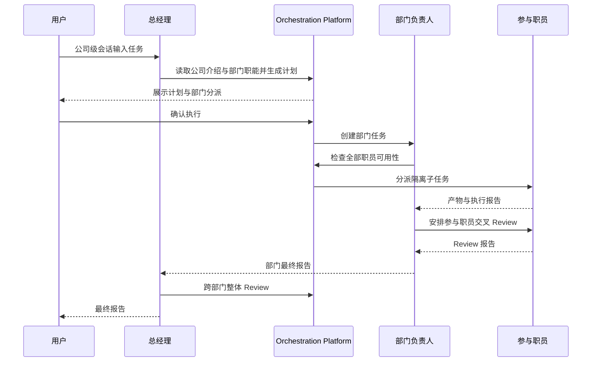
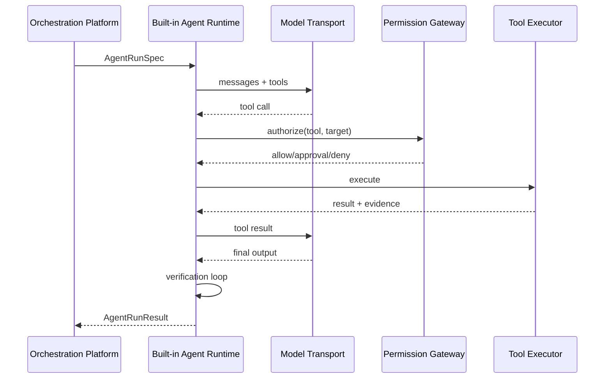

# iBreeze AI 公司桌面应用设计方案

版本：1.0

文档状态：正式设计基线

目标读者：产品、架构、客户端、服务端、测试、运维及第三方实施团队

首发客户端：macOS Apple Silicon

## 1. 产品定义

iBreeze 是一个以“模拟公司运作方式”组织多个 Agent 协作完成任务的桌面应用。应用中的公司、部门、总经理、部门负责人和职员均为 Agent 工作流概念，不代表真实企业、客户组织或租户。

用户在本地创建多个模拟公司，为公司配置部门和职员，再通过公司级会话向总经理提出任务。总经理负责分析、编排、拆分和分派；部门负责人负责部门内计划与协作；职员调用 Codex CLI、Claude Code、OpenCode 或 API Model 完成执行与交叉 Review；最终由部门负责人和总经理逐级汇总、修复和验收。

产品由两个独立交付物组成：

1. **iBreeze 桌面客户端**：保存全部公司业务数据，运行任务编排与 Agent Runtime。
2. **iBreeze 管理后台服务**：提供用户认证以及全局 Agent、模型、API Provider、Skill 和兼容规则目录，不保存桌面业务数据。

## 2. 目标与非目标

### 2.1 产品目标

- 支持 Codex CLI、Claude Code、OpenCode 等 Agent 工具作为职员模型底座。
- 支持 API Model 作为职员模型底座，由 iBreeze Built-in Agent Runtime 驱动完整 Agent Loop。
- 支持同一任务由多个不同 Agent 协作产出、交叉 Review、修复和复测。
- 用公司、部门、职员和逐级汇报表达可理解、可观察、可恢复的 Agent 编排。
- 支持多个本地公司，并在数据、会话、知识、Workspace 和运行上下文层面严格隔离。
- 让总经理根据公司介绍和内部业务流转说明安排部门任务。
- 让部门负责人根据部门职能说明组织本部门工作。
- 由独立后台统一发布 Agent、模型、Provider、Skill 和兼容性基础目录。
- 保证任务的计划、确认、执行、Review、修复、测试和报告均有可追溯证据。

### 2.2 明确非目标

- 不建立真实企业组织、客户组织、租户或多租户 SaaS 模型。
- 不把公司、部门、职员实例、任务、会话、报告、知识或 Workspace 上传后台。
- 不在后台执行用户任务或托管 Agent 运行进程。
- 不设计预算、费用审批或成本配额功能。
- 不允许未确认的公司级计划直接启动 Agent。
- 不把普通多模型聊天作为产品主流程。
- 不依赖 Prompt 实现公司隔离、文件权限或工具权限。

## 3. 核心设计原则

1. **本地业务事实来源**：桌面客户端是公司、任务和会话数据的唯一事实来源。
2. **后台基础目录事实来源**：管理后台是用户、Agent、模型、Provider、Skill、兼容规则和目录发布的唯一事实来源。
3. **公司是最高业务隔离边界**：不同公司之间不共享任务上下文、会话、知识、职员实例或文件。
4. **职责驱动而非名称驱动**：总经理按部门职能和交付能力分派任务，不在代码中硬编码“架构部”“开发部”等名称。
5. **计划先于执行**：总经理先给出计划，用户确认后才创建可执行部门任务。
6. **执行者同时参与 Review**：部门任务参与职员均进入交叉 Review 池，不维护独立 Review 职员池；任何人不得 Review 自己的产物。
7. **运行快照不可漂移**：任务启动时锁定公司说明、部门职能、职员底座、模型、Skill、工具权限和目录版本。
8. **权限由执行层强制**：Workspace 内默认可读写，Workspace 外默认只读；越界写入必须逐目标授权。
9. **适配器可替换**：编排领域模型不依赖任何 Agent CLI 或模型厂商的内部对象。
10. **证据驱动完成**：没有可验证产物、测试结果、Review 问题关闭记录和最终报告，任务不得完成。

## 4. 数据归属与信任边界

| 数据或能力 | 桌面客户端 | 管理后台服务 |
|---|---|---|
| 应用用户与管理员账号 | 保存登录令牌引用 | 唯一事实来源 |
| 公司、介绍和业务流转 | 唯一事实来源 | 不接收、不保存 |
| 部门、职能和职员实例 | 唯一事实来源 | 不接收、不保存 |
| 任务、会话、报告和审计 | 唯一事实来源 | 不接收、不保存 |
| Workspace、文件和知识 | 唯一事实来源 | 不接收、不保存 |
| API Key、CLI 登录态 | Keychain 或 CLI 自有凭据区 | 不接收、不保存 |
| Agent、模型和 Provider 目录 | 签名缓存 | 唯一事实来源 |
| Skill 包和版本 | 安装缓存 | 唯一事实来源 |
| 兼容规则和紧急禁用 | 执行已同步规则 | 唯一事实来源 |

后台不得提供上传本地业务数据的接口。客户端的诊断导出默认只生成本地文件，由用户自行决定是否发送。

## 5. 总体架构

```text
┌──────────────────── iBreeze 桌面客户端 ────────────────────┐
│ React + TypeScript                                          │
│        │ Tauri Command / Event                              │
│ Rust Desktop Core                                           │
│ ├─ Window / Keychain / File Grant                           │
│ ├─ Local Service Supervisor                                 │
│ └─ Runtime Sidecar Supervisor                               │
│        │ authenticated local IPC                            │
│ Local Application Service                                   │
│ ├─ Company / Department / Employee                          │
│ ├─ Conversation / Task / Artifact / Review                  │
│ ├─ Agent Orchestration Platform                             │
│ ├─ Catalog Cache / Knowledge / Audit                        │
│ └─ SQLite + Local Files                                     │
│        │ internal runtime RPC                               │
│ Agent Runtime Gateway                                       │
│ ├─ Built-in Agent Runtime                                   │
│ ├─ Codex / Claude Code / OpenCode Adapter                   │
│ ├─ Model Transport Adapter                                  │
│ ├─ Tool / Permission / Context / Verification               │
│ └─ Workspace / Checkpoint / Event Normalization             │
└─────────────────────────────────────────────────────────────┘
                         │ HTTPS
                         ▼
┌────────────── iBreeze 管理后台服务 ─────────────────────────┐
│ Admin Web                                                   │
│ Backend API                                                 │
│ ├─ Authentication / User Administration                    │
│ ├─ Agent / Model / Provider Catalog                         │
│ ├─ Skill Registry / Compatibility                           │
│ ├─ Catalog Release / Distribution                           │
│ └─ Admin Audit                                              │
│ PostgreSQL + S3-Compatible Object Storage                   │
└─────────────────────────────────────────────────────────────┘
```

### 5.1 桌面组件职责

- **React UI**：展示公司、会话、任务、运行状态和管理页面，不直接访问数据库、Keychain 或 CLI。
- **Rust Desktop Core**：负责桌面系统集成、Keychain、文件授权、本地进程监管和前端 IPC。
- **Local Application Service**：负责本地领域模型、事务、编排、会话投影、目录缓存和审计。
- **Agent Runtime Gateway**：负责 CLI/API Model 的统一执行、权限、Workspace、工具、事件和恢复。

### 5.2 后台组件职责

- **Authentication Service**：应用用户注册登录、管理员登录、Token 颁发和撤销。
- **User Administration**：两类用户的管理与保护账号约束。
- **Catalog Service**：维护 Agent、模型、Provider 和 Skill 元数据。
- **Compatibility Service**：维护 Agent—版本—模型—Skill 兼容矩阵。
- **Distribution Service**：发布带签名的不可变目录快照和 Skill 包。
- **Admin Audit Service**：记录所有后台管理操作。

## 6. 用户与认证

### 6.1 用户类型

`users.user_type` 只能取：

- `admin`：登录管理后台；只能在后台用户管理模块中创建和管理。
- `app_user`：登录 iBreeze 桌面客户端；可公开注册，也可由管理员创建。

两类用户不属于任何组织或租户。后台数据库不得出现 `organization_id`、`tenant_id` 或真实公司归属字段。

### 6.2 应用用户注册

注册页面字段：

- 邮箱；
- 密码；
- 确认密码。

规则：

- 不发送邮箱验证码，不要求验证邮箱所有权。
- 邮箱去除首尾空格并转换为小写后唯一。
- 密码长度为 8 至 128 个 Unicode 字符。
- 客户端校验密码与确认密码一致；服务端再次校验密码规则。
- 注册接口固定创建 `app_user`，忽略并拒绝任何 `user_type`、`role` 或管理员字段。
- 密码使用 Argon2id 哈希；日志、审计和错误响应不得包含密码。

### 6.3 登录与令牌

- Access Token 有效期 15 分钟。
- Refresh Token 有效期 30 天，服务端仅保存哈希。
- 桌面客户端把 Refresh Token 保存到系统 Keychain；本地数据库只保存 Keychain item id。
- 修改密码、管理员重置密码、禁用用户或“退出全部设备”必须撤销全部 Refresh Token。
- 后台 API 使用独立的管理员登录入口，并验证 `user_type=admin`。
- 应用用户不能访问 `/admin/*`；管理员令牌不能用于桌面业务接口。

### 6.4 默认管理员

首次启动后台数据库迁移时幂等创建：

```text
username = admin
password = admin123456
user_type = admin
protected = true
must_change_password = true
```

约束：

- 账号不可删除、不可禁用、不可修改用户名、不可改为应用用户。
- 首次登录后只能访问修改密码接口；修改成功后方可使用其他后台功能。
- 默认密码可被修改，修改后不得再次自动重置。
- API 与数据库双重约束 `protected=true` 的删除操作。

### 6.5 本地用户隔离

桌面客户端按 `backend_origin + app_user_id` 创建独立本地数据目录。不同应用用户不能打开彼此的 SQLite、Workspace、Skill 私有配置或 Keychain 引用。用户退出登录不删除本地数据；重新登录同一后台和同一账号后恢复对应本地资料。

## 7. 管理后台基础目录

### 7.1 Agent Catalog

`AgentCatalogItem` 字段：

| 字段 | 类型 | 约束 |
|---|---|---|
| `id` | UUID | 主键 |
| `key` | string | 全局唯一，如 `codex_cli` |
| `display_name` | string | 非空 |
| `executable_names` | string[] | 允许探测的可执行文件名 |
| `supported_platforms` | enum[] | `macos_arm64` 等 |
| `min_version` | semver | 非空 |
| `max_version_exclusive` | semver/null | 空表示无上限 |
| `probe_command` | string[] | 固定参数数组，不通过 Shell 解释 |
| `capability_tags` | string[] | `code`、`writing`、`review` 等 |
| `status` | enum | `draft/published/disabled` |

首版正式目录必须包含 Codex CLI、Claude Code 和 OpenCode。

### 7.2 Model 与 Provider Catalog

`ModelCatalogItem` 描述模型身份和能力，不保存用户凭据。关键字段：`provider_key`、`model_key`、`display_name`、`context_window`、`supports_tools`、`supports_streaming`、`supports_vision`、`status`。

`AgentModelBinding` 定义某 Agent 可选择的模型及 Agent 版本范围。`ProviderModelBinding` 定义 API Provider 可调用的模型、API 协议和能力。

客户端展示的最终可用模型为：

```text
后台已发布目录
∩ Agent/Provider 兼容规则
∩ 本机 Agent 版本与认证探测
∩ 本地凭据配置
```

### 7.3 Skill Registry

`SkillVersion` 为不可变发布物，包含：

- `skill_id`、语义版本和显示名称；
- 描述、能力标签和入口说明；
- Skill 包对象存储地址；
- SHA-256 内容哈希和服务端签名；
- 支持的 Agent/API Runtime、模型能力和平台；
- 所需工具、网络域名和文件权限声明；
- 冲突 Skill 与最低依赖版本；
- 风险等级和状态。

已发布版本不能覆盖；任何内容变化必须发布新版本。

### 7.4 兼容规则

兼容规则是可执行数据，不允许客户端根据描述文本猜测。每条规则包含主体类型、主体版本范围、依赖类型、依赖版本范围、结果 `allow/deny`、原因代码和优先级。`deny` 高于 `allow`，紧急禁用高于全部普通规则。

### 7.5 目录发布与同步

目录发布生成一个不可变 `CatalogRelease`：

- 单调递增 `release_sequence`；
- `release_id` 和 `created_at`；
- 全量 manifest；
- 各资源内容哈希；
- Ed25519 签名；
- 最低客户端版本；
- 紧急禁用集合。

客户端同步过程：

```text
登录成功
→ 获取 manifest
→ 比较 release_sequence
→ 下载增量资源或完整快照
→ 验证签名、哈希和引用完整性
→ 写入临时目录
→ SQLite 事务切换 active_release
→ 异步执行本机可用性探测
```

任一步失败均保留上一有效快照。后台离线时，已登录过的用户可使用本地数据和最后有效目录继续任务，但不能注册、刷新登录、安装新 Skill 或获取新目录。

## 8. 公司、部门与职员

### 8.1 Company

`Company` 是本地最高业务隔离和编排容器。

| 字段 | 类型 | 说明 |
|---|---|---|
| `id` | UUID | 主键 |
| `name` | string | 1 至 100 字符，当前本地用户内唯一 |
| `introduction` | text | 1 至 20000 字符；公司定位、部门协作关系和内部业务流转说明 |
| `introduction_version` | integer | 每次编辑递增 |
| `general_manager_office_id` | UUID | 唯一总经理办公室 |
| `general_manager_employee_id` | UUID | 唯一总经理 |
| `company_conversation_id` | UUID | 唯一公司级会话 |
| `status` | enum | `active/archived` |
| `created_at/updated_at` | datetime | UTC 存储 |

新增公司必须要求用户输入名称、介绍、总经理名称并选择一个有效职员模型底座。若尚无已发布底座，创建向导必须引导用户先创建底座，不得生成不可运行的占位总经理。

在同一 SQLite 事务中创建公司、总经理办公室、总经理职员实例、公司级会话和总经理办公室部门级会话。总经理办公室的初始职能说明固定为“接收用户任务，依据公司介绍完成需求梳理、计划编排、部门分派、跨部门 Review、问题处理和最终汇报”，用户后续可以补充但不能删除这些职责。任一创建失败则全部回滚。

编辑 `introduction` 必须生成新版本。运行中任务使用其 `TaskContextSnapshot.company_introduction`，不随公司编辑变化。

### 8.2 Department

| 字段 | 类型 | 说明 |
|---|---|---|
| `id` | UUID | 主键 |
| `company_id` | UUID | 隔离键 |
| `name` | string | 1 至 100 字符，公司内唯一 |
| `type` | enum | `general_manager_office/standard` |
| `function_description` | text | 1 至 10000 字符；职责、输入、输出、上下游和质量要求 |
| `function_version` | integer | 每次编辑递增 |
| `leader_employee_id` | UUID | 唯一负责人 |
| `department_conversation_id` | UUID | 唯一部门级会话 |
| `status` | enum | `active/draining/archived` |

普通部门新增时必须输入名称、职能说明、负责人名称并选择负责人的有效职员模型底座。系统在同一事务内创建部门、负责人职员实例和部门级会话。已有职员只能通过显式调岗流程成为新部门负责人，不能在新建部门事务中跨部门直接复用。总经理办公室不能删除、归档或改为普通部门。

部门职能说明必须被总经理的部门匹配器和部门负责人的计划器读取。任务快照锁定所用说明版本。

### 8.3 DepartmentResponsibility

一个部门可配置多项结构化职责：

- `responsibility_key`；
- 名称与说明；
- `accepted_task_types[]`；
- `required_capability_tags[]`；
- `deliverable_types[]`；
- `default_quality_gates[]`；
- 上游和下游职责引用。

系统提供架构、开发、测试、内容和数据部门模板，但创建公司时只自动创建总经理办公室；其他部门由用户显式创建或从模板实例化。

### 8.4 Employee

职员是某个职员模型底座在具体公司和部门中的实例。

| 字段 | 类型 | 说明 |
|---|---|---|
| `id` | UUID | 主键 |
| `company_id/department_id` | UUID | 归属与隔离 |
| `display_name` | string | 部门会话中显示的名称 |
| `base_profile_version_id` | UUID | 锁定底座版本 |
| `organization_role` | enum | `general_manager/department_leader/member` |
| `status` | enum | `active/draining/inactive/unavailable` |

同一部门内职员名称唯一。部门负责人和总经理也是职员，不使用单独账号系统。

职员调岗必须在无 active assignment 后执行；否则先进入 `draining`。已运行任务继续使用原归属快照，新任务使用新部门。

## 9. 职员模型底座

### 9.1 类型

`EmployeeBaseProfile.type` 只能取：

- `agent_cli`：选择 Agent Catalog 项和该 Agent 可用模型。
- `api_model`：选择 API Provider 和模型；任务由 Built-in Agent Runtime 驱动完整 Agent Loop。

底座是本地可复用模板，不属于任何公司；职员实例才属于公司。

### 9.2 版本字段

`EmployeeBaseProfileVersion` 包含：

- `profile_id`、版本号、名称和描述；
- 类型及后台目录引用；
- Agent、Provider、模型和参数；
- System Prompt 和角色工作规范；
- Skill 版本锁定列表；
- 工具与网络策略；
- 上下文策略、超时和重试上限；
- Workspace 权限模板；
- 任务能力标签；
- 内容哈希与 `draft/published/retired` 状态。

发布后不可原地修改。升级职员底座必须显式选择新版本；运行中的任务不自动升级。

### 9.3 Skill 装配校验

发布底座前必须校验：

1. Agent 或 API Model 在当前目录中已发布。
2. Agent 版本、模型和 Skill 兼容。
3. Skill 所需工具存在且权限模板允许。
4. Skill 之间无拒绝规则或版本冲突。
5. Skill 包已下载且签名、哈希有效。
6. 本机环境满足平台和运行时要求。

任务启动时生成 `EmployeeExecutionSnapshot`，锁定所有上述内容。

## 10. 会话体系

### 10.1 公司级会话

每个公司只有一个公司级会话，参与者为：

- 用户；
- 总经理；
- 各部门负责人；
- 总经理办公室中参与当前任务分析和 Review 的职员。

用户输入直接由总经理接收。总经理必须先分析并展示处理意见和部门分派方案，等待用户确认后执行。

部门负责人完成任务后，在公司级会话发布部门报告。总经理在同一会话发布跨部门问题、返工任务和最终报告。

### 10.2 部门级会话

每个部门只有一个部门级会话，参与者为部门负责人和本部门当前任务参与职员。

参与执行的职员同时构成交叉 Review 池，不单独指定一批固定 Reviewer。系统按产物生成 Review 分配，并保证 Reviewer 不是该产物贡献者。只有一名执行职员且部门负责人没有参与该产物时，由部门负责人 Review；若部门负责人也是唯一贡献者，则必须增加另一名可用参与职员，否则任务进入 `waiting_resource`，不能以自审代替 Review。

### 10.3 消息模型

`ConversationMessage` 关键字段：

- `id/company_id/conversation_id/task_id`；
- `sender_type=user/employee/system`；
- `sender_employee_id`；
- `message_type=user_input/analysis/plan/confirmation/assignment/progress/report/review/system`；
- `content`；
- `artifact_refs[]`；
- `source_event_id`；
- `created_at`。

职员消息在 UI 中显示 `Employee.display_name`，Agent 和模型仅在运行详情中显示。

会话是领域事件的可读投影，不是任务状态事实来源。删除或重建消息投影不得改变任务状态。

## 11. Agent Orchestration Platform

### 11.1 公司级计划

用户发起任务后的固定门禁：

```text
user_input
→ general_manager_analysis
→ company_plan_draft
→ plan_validation
→ awaiting_user_confirmation
→ approved 或 revision_requested/rejected
```

总经理生成计划时必须加载：

- 用户原始需求；
- 当前 `Company.introduction`；
- 所有 active 部门的 `function_description` 和职责；
- 可用部门负责人和职员能力摘要；
- Workspace 和权限约束；
- 用户给出的验收标准。

计划必须列出目标、非目标、部门任务、依赖、交付物、验收标准、参与职员选择规则、权限请求、失败处理和最终汇总方式。

用户可确认、要求修改或拒绝。未确认前禁止创建 executable department task、AgentRun 或 Workspace 写入动作。

### 11.2 PlanValidator

PlanValidator 必须拒绝：

- 没有明确交付物或验收标准的计划；
- 引用不存在、归档或职能不匹配部门的计划；
- 依赖图成环；
- 缺少负责人或有效职员的部门任务；
- 要求访问其他公司的数据；
- 需要 Workspace 外写入但未声明目标的计划；
- 产物没有交叉 Review 安排的计划；
- 某项产物没有至少一名非贡献者可承担 Review 的计划；
- 最终报告缺少来源部门报告的计划。

### 11.3 部门匹配

部门匹配输入为任务类型、所需能力、交付物类型、质量门禁和公司流转说明。输出包含候选部门、匹配职责和置信说明。总经理可以选择候选项，但必须在计划中记录选择理由。

没有匹配部门时，计划只能提出以下处理方式：

- 用户创建或配置合适部门；
- 用户为现有部门补充职责和职员；
- 由总经理办公室临时承接，并明确缺失能力风险。

### 11.4 部门执行前可用性检查

创建 AgentRun 前，为每名参与职员生成 `EmployeeAvailabilitySnapshot`：

1. 职员和部门为 active。
2. Agent CLI 已安装、版本兼容、认证可用，或 API Provider 凭据有效。
3. 模型、Skill 和本机运行时兼容。
4. Skill 包完整且签名有效。
5. Workspace 和所需工具可用。
6. 本地运行并发槽位可取得。
7. Agent/Provider 健康探测在超时内通过。

任一必需职员不可用时，部门任务进入 `waiting_resource`。负责人可选择兼容替代职员、Agent 或模型，或向总经理上报。替代导致已确认目标、权限、交付物或质量门禁变化时，总经理必须生成新计划并再次请求用户确认。

### 11.5 部门内协作

支持四种显式协作策略：

- `independent_drafts`：多个职员从同一输入快照独立产出，再综合。
- `section_partition`：按互斥范围分工，合并后整体 Review。
- `primary_with_peer_review`：主执行者产出，其他参与职员交叉 Review。
- `sequential_refinement`：后续职员基于前一不可变快照改进。

负责人选择策略并生成职员子任务。协作过程不能让多个 Agent 无隔离地并发写同一文件。

### 11.6 Review 闭环

`ArtifactReviewAssignment` 包含贡献者、Reviewer、产物快照哈希和轮次。校验器强制贡献者集合与 Reviewer 集合不相交。

`ReviewReport` 必须包含：

- `verdict=pass/needs_changes/failed`；
- 问题严重级别、类别、描述；
- 文件、行号、命令输出或产物引用；
- 期望与实际结果；
- 推荐解决方案；
- Reviewer 和被审快照哈希。

修复生成新产物快照，旧 Review 自动失效。阻断问题未关闭时，部门负责人不得提交完成报告。

### 11.7 报告上报

部门报告必须包含完成项、交付物、验证结果、Review 轮次、已关闭问题、残余风险和证据引用。总经理汇总全部部门报告，执行跨部门一致性 Review；发现问题时创建有归属的返工任务。全部质量门禁通过后生成最终报告。

## 12. 软件需求开发标准工作流

系统内置 `software_requirement_delivery` 模板。模板按职责匹配部门，不依赖部门显示名称。

### 12.1 阶段与依赖

```text
总经理办公室：需求梳理、范围确认、计划与用户确认
  ↓
架构职责部门：需求文档、设计方案、实施计划、文档 Review
  ↓ 文档基线通过
  ├──────────────────────────────┐
  ↓                              ↓
开发职责部门                      测试职责部门
代码实现与单元测试                基于需求和设计编写测试用例
  └───────────────┬──────────────┘
                  ↓
测试职责部门：首轮 Review/测试，输出问题与推荐方案
                  ↓
开发职责部门：修复、补充单元测试、全量代码 Review
                  ↓
测试职责部门：最终回归检测与问题关闭确认
                  ↓
总经理办公室：证据链检查、整体 Review、最终报告
```

### 12.2 阶段完成条件

- 架构阶段：三份文档均通过部门内交叉 Review，需求到设计到计划可追踪。
- 开发首轮：代码编译通过，单元测试通过，实现报告引用对应需求和设计章节。
- 测试设计：测试用例独立来源于需求与设计，形成需求—用例追踪矩阵。
- 测试首轮：每个失败项包含复现步骤、证据、严重级别和推荐修复方案。
- 开发修复：所有接受的问题有修复提交、回归单元测试和全量 Review 结果。
- 测试终轮：首轮问题全部复测，并运行受影响范围的回归测试。
- 总经理终审：部门报告齐全、阻断问题为零、验收项均有证据。

## 13. 任务与状态机

### 13.1 层级

```text
CompanyTask
└─ DepartmentTask[]
   └─ EmployeeTask[]
      └─ AgentRun[]
```

每个下级对象必须继承同一 `company_id`，数据库外键和应用服务均校验，禁止跨公司引用。

### 13.2 CompanyTask 状态

```text
draft → analyzing → awaiting_user_confirmation
awaiting_user_confirmation → approved | revision_requested | rejected
approved → dispatching → checking_resources → executing
executing → reviewing → fixing → final_review → completed
```

辅助状态：`waiting_dependency`、`waiting_resource`、`waiting_permission`、`paused`、`cancelling`、`cancelled`、`failed`。

只有 `final_review` 且全部验收证据满足时可进入 `completed`。

### 13.3 AgentRun 状态

```text
queued → probing → starting → running ↔ waiting_approval
running → verifying → succeeded
```

异常分支：`waiting_resource`、`retrying`、`cancelled`、`timed_out`、`failed`、`lost`。

状态迁移使用乐观版本号和幂等键。非法迁移返回 `STATE_TRANSITION_INVALID`。

### 13.4 DepartmentTask 与 EmployeeTask 状态

`DepartmentTask`：

```text
draft → checking_resources → ready → executing → reviewing
reviewing → fixing → reviewing
reviewing → completed
```

辅助状态：`waiting_dependency`、`waiting_resource`、`waiting_permission`、`cancelled`、`failed`。

`EmployeeTask`：

```text
assigned → ready → running → submitted → peer_reviewing
peer_reviewing → changes_requested → running
peer_reviewing → accepted
```

辅助状态：`waiting_resource`、`cancelled`、`failed`。部门任务只有在全部必需 EmployeeTask 为 `accepted` 且 Review 阻断问题清零后才能完成。

## 14. Agent Runtime Gateway

### 14.1 运行路径

CLI Agent 路径：

```text
Employee(agent_cli)
→ Agent Runtime Gateway
→ Codex/Claude Code/OpenCode Adapter
→ CLI 自身 Agent Loop
→ 标准事件与结果
```

API Model 路径：

```text
Employee(api_model)
→ iBreeze Built-in Agent Runtime
→ Agent Loop / Tool / Permission / Context / Verification
→ Model Transport Adapter
→ API Provider + Model
```

API Model 是职员模型底座；Built-in Agent Runtime 是其任务执行引擎。两者不得混称为同一 Adapter。

### 14.2 从 Codex CLI 抽象的通用能力

- Agent Loop；
- Plan 与 Execute 分离；
- Tool Registry；
- Workspace Sandbox；
- Permission Gateway；
- Context Engine 与确定性压缩；
- 流式事件；
- 会话恢复与检查点；
- Patch、命令输出和证据记录；
- Verification Loop；
- 取消、超时和进程监管。

这些是 iBreeze 自有契约，不复制 Codex CLI 内部代码，也不要求其他 Adapter 暴露其私有对象。

### 14.3 CLI AgentAdapter 契约

```text
probe(config) -> Availability
list_models(catalog, local_config) -> ModelAvailability[]
start(run_spec) -> NativeSessionRef
resume(native_session_ref, run_spec) -> NativeSessionRef
send(input) -> AsyncEventStream
approve(native_approval_ref, decision) -> Result
cancel(reason) -> Result
collect_result() -> AgentRunResult
dispose() -> Result
```

首版实现 `CodexCliAdapter`、`ClaudeCodeAdapter` 和 `OpenCodeAdapter`。每个 Adapter 必须提供版本解析、认证探测、模型映射、事件解析、原生会话恢复、取消和退出码映射。

### 14.4 ModelTransportAdapter 契约

```text
probe(credential_ref, model) -> Availability
complete(messages, tools, options) -> AsyncModelStream
cancel(request_id) -> Result
normalize_usage(native_usage) -> UsageRecord
```

ModelTransportAdapter 不负责任务拆分、工具循环、权限、Workspace、验证或恢复；这些由 Built-in Agent Runtime 负责。

### 14.5 Built-in Agent Runtime

单次 turn 的确定流程：

```text
加载 RunSpec 与 Checkpoint
→ 构建 Context Pack
→ 调用 ModelTransport
→ 若返回工具调用：Permission Gateway 校验
→ Tool Executor 执行并记录证据
→ 将工具结果加入上下文
→ 继续模型调用
→ 产物生成后运行 Verification Commands
→ 未通过则在最大循环次数内反馈修复
→ 保存最终结果与 Checkpoint
```

默认最大工具循环 50 次、最大验证修复循环 5 次；底座版本可向下调整，不能超过应用只读安全上限。

### 14.6 标准事件

所有执行路径必须归一化为：

- `run.started`；
- `model.output.delta`；
- `tool.requested/approved/rejected/started/completed/failed`；
- `workspace.changed`；
- `verification.started/completed`；
- `approval.requested/resolved`；
- `checkpoint.created`；
- `run.completed/failed/cancelled`。

事件包含 `event_id`、`run_id`、`sequence`、`trace_id`、`timestamp` 和类型载荷。`sequence` 在单个 Run 内严格递增。

## 15. Workspace 与权限

### 15.1 Workspace 隔离

目录结构：

```text
profiles/{app_user_id}/
└─ companies/{company_id}/
   ├─ shared/
   ├─ tasks/{task_id}/
   │  ├─ baseline/
   │  ├─ employees/{employee_id}/
   │  ├─ reviews/
   │  └─ final/
   ├─ knowledge/
   └─ backups/
```

代码任务优先使用 Git Worktree；文档和通用文件任务使用隔离目录和不可变基线。并行职员不能同时写同一路径，合并只能由显式 Merge Task 执行。

### 15.2 默认权限

| 范围 | 权限 |
|---|---|
| 当前 AgentRun Workspace | 读、写、创建、修改、删除 |
| 当前任务共享产物 | 按计划授予只读或合并写入 |
| 其他职员私有执行区 | 不可访问 |
| 其他公司或其他本地用户数据区 | 不可访问 |
| Workspace 外普通文件 | 只读，受操作系统权限限制 |
| Workspace 外写入 | 默认拒绝；按明确路径和单次动作请求用户授权 |
| Keychain、Token、凭据文件 | Agent 不可直接读取；仅 Credential Broker 代用 |
| 系统保护路径 | 不可访问 |

“Workspace 外只读”不覆盖其他 iBreeze 用户、其他公司隔离目录、Keychain 和系统保护路径。

### 15.3 执行层校验

- 所有路径先解析绝对路径和符号链接，再判定权限。
- Shell 命令在沙箱中执行，工作目录固定为当前 Workspace。
- 对外部写入的批准绑定规范化路径、动作、内容哈希和有效期，防止批准后替换目标。
- 文件变更记录旧哈希、新哈希、操作者、Run 和时间。
- 删除、覆盖外部文件、发布和凭据变更均为逐次批准动作。

## 16. Context、知识与记忆

### 16.1 Context Pack

每次运行只接收经编排平台授权的 Context Pack：

- 任务目标、验收标准和依赖；
- 公司介绍快照；
- 当前部门职能说明快照；
- 职员执行快照；
- 当前会话相关消息摘要；
- 允许读取的产物和知识引用；
- Workspace 和工具权限；
- 上一次 Checkpoint。

Context Pack 包含来源引用和内容哈希，不允许 Agent 自行加载其他公司上下文。

### 16.2 本地知识

原始会话、任务事件和可检索知识分开保存。知识条目必须带 `company_id`、来源、可见范围、内容哈希和生成时间。检索先计算公司和任务权限，再执行全文或向量检索；禁止先跨公司召回再由模型忽略。

### 16.3 会话恢复

CLI Adapter 优先使用原生 session id 恢复。原生恢复失败时，使用标准化转录、确定性摘要和最近 Checkpoint 创建新会话。API Model 底座始终由 Built-in Agent Runtime 使用本地标准上下文恢复。

## 17. 本地持久化模型

### 17.1 核心表

| 表 | 关键职责 |
|---|---|
| `local_profiles` | 后台来源与 app_user_id 的本地隔离映射 |
| `companies` | 公司名称、介绍和版本 |
| `departments` | 部门职能、负责人和状态 |
| `department_responsibilities` | 结构化职责 |
| `employee_base_profiles` | 底座身份 |
| `employee_base_profile_versions` | 不可变底座版本 |
| `profile_skill_bindings` | 底座与 Skill 版本锁定 |
| `employees` | 公司职员实例 |
| `conversations` | 公司级和部门级会话 |
| `conversation_messages` | 消息投影 |
| `company_tasks` | 公司任务及确认状态 |
| `department_tasks` | 部门任务与依赖 |
| `employee_tasks` | 职员任务 |
| `task_context_snapshots` | 公司、部门和能力快照 |
| `employee_availability_snapshots` | 执行前可用性证据 |
| `agent_runs` | 运行状态和原生会话引用 |
| `agent_run_events` | 归一化事件流 |
| `checkpoints` | 可恢复检查点 |
| `artifacts` | 产物、哈希和路径 |
| `artifact_contributors` | 产物贡献者 |
| `review_assignments` | 交叉 Review 分配 |
| `review_reports/review_issues` | Review 和问题闭环 |
| `catalog_releases_cache` | 签名目录缓存 |
| `audit_logs` | 本地操作审计 |
| `outbox_events` | 事务外事件投递 |

### 17.2 通用约束

- 所有业务表使用 UUID 主键和 UTC 时间。
- 公司业务表必须带 `company_id` 并建立组合外键，防止跨公司引用。
- 可变聚合带 `version` 实现乐观并发控制。
- 写命令带 `idempotency_key`，相同键和相同请求返回原结果；相同键不同请求返回冲突。
- SQLite Schema 变更全部通过 `sidecar/migrations/YYYYMMDDHHMMSS_description.sql`。
- 迁移使用 `CREATE ... IF NOT EXISTS`；增加列前检查 `PRAGMA table_info`。

## 18. 后台持久化模型

| 表 | 关键职责 |
|---|---|
| `users` | 两类用户、保护标识和密码哈希 |
| `refresh_tokens` | Token 哈希、设备和撤销状态 |
| `agent_catalog/agent_versions` | Agent 与版本规则 |
| `model_catalog` | 模型能力 |
| `agent_model_bindings` | Agent—模型关系 |
| `provider_catalog/provider_model_bindings` | API Provider 与模型 |
| `skill_catalog/skill_versions` | Skill 元数据和不可变版本 |
| `compatibility_rules` | 兼容与拒绝规则 |
| `catalog_releases/catalog_release_items` | 目录发布快照 |
| `emergency_disables` | 紧急禁用 |
| `admin_audit_logs` | 管理操作审计 |

PostgreSQL Schema 不包含公司、部门、职员实例、任务、会话、报告、知识或 Workspace 表。

## 19. 通信与 API

### 19.1 桌面本地 IPC

WebView 只能经 Tauri Command 调用 Rust Core。Rust Core 与 Local Application Service/Runtime Sidecar 使用应用私有 Unix Domain Socket，权限 `0600`，启动时用一次性 nonce 认证。

本地 RPC 使用 JSON-RPC 2.0：

```json
{
  "jsonrpc": "2.0",
  "id": "request-id",
  "method": "task.confirmPlan",
  "params": {},
  "meta": {
    "trace_id": "uuid",
    "idempotency_key": "uuid"
  }
}
```

### 19.2 后台公开 API

基础路径 `/api/v1`：

- `POST /auth/register`
- `POST /auth/login`
- `POST /auth/refresh`
- `POST /auth/logout`
- `POST /auth/logout-all`
- `POST /auth/change-password`
- `GET /catalog/manifest`
- `GET /catalog/releases/{release_id}`
- `GET /catalog/agents`
- `GET /catalog/agents/{agent_id}/models`
- `GET /catalog/providers`
- `GET /catalog/providers/{provider_id}/models`
- `GET /catalog/skills`
- `GET /catalog/skills/{skill_id}/versions/{version}/package`
- `GET /catalog/compatibility`

除注册和登录外均要求应用用户 Access Token。

### 19.3 后台管理 API

基础路径 `/admin/api/v1`：

- `POST /auth/login`
- `POST /auth/change-password`
- `GET/POST /users`
- `GET/PATCH/DELETE /users/{id}`
- `POST /users/{id}/reset-password`
- `POST /users/{id}/revoke-tokens`
- Agent、模型、Provider、Skill 和兼容规则的 CRUD；
- `POST /catalog-releases`；
- `POST /catalog-releases/{id}/publish`；
- `POST /emergency-disables`；
- `GET /audit-logs`。

保护管理员删除、禁用、改名或改类型返回 `PROTECTED_USER_OPERATION_DENIED`。

### 19.4 后台响应格式

```json
{
  "data": {},
  "meta": {"request_id": "uuid"},
  "error": null
}
```

错误时 `data=null`，`error` 包含稳定 `code`、用户可读 `message` 和不含敏感信息的 `details`。

## 20. 错误码

| 错误码 | 含义 |
|---|---|
| `AUTH_INVALID_CREDENTIALS` | 登录失败，响应不区分账号不存在或密码错误 |
| `AUTH_TOKEN_EXPIRED` | Access Token 过期 |
| `AUTH_USER_DISABLED` | 用户被禁用 |
| `AUTH_EMAIL_EXISTS` | 注册邮箱已存在 |
| `AUTH_PASSWORD_CHANGE_REQUIRED` | 默认管理员必须修改密码 |
| `PROTECTED_USER_OPERATION_DENIED` | 保护管理员操作被拒绝 |
| `CATALOG_SIGNATURE_INVALID` | 目录签名无效 |
| `CATALOG_VERSION_ROLLBACK` | 收到低于当前的目录版本 |
| `CATALOG_ITEM_DISABLED` | 目录项已禁用 |
| `COMPANY_SCOPE_VIOLATION` | 发生跨公司访问 |
| `PLAN_CONFIRMATION_REQUIRED` | 未确认计划试图执行 |
| `PLAN_VALIDATION_FAILED` | 计划结构或依赖无效 |
| `EMPLOYEE_UNAVAILABLE` | 职员可用性检查失败 |
| `REVIEW_SELF_ASSIGNMENT` | 贡献者被安排 Review 自己的产物 |
| `WORKSPACE_ACCESS_DENIED` | 文件权限不足 |
| `EXTERNAL_WRITE_APPROVAL_REQUIRED` | Workspace 外写入需要批准 |
| `AGENT_NOT_INSTALLED` | CLI 未安装 |
| `AGENT_AUTH_UNAVAILABLE` | CLI 或 API 凭据不可用 |
| `AGENT_VERSION_INCOMPATIBLE` | 本机 Agent 版本不兼容 |
| `MODEL_UNAVAILABLE` | 模型不可用 |
| `SKILL_INCOMPATIBLE` | Skill 兼容校验失败 |
| `STATE_TRANSITION_INVALID` | 状态迁移非法 |
| `RUN_RECOVERY_UNCERTAIN` | 无法确定外部副作用是否完成 |
| `IDEMPOTENCY_CONFLICT` | 幂等键与不同请求冲突 |

## 21. 崩溃恢复与备份

### 21.1 恢复原则

- 所有状态迁移先写数据库，再通过 Outbox 发布事件。
- 每次工具调用前后保存调用哈希、状态和结果摘要。
- 无外部副作用的步骤可按幂等键自动重试。
- 无法证明是否完成的外部副作用不得自动重放，进入 `waiting_approval`。
- CLI 原生会话恢复后必须校验 company、task、employee 和 Workspace 上下文一致。

### 21.2 启动对账

桌面启动后：

1. 检查数据库迁移和文件目录。
2. 查找非终态 AgentRun。
3. 对账本地子进程、原生 session 和最后 Checkpoint。
4. 可确定恢复的 Run 进入 `retrying` 后恢复。
5. 无法确定副作用的 Run 进入 `waiting_approval`。
6. 重建会话和任务读模型。

### 21.3 备份

- 每日和应用升级前创建本地一致性备份。
- 备份包含 SQLite、目录 manifest、Skill 锁文件、任务产物索引和用户选择包含的 Workspace 文件。
- 恢复后校验数据库完整性、文件哈希和公司隔离约束。
- 备份不包含 Keychain 明文、CLI 凭据或后台密码。

## 22. UI 信息架构

### 22.1 桌面客户端

未登录路由：

- `/login`
- `/register`
- `/server-settings`

登录后主导航：

- 公司
- 会话
- 任务
- 职员模型底座
- Agent Runtime
- Skill
- 设置

公司页面支持新建、编辑、归档和切换公司。新增/编辑表单必须包含公司介绍及内部部门业务流转说明。公司详情显示总经理办公室、部门流转、职员可用性和当前任务。

部门页面必须包含部门职能说明、结构化职责、负责人、职员和上下游部门。

会话页面先选择公司，再展示公司级会话与部门级会话。待确认计划以独立卡片显示“确认执行、要求修改、拒绝”操作。

任务页面展示部门依赖图、职员子任务、Review 轮次、问题关闭状态和证据链。

职员模型底座页面明确选择 `Agent CLI` 或 `API Model`，显示后台目录允许状态、本机探测状态、模型和 Skill 兼容结果。

所有时间统一转换为 `Asia/Shanghai` 显示；无时区字符串按北京时间墙钟时间解释。数值统一最多显示两位小数且不补零。

### 22.2 管理后台

主导航：

- 仪表盘
- 用户管理
- Agent 管理
- 模型管理
- API Provider 管理
- Skill 管理
- 兼容规则
- 目录发布
- 管理审计
- 系统设置

用户管理显示用户类型、状态、注册时间和最近登录时间。默认 `admin` 显示保护标识并禁用删除、禁用、改名和改类型入口。

目录编辑只产生草稿；只有发布目录版本后客户端才能读取。发布前必须运行引用完整性、版本兼容和 Skill 包签名检查。

## 23. 安全设计

- 后台所有外部通信使用 TLS 1.2 以上。
- 密码使用 Argon2id；Refresh Token 仅存哈希；API Key 仅存桌面 Keychain。
- 登录和注册接口按 IP 与账号标识限速；不使用验证码不等于不做防暴力保护。
- 管理操作使用管理员 Access Token 并写不可修改的审计记录。
- CORS 仅允许配置的 Admin Web 来源；桌面客户端使用原生 HTTPS 客户端。
- Skill 包和目录均验证签名与哈希，压缩包解压必须阻止路径穿越。
- CLI 子进程使用最小环境变量集合，不把无关凭据传入。
- 日志自动脱敏 Authorization、Cookie、密码、Token、API Key 和常见凭据格式。
- 本地 RPC 仅监听应用私有 UDS，不开放 TCP 端口。
- 公司隔离、用户隔离和 Workspace 权限必须有负向测试，不能只测试成功路径。

## 24. 可观测性与审计

### 24.1 本地

统一关联字段：`trace_id`、`company_id`、`task_id`、`department_task_id`、`employee_id` 和 `run_id`。

本地审计记录：组织配置变化、计划确认、任务分派、职员替换、权限批准、工具调用、外部写入、Review 问题状态和任务完成。

运行日志默认保留 30 天，可由用户本地调整；审计日志随公司数据保留。日志不得上传后台。

### 24.2 后台

后台指标只覆盖认证、目录请求、Skill 下载、发布和服务健康。后台不得记录用户公司名称、任务内容、会话内容、Workspace 路径或 Agent 输出。

## 25. 测试策略

### 25.1 单元测试

必须覆盖：

- 公司创建默认资源的事务原子性；
- 公司介绍和部门职能版本锁定；
- 部门职责匹配和依赖图校验；
- 用户确认门禁；
- 职员可用性检查；
- 贡献者与 Reviewer 不重叠；
- 所有任务与 AgentRun 状态迁移；
- Built-in Agent Runtime 的工具循环和验证循环；
- Workspace 内读写、外部只读和外部写入审批；
- 目录签名、同步、回滚拒绝和紧急禁用；
- 注册、登录、令牌撤销和保护管理员约束。

### 25.2 Adapter 契约测试

每个 CLI Adapter 使用可控假 CLI 覆盖：探测、版本、认证、模型列表、流式事件、工具批准、取消、超时、异常退出、原生恢复和转录兜底。

每个 ModelTransportAdapter 使用假模型服务覆盖：流式输出、结构化工具调用、限流、断流、取消和错误映射。

### 25.3 集成测试

- Codex CLI、Claude Code 和 OpenCode 的受支持真实版本矩阵。
- API Model 职员由 Built-in Agent Runtime 完成含工具调用和验证的任务。
- 公司级计划确认后跨部门执行，未确认时零 AgentRun。
- 软件需求标准流程完成两轮测试与修复闭环。
- 后台目录发布、客户端同步、断网降级和恢复。
- 桌面崩溃后的 Run 对账、恢复和不确定副作用处理。
- 不同公司、不同本地用户之间的权限逃逸测试。

### 25.4 端到端测试

完整场景：

```text
注册 → 登录 → 创建职员底座 → 创建公司
→ 创建架构/开发/测试职责部门并招揽职员
→ 在公司会话输入需求 → 查看并确认总经理计划
→ 架构文档 → 开发与测试设计并行
→ 测试首轮 → 开发修复与 Review → 测试终轮
→ 总经理终审 → 最终报告
```

### 25.5 发布门禁

- 单元、契约、集成和端到端测试全部通过。
- TypeScript、Rust、Python 静态检查无错误。
- 数据库迁移从空库和上一正式版本升级均通过。
- 安全负向测试和路径逃逸测试通过。
- 三个 CLI Adapter 真实冒烟测试通过。
- 后台不得出现桌面业务数据写入接口或表。

## 26. 部署设计

### 26.1 桌面客户端

- Tauri 安装包包含 Rust Core、Local Application Service 和 Python Runtime Sidecar，不要求用户安装 Python。
- Codex CLI、Claude Code 和 OpenCode 由用户自行安装和登录，客户端负责探测并显示状态。
- 本地数据目录、Workspace 和日志目录在设置页可查看；业务数据库不可通过 WebView 直接打开。
- macOS 包必须完成签名、公证和自动更新校验。

### 26.2 管理后台

正式部署单元：

- `admin-web` 静态站点；
- `backend-api` 无状态服务；
- PostgreSQL；
- S3-Compatible Object Storage；
- TLS 反向代理。

部署时必须配置数据库连接、对象存储、JWT 签名密钥、目录 Ed25519 私钥和允许的 Admin Web Origin。目录签名私钥不得存入数据库或镜像。

数据库首次迁移创建保护管理员。生产部署文档必须明确首次登录使用 `admin/admin123456`，并立即完成强制改密。

## 27. 验收标准

以下条件必须全部满足：

1. 应用用户能以邮箱、密码和确认密码完成无验证码注册，并在后台用户管理中出现。
2. 管理员只能通过后台用户管理模块创建和管理管理员用户。
3. 默认 `admin/admin123456` 可首次登录、必须改密且账号不可删除。
4. 后台能发布 Agent、模型、Provider、Skill 和兼容规则目录。
5. 客户端只接受签名有效的新目录，离线时使用上一有效目录。
6. 后台数据库和 API 不保存本地公司、部门、职员实例、任务、会话、报告、知识或 Workspace。
7. 用户能创建多个相互隔离的本地公司。
8. 公司创建时原子生成总经理办公室、总经理、公司级会话和办公室部门级会话。
9. 公司新增和编辑包含介绍及内部部门业务流转说明。
10. 部门新增和编辑包含部门职能说明。
11. 总经理生成计划时使用公司介绍、部门职能和结构化职责。
12. 用户未确认计划时不创建可执行部门任务，不启动任何 Agent。
13. 部门执行前检查全部参与职员的实际可用性。
14. 职员底座支持 `agent_cli` 和 `api_model`，并可绑定版本化 Skill。
15. Codex CLI、Claude Code 和 OpenCode 均可通过统一 Runtime Gateway 完成任务。
16. API Model 作为职员底座时，由 Built-in Agent Runtime 驱动完整 Agent Loop。
17. 同一任务能由多个不同 Agent 协作产出并交叉 Review。
18. 部门任务参与职员同时进入 Review 池，且任何职员不能 Review 自己的产物。
19. 软件需求能完成架构、开发、测试首轮、开发修复、测试终轮和总经理终审闭环。
20. Workspace 内默认可读写，Workspace 外普通文件默认只读，越界写入必须逐目标批准。
21. 不同公司、其他职员私有执行区和其他本地用户数据不可访问。
22. Agent 崩溃或应用重启后能恢复确定性步骤；不确定外部副作用不会被自动重放。
23. 部门报告和最终报告能追溯到产物、测试、Review、修复和复测证据。

## 附录 A：建议工程结构

```text
ibreeze/
├─ apps/
│  ├─ desktop/                  # React UI
│  ├─ desktop-core/             # Tauri/Rust
│  ├─ admin-web/                # 后台 Web
│  └─ backend-api/              # FastAPI
├─ sidecar/
│  ├─ application/              # 本地领域服务
│  ├─ orchestration/            # 公司/部门编排
│  ├─ runtime/                  # Built-in Agent Runtime
│  ├─ adapters/
│  │  ├─ codex_cli/
│  │  ├─ claude_code/
│  │  ├─ opencode/
│  │  └─ model_transport/
│  ├─ tools/
│  ├─ permissions/
│  ├─ workspace/
│  ├─ knowledge/
│  └─ migrations/
├─ backend/
│  ├─ auth/
│  ├─ users/
│  ├─ catalog/
│  ├─ skills/
│  ├─ compatibility/
│  ├─ releases/
│  └─ migrations/
├─ packages/
│  ├─ contracts/
│  └─ ui/
├─ tests/
│  ├─ contract/
│  ├─ integration/
│  ├─ e2e/
│  └─ security/
└─ docs/
```

## 附录 B：关键本地 RPC

### B.1 公司与部门

- `company.create/get/list/update/archive`
- `department.create/get/list/update/archive`
- `department.setLeader`
- `department.responsibility.create/update/delete`
- `employee.create/updateStatus/transfer/list`

### B.2 职员模型底座

- `profile.createDraft/updateDraft/publish/list/get`
- `profile.bindSkill/unbindSkill/validate`
- `runtime.probeAgent/probeProvider/listAvailableModels`

### B.3 会话与任务

- `conversation.getCompany/getDepartment/listMessages/sendUserMessage`
- `task.analyze/generatePlan/revisePlan/confirmPlan/rejectPlan`
- `task.dispatch/pause/resume/cancel/getGraph/getEvidence`
- `departmentTask.checkResources/start/submitReport`

### B.4 运行与 Review

- `run.start/resume/cancel/get/listEvents`
- `approval.listPending/resolve`
- `artifact.list/getSnapshot/merge`
- `review.assign/submit/listIssues/resolveIssue/rerun`

### B.5 目录

- `catalog.sync/getActiveRelease/listAgents/listModels/listSkills`
- `catalog.installSkill/removeSkill/verifyCache`

## 附录 C：关键时序

### C.1 用户任务确认与跨部门执行



### C.2 API Model 职员执行



## 附录 D：不可违反的不变量

1. 后台永远不保存桌面业务数据。
2. 不存在真实组织、租户或跨用户公司共享模型。
3. 每个公司恰有一个总经理办公室、一个总经理和一个公司级会话。
4. 每个部门恰有一个负责人和一个部门级会话。
5. 任何可执行任务都引用已确认的公司级计划版本。
6. 任一任务及其下级对象的 `company_id` 必须一致。
7. 任一 Review 的贡献者与 Reviewer 集合不得相交。
8. API Model 职员必须通过 Built-in Agent Runtime 执行完整 Agent Loop。
9. Workspace 外写入必须绑定明确目标并获得授权。
10. 运行快照中的公司说明、部门职能、底座、模型和 Skill 不随编辑漂移。
11. 阻断 Review 问题未关闭时，部门任务和公司任务不得完成。
12. 默认保护管理员不可删除、不可禁用、不可改名、不可改类型。

## 附录 E：关键 DTO 契约

以下 DTO 是跨模块事实来源。实现可以使用不同语言类型，但字段语义、必填性和枚举值不得自行改变。

### E.1 注册与登录

桌面注册表单包含 `email`、`password` 和 `confirm_password`；调用服务端前校验后两者相等。注册请求：

```json
{
  "email": "user@example.com",
  "password": "password-value"
}
```

注册成功返回：

```json
{
  "data": {
    "user": {
      "id": "uuid",
      "user_type": "app_user",
      "email": "user@example.com",
      "status": "active"
    }
  },
  "meta": {"request_id": "uuid"},
  "error": null
}
```

注册成功后跳转登录页，不自动创建公司，也不自动登录。登录请求：

```json
{
  "identifier": "user@example.com",
  "password": "password-value",
  "device_id": "installation-uuid"
}
```

应用登录响应的 `user.user_type` 必须为 `app_user`。管理员登录使用相同字段结构，但 `identifier` 为管理员用户名，并通过 `/admin/api/v1/auth/login` 调用。

### E.2 CatalogManifest

```json
{
  "release_id": "uuid",
  "release_sequence": 42,
  "created_at": "2026-01-01T00:00:00Z",
  "minimum_client_version": "1.0.0",
  "resources": [
    {
      "type": "agent_catalog",
      "version": "content-version",
      "sha256": "hex",
      "download_path": "/api/v1/catalog/releases/uuid/resources/agent_catalog"
    }
  ],
  "emergency_disables": [],
  "signature_algorithm": "Ed25519",
  "signature": "base64"
}
```

签名输入为排除 `signature` 字段后、按 RFC 8785 规范化的完整 JSON 字节。

### E.3 CreateCompanyCommand

```json
{
  "name": "产品研发公司",
  "introduction": "说明公司定位、各部门流转顺序和最终汇报方式",
  "general_manager": {
    "display_name": "总经理",
    "base_profile_version_id": "uuid"
  }
}
```

命令结果必须同时返回 `company_id`、`general_manager_office_id`、`general_manager_employee_id`、`company_conversation_id` 和 `office_conversation_id`。任何字段对应对象创建失败均不得返回部分成功。

### E.4 CreateDepartmentCommand

```json
{
  "company_id": "uuid",
  "name": "研发部",
  "function_description": "负责代码实现、单元测试、缺陷修复和代码 Review",
  "responsibilities": [
    {
      "responsibility_key": "software_development",
      "name": "软件开发",
      "description": "按照设计方案实现并验证功能",
      "accepted_task_types": ["software_requirement"],
      "required_capability_tags": ["code", "review"],
      "deliverable_types": ["source_code", "unit_tests", "implementation_report"],
      "default_quality_gates": ["build_passed", "unit_tests_passed"]
    }
  ],
  "leader": {
    "display_name": "研发负责人",
    "base_profile_version_id": "uuid"
  }
}
```

结果必须同时创建部门、负责人和部门会话。

### E.5 EmployeeBaseProfileDraft

CLI Agent 底座：

```json
{
  "name": "Codex 高级开发职员",
  "type": "agent_cli",
  "runtime_binding": {
    "agent_catalog_id": "uuid",
    "model_catalog_id": "uuid"
  },
  "system_prompt": "角色工作规范",
  "skill_versions": ["skill-version-uuid"],
  "capability_tags": ["code", "unit_test", "review"],
  "timeout_seconds": 3600,
  "max_retries": 2,
  "workspace_policy": "workspace_rw_external_ro"
}
```

API Model 底座：

```json
{
  "name": "API 架构设计职员",
  "type": "api_model",
  "runtime_binding": {
    "provider_catalog_id": "uuid",
    "model_catalog_id": "uuid",
    "credential_ref": "keychain-item-id"
  },
  "system_prompt": "角色工作规范",
  "skill_versions": ["skill-version-uuid"],
  "capability_tags": ["architecture", "writing", "review"],
  "timeout_seconds": 3600,
  "max_retries": 2,
  "workspace_policy": "workspace_rw_external_ro"
}
```

`credential_ref` 只在本地保存和解析，不进入日志、目录同步或后台 API。

### E.6 CompanyPlan

```json
{
  "id": "uuid",
  "company_task_id": "uuid",
  "version": 1,
  "company_introduction_version": 3,
  "summary": "需求处理意见",
  "goals": ["明确目标"],
  "non_goals": ["明确非目标"],
  "department_tasks": [
    {
      "local_ref": "architecture",
      "department_id": "uuid",
      "matched_responsibility_keys": ["requirements_and_architecture"],
      "objective": "形成需求、设计和实施计划基线",
      "dependency_refs": [],
      "deliverables": ["requirements_document", "design_document", "implementation_plan"],
      "acceptance_criteria": ["三份文档交叉一致并通过 Review"],
      "required_capability_tags": ["architecture", "writing", "review"],
      "required_external_writes": []
    }
  ],
  "final_acceptance_criteria": ["所有部门报告通过总经理终审"],
  "status": "awaiting_user_confirmation",
  "content_hash": "sha256"
}
```

确认命令必须携带 `plan_id`、`version` 和 `content_hash`。任一值不匹配当前待确认版本时返回 `PLAN_VERSION_CONFLICT`，禁止确认被替换的计划。

### E.7 EmployeeAvailabilitySnapshot

```json
{
  "employee_id": "uuid",
  "base_profile_version_id": "uuid",
  "catalog_release_id": "uuid",
  "agent_or_provider_status": "available",
  "model_status": "available",
  "skills_status": "available",
  "workspace_status": "available",
  "runtime_slot_status": "available",
  "probe_evidence_refs": ["artifact-or-log-ref"],
  "checked_at": "2026-01-01T00:00:00Z",
  "expires_at": "2026-01-01T00:05:00Z",
  "overall_status": "available"
}
```

进入 `starting` 前快照必须未过期；过期则重新探测。

### E.8 AgentRunSpec

```json
{
  "run_id": "uuid",
  "company_id": "uuid",
  "company_task_id": "uuid",
  "department_task_id": "uuid",
  "employee_task_id": "uuid",
  "employee_id": "uuid",
  "execution_snapshot_id": "uuid",
  "objective": "明确目标",
  "acceptance_criteria": ["可验证条件"],
  "input_artifact_refs": ["uuid"],
  "workspace": {
    "root": "/absolute/managed/path",
    "shared_readonly_paths": [],
    "external_readonly_paths": []
  },
  "tool_policy": "policy-version-id",
  "verification_commands": [["command", "arg1"]],
  "timeout_seconds": 3600,
  "max_retries": 2,
  "idempotency_key": "uuid"
}
```

命令以参数数组保存和执行，不拼接为 Shell 字符串；确需 Shell 语法时必须使用专门工具类型并进入权限校验。

### E.9 ExecutionReport 与 ReviewReport

```json
{
  "summary": "执行摘要",
  "completed_items": ["完成项"],
  "deliverable_refs": ["artifact-uuid"],
  "verification_results": [
    {
      "name": "unit_tests",
      "status": "passed",
      "evidence_ref": "artifact-uuid"
    }
  ],
  "residual_risks": [],
  "evidence_refs": ["artifact-uuid"]
}
```

```json
{
  "verdict": "needs_changes",
  "reviewer_employee_id": "uuid",
  "reviewed_snapshot_hash": "sha256",
  "review_round": 1,
  "issues": [
    {
      "severity": "high",
      "category": "functional",
      "description": "问题说明",
      "expected": "期望结果",
      "actual": "实际结果",
      "evidence_refs": ["artifact-uuid"],
      "suggested_fix": "推荐解决方案"
    }
  ]
}
```

严重级别固定为 `blocker/high/medium/low`。`blocker` 或 `high` 未关闭时任务不得完成；`medium` 和 `low` 必须被修复或由部门负责人记录接受理由，并在总经理终审中显式展示。
