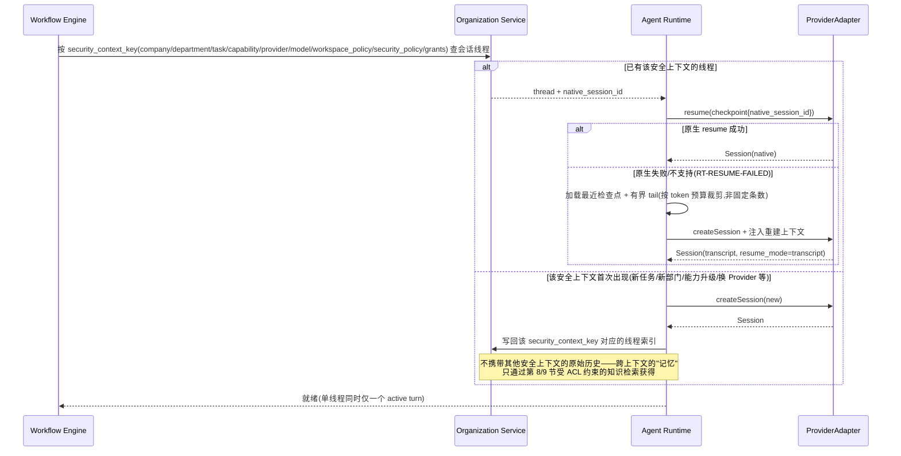
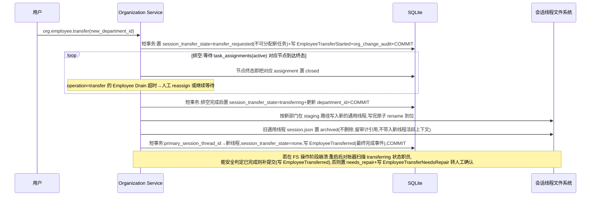
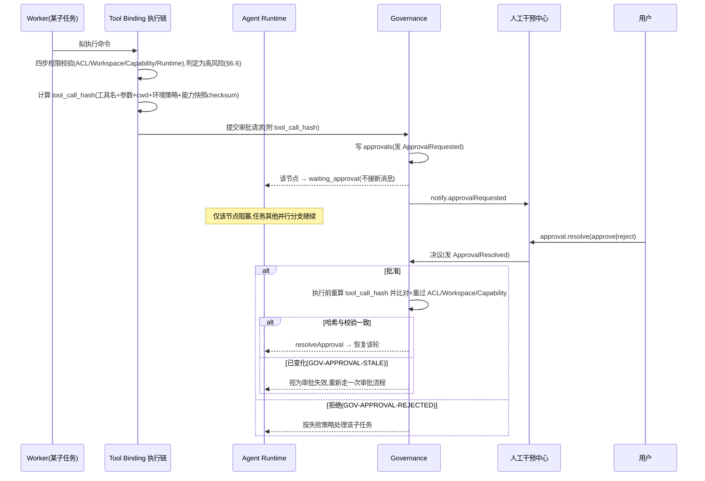
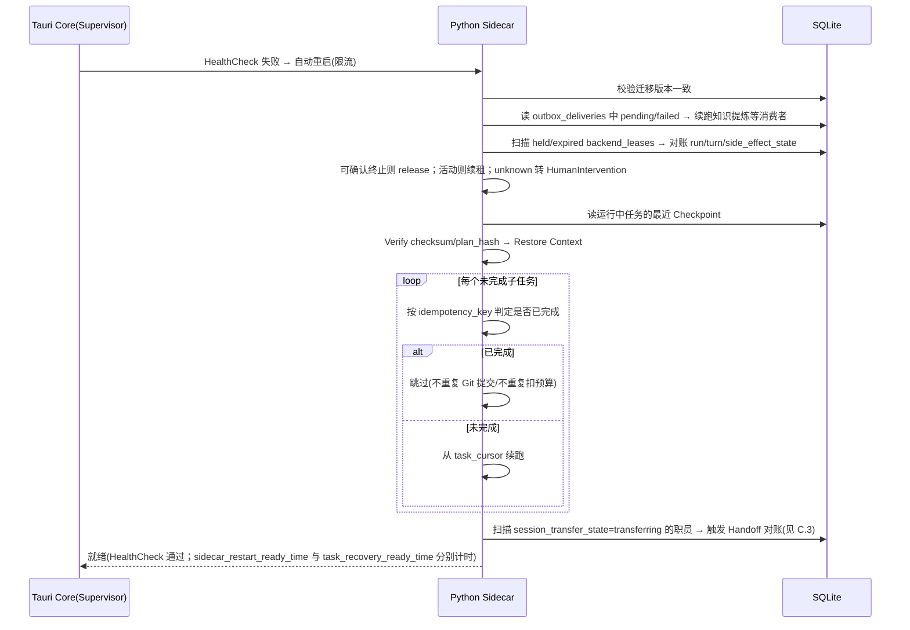
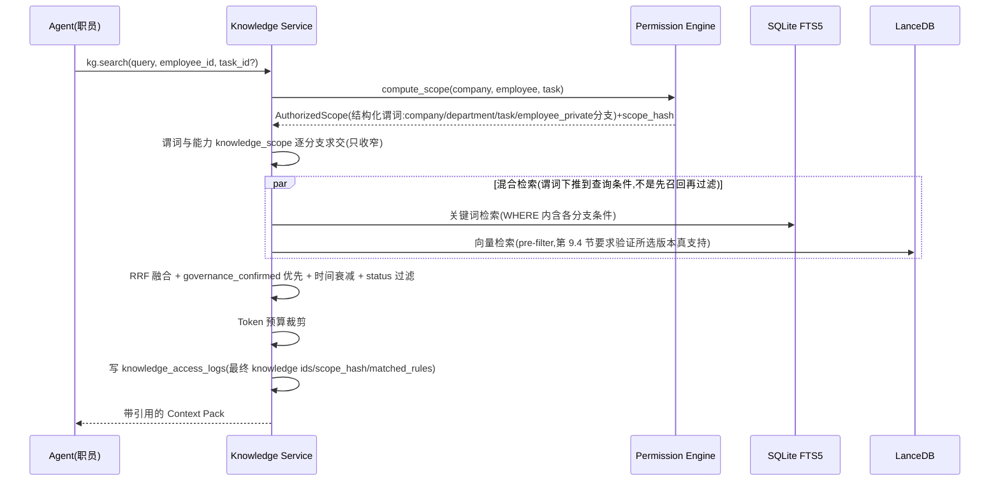

# AI 公司桌面应用设计方案（开发指导版）

## 融合 OpenSpawn 组织治理、OpenHands Agent 运行时、本地 RAG 与能力（Capability）资产化的桌面级 AI 组织平台

版本：1.0
首发平台：macOS Apple Silicon（arm64）
团队规模与周期：约 5–6 人，5 人 25 周功能基线（6 人可压缩为 24 周）+ 4 周集成/修复缓冲，目标为正式可发布产品
文档定位：本文档详尽到可直接指导第三方团队进行开发——每个核心对象给出字段、状态机、接口签名、错误码、事件与持久化契约。凡标注"后续版本/非目标"的内容明确不在首版范围。

产品定位：以"公司—部门—职员—能力—任务—知识"为核心领域模型的**本地** AI 组织运行平台，而不是多模型聊天客户端或工作流编辑器。

设计原则：
1. 组织与知识模型是产品差异化，强制在数据库与执行层落实，不靠 Prompt 约束。
2. 技术栈优先贴合 Agent / RAG 生态的实际成熟度，本地优先、单机可用。
3. 安全与权限边界一次做对且不可退让；其余精细化能力留可扩展接口，不在首版过度设计（YAGNI）。
4. 能力（Capability）是可复现的静态资产：任何能力变更都是显式的、有版本的、可回滚的，不存在运行时自动改写职员能力的路径。
5. 契约先行：模块间通过明确的接口、事件、错误码解耦；所有跨聚合写操作幂等、可审计、可恢复。

---

## 1. 参考来源与取舍

| 来源 | 采纳 | 不采纳/不绑定 |
|---|---|---|
| OpenSpawn | 声明式组织定义、层级、政策、预算理念 | 其数据模型与调度实现 |
| OpenHands Agent Canvas | UI 控制中心与 Agent Server 分离、多 Backend、会话管理 | 其偏软件开发的产品形态 |
| OpenHands Software Agent SDK | Agent/Tool/Sandbox 抽象**可选**作为代码类任务的一种 Provider 实现细节（见第 11.1、11.2 节） | 公司/部门/知识/权限模型（保持独立事实来源）；不是 Agent Runtime 的硬依赖 |
| agentflow（参考实现，不构成运行时依赖） | 仅借鉴 CLI Provider 会话持久化理念：原生 session/resume 优先、transcript+确定性摘要兜底、文件系统落盘 | 不复用其代码、进程、协议、数据目录或"一对话一 session"绑定；本项目按职员身份+安全上下文独立实现（见第 11.4 节） |

**Agent Runtime 与 OpenHands SDK 的契约边界**：本方案的 Agent Runtime（第 11.1 节）、ProviderAdapter（第 11.2 节）、Workspace（第 11.3 节）、Employee Session（第 11.4 节）都是**自研的、独立于任何第三方 SDK 的契约**——这四层接口是本方案的事实来源，任何 Provider（无论是否内部使用 OpenHands SDK）都必须实现这套契约，而不是反过来让 Runtime 去适配 OpenHands SDK 的对象模型。OpenHands SDK 的 Agent/Tool/Sandbox 抽象可以作为**某一个具体 CLI Provider Driver 的内部实现细节**（例如用它来跑代码类任务的沙箱与工具执行），封装在该 Driver 内部，对外仍然只暴露 `ProviderAdapter` 接口。是否采用 OpenHands SDK 作为某个 Driver 的内部实现，必须在 Phase 0 完成选型验证（Runtime Spike，见实施计划 Phase 0）：验证其 CLI Provider 包装、持久 Session、事件流、取消、Workspace、工具调用是否能在不破坏 `ProviderAdapter` 契约的前提下接入；验证失败则该 Driver 完全自研，不影响 Runtime 层的其他部分。

本方案吸收了成熟的契约级工程实践（统一错误码、领域事件信封、ACL 结构化查询谓词、审计、能力不可变发布、Prompt Asset 结构化、Tool Binding 校验链、Checkpoint 幂等、质量门禁），同时按本地优先、单机可托管多个相互隔离的公司、5–6 人、25 周功能基线加 4 周集成/修复缓冲的定位，明确排除云原生/分布式取向的设计（DSL、完整 Saga、分布式 HA、多租户、完整 RBAC、消息中间件、能力市场、自动进化、知识图谱等，见第 18 节非目标）。

---

## 2. 核心架构原则

- 公司是最高隔离边界：不同公司不共享职员、能力、任务、知识、记忆、文件、日志和凭据。单机可以承载多个公司，但每个公司之间零共享——"本地优先"指部署形态（不依赖远端服务），不代表只能管理一个公司。
- 部门是默认知识共享边界：同部门职员可查本部门全部历史知识；部门负责人继承本部门及所有下级部门读取权限；公司负责人可读全公司。
- 普通职员不能读平级/上级部门私有知识，除非获得显式、带过期的任务授权。
- 所有权限由数据库查询、文件访问层和执行层强制实现，不能只依赖 Prompt；权限判定必须是**结构化查询谓词**（按可见性等级分支求解），不能用"部门集合 ∩ 可见性等级列表"的扁平交集近似，否则会把"仅本人可见"和"仅任务参与者可见"错误地放宽成"部门内任何人可见"（第 8.3 节）。
- 知识检索必须先计算 ACL 再检索（Policy Before Data）；禁止先跨范围召回再让模型忽略。
- 全部对话与任务事件必须保存，但不把原始噪声直接向量化——原始事件层与可检索知识层分离；跨任务/跨安全上下文的"记忆"只通过这条受 ACL 约束的知识检索路径获得，职员会话的原始上下文不作为绕过 ACL 的隐藏记忆通道（第 11.4 节）。
- 所有知识可追溯到会话、任务、报告、文件或人工输入。
- 多 Agent 并发只用在真正省时间的环节（并行执行、并行审查、并行修复），不用在需反复说服彼此才能收敛的多轮协商上。
- Capability 决定职员"怎么做"，Runtime 决定"在哪做"，两者正交。
- 能力变更显式化：能力只能通过发布新版本改变，运行中职员用固定快照，无自动漂移路径。
- 跨聚合写操作幂等、可审计（应用层不可篡改，不代表能防御拥有本机管理员权限的攻击者）、可从 Checkpoint 恢复；崩溃不丢已确认数据、不重复已完成动作。
- 所有代表"人"的操作（审批、发布、组织变更）的操作者身份由本机唯一的 `LocalOwnerPrincipal`（第 5.6 节）在服务端注入，不信任客户端传入的身份声明；代表"某个职员在执行任务"的身份由 Task/Workflow Engine 按任务分派记录注入，不由调用方随意指定。
- 任务不天然等同于代码任务：Workspace 与合并策略按任务性质选择（代码类走 Git Worktree，通用文件/研究类走隔离目录或只读区，见第 10.1、11.3 节），不强制所有任务都走 Git 语义。

---

## 3. 总体架构

```text
┌─────────────────────────────────────────────┐
│  macOS Desktop UI（React + TypeScript）        │
└───────────────────┬───────────────────────────┘
                    │ Tauri IPC（前端不直接连数据库/网络/CLI）
┌───────────────────▼───────────────────────────┐
│  Tauri Core（Rust）                             │
│   ├─ Window / Tray / Notification              │
│   ├─ Keychain / Auto-Update / Code Signing      │
│   ├─ Sidecar Supervisor（拉起/心跳/重启/日志）    │
│   └─ Sidecar RPC Client                         │
└───────────────────┬───────────────────────────┘
                    │ JSON-RPC 2.0 over Unix Domain Socket
┌───────────────────▼───────────────────────────┐
│  Python Sidecar（本机常驻进程，AI 后端主体）        │
│   ├─ Organization Service（公司/部门/职员/权限/审计）│
│   ├─ Capability Engine（技能/能力 → 运行时装配）    │
│   ├─ Task Service（DAG/状态机/审批）             │
│   ├─ Workflow Engine（Plan→Execute→Review→Fix）  │
│   ├─ Knowledge Service（双层存储/提炼/检索）       │
│   ├─ Agent Runtime（Agent/Conversation/Tool）    │
│   ├─ Provider Adapters（CLI/API/OpenHands SDK）   │
│   └─ Outbox Worker / Embedding Worker / Metrics  │
└───────────────────┬───────────────────────────┘
                    │
┌───────────────────▼───────────────────────────┐
│  本地存储                                        │
│   ├─ SQLite（业务元数据 + FTS5 全文索引 + 事件/审计）│
│   ├─ LanceDB（向量 + 混合检索）                   │
│   └─ 本地文件系统（Workspace / Artifact / Session）│
└───────────────────┬───────────────────────────┘
                    │
┌───────────────────▼───────────────────────────┐
│  执行 Backend                                   │
│   ├─ 公司级 Backend Registry / Health / Lease    │
│   ├─ local_process（v1 正式实现）                 │
│   ├─ Workspace：Git / 文件 / 只读（独立维度）      │
│   ├─ Docker（后续版本）                          │
│   └─ Remote Agent Server（后续版本）              │
└─────────────────────────────────────────────┘
```

层次职责：**Tauri Core（Rust）只做壳**——窗口、系统集成、Sidecar 拉起监控；**Python Sidecar 承载脑**——组织/能力/任务/知识/运行时全部在此，直接复用 Python 的 embedding/reranker/文档解析/Agent SDK。Organization 决定"谁"，Capability Engine 决定"怎么做"（装配运行配置），BackendScheduler 决定"在哪个公司级本机资源池做"并取得 lease，Agent Runtime 负责实际执行。

边界原则：
- WebView 前端不直连数据库、Keychain、CLI 子进程，一切经 Tauri Core → Sidecar。
- 公司/部门/权限的事实来源在 Organization Service，Capability Engine 与 Agent Runtime 只消费不决策。
- Sidecar 无状态可重启：状态落 SQLite/LanceDB/文件系统，崩溃重启后从 Outbox + Checkpoint 恢复，不依赖内存态。

---

## 4. Sidecar 通信协议与生命周期

### 4.1 通信协议
- 传输：Unix Domain Socket（本机，不监听网络端口）。
- Socket 创建在应用私有运行目录，权限固定为 `0600`；Rust Core 与 Sidecar 启动时使用一次性 nonce 完成双向认证，握手 nonce 用后即失效。认证成功后双方在内存保存 logical IPC session id 与 resume MAC；仅当 Rust Core 与 Sidecar 两个进程均未重启时，瞬时传输断开才可在 5 分钟内由 Rust Core（不经 WebView）用该 MAC 恢复同一 logical session。IPC session 的 5 分钟恢复窗口与附录 B.7 的“每个 stream 最近 1000 条或 5 分钟”缓冲保留条件是两个同时成立的门禁：恢复 session 不保证目标 sequence 仍在缓冲，缓冲尚在也不能跨新 session 使用。任一进程重启、超过 session 窗口或 MAC 校验失败都会销毁 session 并要求全新握手；旧 stream 一律返回 `gap`，客户端通过事实查询 RPC 刷新。除当前系统用户启动的受管 Sidecar 外，其他本机进程不能建立业务 RPC 或 Credential Broker 会话。
- 编码：JSON-RPC 2.0；每个请求带 `trace_id`（贯穿全链路日志与事件），写操作带 `idempotency_key`（见第 5.3 节）。
- 流式：Server-Sent 风格 `notify` 消息（token/工具调用/状态变化），Rust Core 转发给 WebView。

### 4.2 组件生命周期接口
Sidecar 内每个长生命周期服务实现统一接口，便于 Supervisor 统一管理与优雅关闭：
```text
Initialize() -> Result      -- 建连、加载配置、迁移检查
Start()                      -- 开始接受请求/消费 Outbox
Stop()                       -- 停止接受新请求，等待 in-flight 完成
Dispose()                    -- 释放资源：关闭 DB 连接、清理临时 Worktree、关闭子进程
HealthCheck() -> HealthStatus -- 供 Tauri 心跳探活
```
`Pause`/`Resume`（如低电量、用户主动暂停后台任务）不是首版范围：v1 没有对应的产品需求，加了也没人调用；见第 18 节非目标。若后续要支持，直接在这套接口上加，不影响已有实现。

### 4.3 进程生命周期（Rust Core 职责）
```text
App 启动 → 校验 Sidecar 与 App 版本一致（内嵌版本号，不允许漂移）
  → 拉起 Sidecar，传入 Socket 路径与数据目录
  → 等待就绪心跳（超时重试，超上限提示用户）→ 建立 RPC
运行中 → 每 N 秒 HealthCheck
  → 崩溃 → 自动重启（限流：短时内多次崩溃则停止自动重启并告警）
  → 恢复后：Outbox 续跑 + 从最近 Checkpoint 恢复运行中任务（第 10.5 节）
App 退出 → 优雅关闭：Stop → 等 in-flight 写完 Outbox → Dispose，超时强杀
```

### 4.4 打包（首版最先验证）
- Sidecar 用 PyInstaller / `uv` 冻结环境打包为单一可执行文件，随 Tauri 签名公证，不要求用户装 Python。
- native 依赖（ONNX Runtime、LanceDB、tokenizers）显式 `--collect-all` 并逐一验证 arm64 可加载；打包体积数百 MB 属预期。
- 本地 embedding 权重随资源目录分发或首次运行下载，不进可执行文件。
- v1 必须交付 Claude Code CLI Driver（用户自装官方 CLI）和 OpenAI API Driver；Sidecar 探测 CLI，未安装/未登录时展示原因并走降级。Cursor/OpenCode/Codex/Gemini CLI 与 DeepSeek/智谱/MiniMax/OpenAI-Compatible Driver 属扩展项，不计入 v1 完成条件。

### 4.5 关键性能门禁（需按真机实测校准，测试基线：Apple Silicon M 系列、16GB 内存、本地数据规模约 1 万条知识 / 100 个职员）
每项指标标注类型：`release_gate`（未达标阻止发布，第 17 节质量门禁强制检查）或 `observational`（记录实测数值，用于后续优化，不阻止发布）。指标需测 p95（除非说明为单次场景），且必须区分以下两组不能混为一谈的时间：**进程级恢复**（Sidecar 子进程本身重新可用）与**任务级恢复**（某个正在执行的任务从 Checkpoint 恢复到继续执行，耗时随任务规模变化，不是常数）。

`release_gate` 采用二元裁决：在表中基线机器和数据规模上跑 3 个相互独立的测试轮次，每轮至少 30 个有效样本；阈值为严格上界，任一轮 p95 大于或等于阈值即失败。临界超标不允许在 Go/No-Go 现场降级为 `observational` 或人工豁免，只能优化后重测，或在发布前通过正式设计变更同步修改本节、实施计划与验收证据。环境故障导致的无效样本必须有机器日志证明并整轮重跑，不能选择性删除慢样本。

| 指标 | 目标 | 类型 |
|---|---|---|
| `sidecar_restart_ready_time`：Sidecar 子进程崩溃后重启到能接受 RPC（不含任务恢复） | < 3 s | release_gate |
| `task_recovery_ready_time`：单个运行中任务从最近 Checkpoint 恢复到继续调度下一步（不含该步本身的执行耗时） | < 10 s（小任务，≤10 节点） | observational（v1 先记录数据，积累基线后转 release_gate） |
| `thread_lookup_and_dispatch_time`：从收到请求到完成线程索引查找、安全上下文校验并向 ProviderAdapter 发起调用（不含 Provider 进程启动/网络） | < 500 ms | release_gate |
| Checkpoint 写入 | < 100 ms | release_gate |
| `provider_fallback_selection_time`：已知当前 Provider 不可用后，基于缓存的 Availability/Capability Matrix 选出替代 Provider（不含外部探测） | < 200 ms | release_gate |
| `provider_native_resume_e2e_time`：原生 session resume 的端到端耗时，按 Provider、冷/热启动、网络环境分别记录 | 记录 p50/p95 | observational |
| `provider_probe_e2e_time`：Provider 安装/认证/网络探测端到端耗时，按 Provider 与网络环境分别记录 | 记录 p50/p95；每个 Adapter 配置有界超时 | observational |
| `backend_slot_acquire_time`：使用缓存健康状态完成 Backend 选择并原子取得空闲 lease（不含排队/主动探测） | < 50 ms | release_gate |
| `local_backend_probe_time`：检查本机 workspace、worker handshake 与进程池可用性（不含 Provider 网络） | < 500 ms | release_gate |
| `permission_compute_scope_time`：`compute_scope()` 纯策略计算（不含审计写入，第 8.3 节） | < 10 ms | release_gate |
| `permission_authorize_and_audit_time`：`authorize()` 对具体 resource/action 判定并写 `acl_audit_log` | < 30 ms | observational |
| `knowledge_access_audit_write_time`：Context Pack 生成后写 `knowledge_access_logs` | < 30 ms | observational |

### 4.6 Sidecar 内并发调度
Sidecar 主事件循环是单进程 asyncio，只负责 I/O、状态机与调度；**真正的并发隔离通过独立进程/线程池实现，不能只靠 asyncio 任务优先级**——CPU 密集型工作（embedding 推理、Tree-sitter 解析、大文档分块）若直接跑在主事件循环里，会阻塞所有其他协程，"优先级更低"并不能防止这种阻塞。四层约束：
- **CPU 密集型工作进程隔离**：本地 embedding 推理、Tree-sitter 解析、分块统一放进受限的 `ProcessPoolExecutor`（或独立 worker 子进程），主事件循环只做任务分发和结果回收，不在主循环里直接跑同步 CPU 计算。
- **全局子进程池**：所有 CLI Provider 子进程与 Git 操作走统一进程池。Rust Core 启动时从应用只读默认配置读取 `global_process_limit`；未配置时取 `clamp(logical_cpu_count, 2, 16)`，显式值仅允许 `1..64`。Rust 校验后通过已认证的 Sidecar bootstrap 消息注入，Sidecar 只读保存并拒绝运行期修改；WebView、业务 RPC、公司设置和环境变量均不能覆盖。本次进程生命周期内该值固定，超出排队（队列语义 Ready/Waiting/Retry/DeadLetter，见第 10 节）。
- **Backend 与全局双层限流**：每个 Backend 的 `concurrency_limit`（§6.11）和全应用 `global_process_limit` 都是硬上限。Workflow/Session 调度器必须先写持久化 `backend_queue_entry`，再由同一个 SQLite 事务同时检查“目标 Backend held 数”和“全部 Backend held 总数”后取得 `backend_lease`，之后才能启动执行；满载/不健康时任务节点保持 `ready`、会话线程保持 `waiting_backend`，原因来自队列表，不得先启动后补记槽位。单个 Backend 内严格按 `(queued_at, queue_id)` FIFO；存在全局空槽时，从各个健康且未达自身上限 Backend 的队首中选全局最早者，避免 Workflow/Session 或某个 Backend 饥饿。
- **上下文线程级串行**：单个会话上下文线程同时只有一个 active turn（§11.4），是并发模型的最内层约束；并行来自"多个不同职员/不同上下文线程同时工作"。

需要一项前台延迟不受后台批处理影响的性能测试：后台知识提炼/embedding 批量运行时，前台交互式对话的响应延迟不应显著上升（`observational`，first release 记录基线）。

### 4.7 备份与恢复
Sidecar 数据目录（SQLite + LanceDB + `employee_sessions/`）支持导出为单个**跨存储一致**的加密备份快照——不是"分别复制三份互不同步的数据再打包"：

- **备份流程（全局 snapshot barrier，短暂阻塞写入，不是长时间停机）**：
  1. 冻结：拒绝新写入请求（短暂重试报 `SYS-BACKUP-IN-PROGRESS`），暂停领取新的 outbox delivery，要求 active turn 在安全边界落 Checkpoint 后暂停，并等待正在进行的数据库事务、当前 delivery 与投影写入在有界超时内完成。任何 writer 未在期限内 quiesce 时，本次快照以 `SYS-BACKUP-QUIESCE-TIMEOUT` 失败并解除冻结，绝不“强制落一次检查点后带着仍在写的执行器继续打包”。
  2. 记录统一的单调递增 `snapshot_epoch`：SQLite 用在线备份 API 生成一致性快照；LanceDB 按公司冻结/固定各自当前 active generation（尚无索引的公司无条目；之后的新写入走 COW 进入下一代，不污染本次快照）；会话文件目录 flush 并记录每条线程此刻的 `last_checkpoint_offset`。
  3. 解冻：恢复正常写入（新写入自然落入下一个 `snapshot_epoch` 之后的状态）。
  4. 打包：三部分数据均取自步骤 2 记录的同一个 `snapshot_epoch`，写入完整性 manifest（每文件 hash、`app_version`、`schema_version`、按 company_id 排序的 LanceDB active generation 列表、事件/checkpoint watermark、`snapshot_epoch`）。
  5. 加密：备份包用独立随机数据密钥（DEK）加密，DEK 由 Rust Keychain 中的主密钥包装（envelope encryption）后随 manifest 一起存放；备份文件权限收紧为仅当前系统用户可读。
- **恢复流程**：先离线校验 manifest（逐文件 hash、`schema_version` 兼容性——不兼容则先跑迁移或拒绝恢复并提示）→ 停止 Sidecar 写入 → 仅整体替换 manifest 明确列出的业务数据根（SQLite/LanceDB/会话投影），不得覆盖 Rust `system/`、Keychain 或第 4.8 节更新 journal → 重启 Sidecar → 跑一次跨存储 reconciler，核对 SQLite/LanceDB/会话文件三者的 watermark 确实同属恢复包记录的那个 `snapshot_epoch` → 校验通过才对外开放写入；不通过则自动回退到下方的"恢复前快照"并报 `SYS-BACKUP-INCONSISTENT`，不允许带着不一致状态继续运行。
- 恢复是全量覆盖式的（不支持增量合并恢复），恢复前默认对当前数据目录再做一次"恢复前快照"，避免恢复操作本身不可逆。
- **保留与删除**：默认保留最近 5 份且不超过 30 天（通过 `settings.backupPolicy.get/update` 配置），超出的旧备份自动清理；提供 `settings.backup.delete(backup_id)`（单份删除）与"立即删除全部历史备份"入口；一旦 Keychain 主密钥被删除或设备重置，所有历史备份均不可再解密——这是设备丢失/淘汰场景下销毁备份数据的手段之一，但不能替代显式删除。
- 备份/恢复只覆盖应用自身数据目录，不涉及用户代码仓库（Git Worktree 里的用户文件由 Git 自身管理，不纳入本应用备份范围）。

备份事实表由 `0002c_snapshot_epochs_backups.sql` 建立，字段与约束固定为：
```text
snapshot_epochs:
  snapshot_epoch(INTEGER PK AUTOINCREMENT), state(creating|ready|failed),
  sqlite_event_watermark, outbox_delivery_watermark, lancedb_generation_map_json,
  session_watermarks_json, barrier_started_at, captured_at?, failure_code?

backup_manifests:
  backup_id(UUID PK), snapshot_epoch(FK UNIQUE), kind(scheduled|manual|pre_update|pre_restore),
  app_version, schema_version, archive_path, manifest_sha256, encrypted_archive_sha256,
  wrapped_dek, file_count, total_bytes, status(creating|available|restoring|deleted|failed),
  created_at, completed_at?, deleted_at?, delete_reason?
```
`session_watermarks_json` 是按 `(company_id,employee_id,security_context_key)` 稳定排序的 `last_checkpoint_offset` 列表；`lancedb_generation_map_json` 是按 company_id 排序的 `[{company_id,generation_id}]`，逐公司记录快照时的 active generation，尚无索引的公司不出现，禁止用一个 generation 代表全部公司。只有 `snapshot_epochs.state=ready` 且 manifest/加密归档两个 hash 均已写入的记录才能转为 `backup_manifests.status=available` 并被 `settings.backup.list/restore` 看见。失败中的临时归档不可见且由恢复器清理；`snapshot_epoch` 永不复用。

### 4.8 自动更新与回滚
- 更新元数据使用离线发布私钥签名的 manifest，至少包含 `version/channel/package_sha256/bundle_id/team_id/min_schema_version/published_at`；应用内固定信任公钥和发布 channel。安装前必须依次校验 manifest 签名、包 SHA-256、版本单调递增、bundle id、macOS code signature 与 Team ID，任一不匹配均拒绝安装。密钥轮换采用旧/新公钥双签过渡，防止单纯替换下载源和 hash 即绕过发布者认证。
- 更新由 Rust Updater 编排为一笔带 `update_transaction_id` 的状态机：`downloaded → quiescing → backed_up → migrated → observing → committed`，失败支线为 `rolling_back → rolled_back | needs_repair`。更新前保留上一个可用版本的 Sidecar 可执行文件与 Tauri 应用包，并创建与该事务绑定的 `pre_update_backup_id`。
- 更新状态写入 Rust Core 独占的原子 journal（应用数据目录 `system/update-transactions/<id>.json`，临时文件 + fsync + rename，目录 `0700`），位于 Sidecar 业务 SQLite 和 `pre_update_backup` 的恢复集合之外；因此恢复旧数据库不会抹掉 `rolling_back` 状态。journal 带 CAS version、目标/来源版本、manifest hash、签名者/channel、pre_update_backup_id、失败点和最近安全动作；Rust 是唯一写者，`settings.update.status` 只读投影。journal 终态按发布保留策略归档，不能在 rollback/needs_repair 中清理。
- 执行顺序：停止接收新写入并排空当前事务 → 创建第 4.7 节的一致快照 → 安装新二进制 → 执行 Forward-only 迁移 → 启动新版本 → 运行 schema/data canary、Sidecar `HealthCheck`、RPC 握手与最小读写检查 → 进入有界观察窗口。全部检查通过后才置 `committed` 并允许清理旧二进制与升级前快照。
- 在 `migrated/observing` 阶段发生任何失败（包括迁移已成功但 Runtime 初始化、Provider/Backend Registry、Backend lease reconciler、RPC 握手或后续健康检查失败），必须先停止新版本，再恢复该事务绑定的 `pre_update_backup_id`，最后启动旧版本；禁止让旧二进制直接读取已经迁移的新 schema。
- 回滚恢复失败时置 `needs_repair`，保持写入关闭并进入人工干预中心；不得在数据版本不确定时反复自动启动新旧二进制。更新事务与备份恢复均需幂等，应用重启后可从持久化状态继续。

---

## 5. 跨领域契约（错误码 / 事件 / RPC / 持久化 / 审计）

这一节是各模块共享的横切规范，先定义清楚，后续各领域引用。

### 5.1 统一错误码体系
所有错误对象四字段，跨 RPC 与日志一致：
```text
{ code: string, message: string, cause?: string, suggestion?: string, trace_id: string }
```
`code` 采用模块前缀命名空间，便于定位与聚合告警：
```text
ORG-*   组织与权限（如 ORG-PERM-DENIED, ORG-DEPT-CYCLE）
CAP-*   能力与技能（如 CAP-VERSION-IMMUTABLE, CAP-SNAPSHOT-CHECKSUM-MISMATCH）
WF-*    工作流与任务（如 WF-BUDGET-EXCEEDED, WF-FIX-MAX-ROUNDS）
RT-*    运行时与会话（如 RT-SESSION-BUSY, RT-RESUME-FAILED）
PROV-*  Provider（如 PROV-UNAVAILABLE, PROV-AUTH-INVALID）
BACKEND-* 本机执行 Backend（如 BACKEND-UNAVAILABLE, BACKEND-CAPACITY-FULL）
KG-*    知识与 RAG（如 KG-EXTRACT-FAILED, KG-EMBED-VERSION-MISMATCH）
GOV-*   治理（预算/审批/安全，如 GOV-APPROVAL-REJECTED）
SYS-*   Sidecar/系统（如 SYS-SIDECAR-CRASH, SYS-MIGRATION-FAILED）
```

### 5.2 领域事件与 Transactional Outbox
统一事件信封（append-only，写入 `domain_events` 表，**不可变的业务事实记录**）：
```text
event_id(UUID), company_id, event_type, aggregate_type, aggregate_id, aggregate_version,
task_id(NULLABLE), employee_id(NULLABLE), run_id(NULLABLE),
occurred_at, trace_id, actor_type(local_owner|employee|system), actor_id, payload(JSON), metadata(JSON)
```
`company_id` 是强制租户分区键；可选的 task/employee/run 维度是不可变的索引列，不依赖解析 payload 才能完成租户隔离和读模型过滤。`actor_type/actor_id` 的取值来源是服务端注入而非客户端参数：UI 发起的操作（发布、调岗、审批、创建公司等）由 `LocalOwnerPrincipal.id`（第 5.6 节）填充；Agent 执行任务过程中产生的事件由 Task Service 按活动 assignment 注入。任何 RPC 都不接受“我现在代表谁”这种可被调用方随意声明的 actor 参数。

`domain_events` 本身**不是投递队列**，只是不可变事实。投递/消费状态单独用 `outbox_deliveries` 表承载：
```text
delivery_id(UUID), event_id(FK), consumer_name, status(pending|delivered|failed),
attempt_count, next_retry_at, last_error, created_at, updated_at
```
关键约束：
- **同事务写入**：领域状态变更、其 `domain_events` 记录、以及初始的 `outbox_deliveries` 记录在同一 SQLite 事务内提交（一个聚合一次事务）。
- **幂等消费**：每个 consumer 按 `(event_id, consumer_name)` 去重，配合聚合 `version` 防重复处理；重试只更新 `outbox_deliveries`，不改写 `domain_events`。
- **事件驱动关键流程**：例如调岗由具名事件 `EmployeeTransferStarted` 驱动排空与 Handoff（第 11.4 节），完成后写 `EmployeeTransferred`（无法安全判定完成则写 `EmployeeTransferNeedsRepair`），而非隐式代码调用，可追溯、可重放。

首版组织状态转换必须使用下列具名事件；同一事务写业务行、事件、初始 delivery 和 `org_change_audit`，任何一步失败都整体回滚：
```text
组织：CompanyCreated, CompanyActivated, CompanyDissolutionStarted, CompanyDissolved,
      DepartmentCreated, DepartmentLeaderChanged, DepartmentMoved, DepartmentFrozen,
      DepartmentUnfrozen, DepartmentArchived, EmployeeCreated, EmployeeManagerChanged,
      EmployeeDrainStarted, EmployeeDrainCompleted, EmployeeDrainNeedsRepair,
      EmployeeTransferStarted, EmployeeTransferred, EmployeeTransferNeedsRepair,
      EmployeeActivated, EmployeeSuspended, EmployeeResumed, EmployeeArchived,
      EmployeeCapabilityUpgraded, AccessGranted, AccessRevoked
能力：SkillPublished, SkillDeprecated, PromptAssetPublished, PromptAssetDeprecated,
      CapabilityPublished, CapabilityDeprecated, CapabilitySnapshotBound
任务：TaskCreated, PlanGenerated, PlanApprovalRequested, PlanApproved, SubtaskStarted, SubtaskCompleted, ReviewCompleted,
      FixRoundCompleted, TaskCompleted, TaskCancellationStarted, TaskCancelled, TaskEscalatedToHuman
运行：SessionCreated, TurnStarted, TurnCompleted, ApprovalRequested, ApprovalResolved,
      SessionArchived
知识：KnowledgeExtracted, KnowledgeSuperseded, KnowledgeRejected, HardDeletionPerformed, IndexRebuilt
Backend：BackendCreated, BackendUpdated, BackendDefaultChanged, BackendEnabled,
         BackendDraining, BackendDisabled, BackendArchived, BackendHealthChanged,
         BackendRecoveryRequired, BackendRecoveryResolved
治理：BudgetThresholdHit, BudgetApprovalRequested, BudgetLimitChanged, HighRiskCommandBlocked,
      ProviderHardBudgetFrozen, ProviderHardBudgetUnfrozen
```
Outbox 仅作本机可靠投递与审计/可观测用途，**不引入 Kafka/NATS/通用 EventBus**——单机进程内不需要分布式消息中间件。

### 5.3 RPC 契约约定
- RPC 请求的 `trace_id` 可选；未提供时由 Sidecar 在进入业务 handler 前生成并回传，后续日志、事件、审计和通知统一携带该值。RPC schema 必须显式声明 `is_write`、`retry_failed` 与幂等保留窗口，禁止通过方法名猜测；`is_write=true` 的方法必须携带 `idempotency_key`。
- Sidecar 使用 `rpc_idempotency_records(company_id, actor_type, actor_id, method, idempotency_key, request_hash, status(processing|succeeded|failed), response_ref?, error_ref?, created_at, updated_at, expires_at, version)` 去重；唯一键为 `(company_id, actor_type, actor_id, method, idempotency_key)`。`request_hash` 是去除 `trace_id` 后的规范化 DTO 摘要：同键同 hash 在 `succeeded/failed` 时重放原结果/错误，在 `processing` 时返回同一 operation reference；同键不同 hash 返回 `SYS-IDEMPOTENCY-CONFLICT`，不同公司或主体永不共享结果。`processing→succeeded|failed` 由 CAS 完成，失败是否允许在同一 key 下重新占有由方法 schema 的 `retry_failed` 明确声明；过期后视为新请求，但审计记录继续保留。
- 请求/响应用 DTO，与内部实体解耦（DTO 变更不直接牵动表结构）。
- 所有返回集合的 `*.list`/查询方法使用统一游标分页：请求带 `page{cursor?:string,limit:int=50}`，`limit` 只允许 `1..200`；响应为 `{items:[],next_cursor?:string,has_more:bool}`。游标是服务端签名的 opaque 值，绑定 method/company/subject/filter_hash/sort_key；默认按 `(created_at DESC, primary_id DESC)` 稳定排序，游标过期、篡改或与当前过滤条件不匹配返回 `SYS-PAGE-CURSOR-INVALID`，不接受 offset/page-number。附录 B.0 定义各方法的过滤字段白名单，白名单外字段按校验错误拒绝，不静默忽略。
- 错误统一返回 5.1 的错误对象。
- `stream_id` 是服务端分配的 opaque UUID，客户端不得创建或复用。流式请求被接受后，服务端先返回 `stream_started{stream_id, aggregate_type, aggregate_id}`，后续 `notify` 才使用该 id；`session.sendMessage` 每个已接受的 `session_turn_id` 对应一个新 `stream_id`，任务/知识/Backend 等后台通知则由 Rust Core 建立内部订阅时按 `(IPC session, topic, aggregate_id)` 分配。`sequence` 从 1 开始并在单个 stream 内递增。补发请求必须同时携带原 `stream_id` 与 `resume_from_sequence`，只在同一 Sidecar 进程、同一已认证 IPC 会话和缓冲保留窗口内有效；进程或 IPC 会话变化、越权 aggregate、缓冲过期均返回 `gap`，客户端随后用对应查询 RPC 刷新事实状态。不同请求或 topic 的 stream 不拼接，也不共享 sequence。

### 5.4 持久化通用规范
可变聚合与资源表带以下通用列：
```text
created_at, updated_at
version              -- 乐观锁；更新用 CAS（WHERE version = ? 命中才写，防调岗/改组织并发覆盖）
deleted_at, deleted_by, delete_reason   -- 软删除（不物理删除组织/知识/会话资产）
```
append-only 事实/审计表（`domain_events`、`conversation_events`、`provider_model_prices`、`backend_health_checks/backend_health_daily`、五类业务审计、`usage_records` 及证据 ledger）只带 `created_at/occurred_at` 与自身不可变主键，不带可被业务更新的 `updated_at/version/deleted_*`；业务 repository 禁止 update/delete。投递、幂等、审批、Backend queue/lease 等状态表不是 append-only，保留 CAS version/updated_at，但不能用软删抹掉其引用的事实。删除例外只有三类专用最小权限服务：第 5.5 节 RetentionCompactor；第 6.11 节健康记录聚合清理；第 9.1 节 LocalOwner 明确发起的合规硬删除。合规删除可按 source 删除内容型 conversation/domain event 与派生行，但必须在同一事务先写不含正文的 `HardDeletionPerformed` 事件和 governance audit（记录 company/source ids、行数、hash、reason），禁止通用 repository 获得 delete API。三类例外优先于“默认通用列”的简写。
迁移规范：生产环境**只前向迁移（Forward-only）**——升级前自动做一次第 4.7 节的备份，迁移失败则从该备份恢复，不依赖迁移脚本自带的 `down` 来"回滚"生产数据（`down` 脚本只在开发阶段、迁移尚未随任何版本发布前使用，帮助开发者迭代还没定型的迁移，一旦随版本发布就不再允许该迁移被回滚，只能靠"备份恢复"整体退回）。迁移脚本本身要求幂等（重复执行同一已应用迁移是 no-op）。发布前必须通过"备份 → 迁移 → 校验 → （模拟失败）→ 从备份恢复"的演练，且演练数据必须是带真实历史数据的副本，不能只用空库建表验证（见第 17 节）。

### 5.5 审计
五类业务 append-only 审计共同覆盖具体鉴权、知识查询、知识治理、组织变更和 Backend 变更。业务 API 不提供修改/删除接口——这是"应用层不可篡改"，不是"物理不可篡改"：拥有本机管理员权限、能直接操作数据库文件的攻击者不在本方案的威胁模型内；若需要检测这类篡改，可选增加启动时的哈希链/HMAC 完整性校验，v1 不做，见第 18 节。五类审计如下：
1. `acl_audit_log`（鉴权判定留痕）
2. `knowledge_access_logs`（知识检索/浏览结果留痕）
3. `knowledge_governance_audit`（知识治理操作留痕）
4. `org_change_audit`（组织变更留痕）
5. `backend_change_audit`（Backend 变更留痕）

唯一的保留压缩入口是专用 `RetentionCompactor`：仅处理超过 90 天、`decision=allow` 且没有引用的 `acl_audit_log` 和 `knowledge_access_logs` 明细（即上述第 1、2 类）。引用事实由 append-only 的 `audit_record_refs(ref_id, company_id, audit_table, audit_id, ref_type(evidence|citation|checkpoint|incident), ref_id_value, created_at)` 维护：创建证据、引用、Checkpoint 或 incident 时，与其事实行在同一 SQLite 事务插入引用边；Compactor 只接受对该表做 `NOT EXISTS` 反连接的候选，禁止扫描 JSON/payload 猜测引用。在同一事务先写不可变日聚合与 `audit_compaction_manifests(source_table, company_id, time_range, source_count, source_merkle_root, aggregate_ids, compacted_at)`，校验计数/root 后才物理删除对应明细。deny、knowledge governance、org audit 和任何被引用记录永久不进入该路径。Compactor 使用独立最小权限连接且不可由 RPC/UI 指定任意条件；失败事务不删源记录。

- `acl_audit_log`：`authorize()` 对**具体** `resource/action` 的判定留痕——`subject(employee_id), company_id, resource_type, resource_id, action, decision(allow|deny), matched_rule, scope_hash, trace_id, timestamp`。适用于工具、Workspace、组织资源、单条知识详情等逐资源访问；不存在尚未检查资源就写一条笼统 allow 的路径。`decision=deny` 明细长期保留；`decision=allow` 明细默认保留 90 天，之后允许压缩为不可逆的按天聚合统计。表带 `(subject, timestamp)`、`(resource_type, resource_id, timestamp)` 与 `(decision, timestamp)` 索引。
- `knowledge_access_logs`：记录批量检索/浏览的实际结果——`id, company_id, operator(NULLABLE), subject, action(search|list|get|citation|context_pack), query_hash, scope_hash, result_knowledge_ids(JSON), result_count, decision, matched_rules(JSON), trace_id, timestamp`。UI view-as 时同时记录 LocalOwner operator 与被查看的 employee subject；任务内部调用 operator 为空、subject 由 assignment 注入。`result_knowledge_ids` 只记录最终返回给调用方的 Context Pack/分页结果，拒绝请求记录空结果与拒绝规则。allow 明细 90 天后可压缩，deny 明细长期保留。
- `knowledge_governance_audit`：知识来源删除、条目拒绝/确认与摄取重试等管理操作留 `id, company_id, resource_type, resource_id, action, before_snapshot, after_snapshot, operator, reason, trace_id, timestamp`；明细长期保留。
- `org_change_audit`：组织变更（公司、部门、领导、汇报关系、职员、授权、能力升级）留 `id, company_id, aggregate_type, aggregate_id, action, before_snapshot, after_snapshot, operator, reason, trace_id, timestamp`；`operator` 由服务端注入 `LocalOwnerPrincipal.id`，不接受客户端传参。按 `(company_id,timestamp)`、`(company_id,aggregate_type,aggregate_id,timestamp)` 建索引。
- `backend_change_audit`：Backend 创建/配置/默认切换/lifecycle 变化及人工恢复留 `id, company_id, backend_id, action, before_snapshot, after_snapshot, operator, reason, trace_id, timestamp`；探测明细进入 `backend_health_checks`，仅健康状态变化同时写具名事件，避免每 30 秒制造治理审计噪声。该表长期保留，不进入 allow 明细压缩。

### 5.6 本地身份主体（LocalOwnerPrincipal）
本方案 v1 是单机单操作者应用（一个人在自己的电脑上管理一个或多个公司），不做多用户账户体系，但所有需要"谁批准的/谁操作的"字段（发布、审批、组织变更、公司解散）都需要一个明确、不可被客户端伪造的操作者身份：
```text
local_owner: owner_id(本机首次启动时生成的 UUID，保存在 SQLite `local_owner` 单行表), display_name, created_at
```
- `owner_id` 只在本机生成一次，后续所有 `actor`/`operator`/`approved_by` 字段引用它，不接受任何 RPC 参数覆盖。
- 这不是一个可扩展的多用户表；如果后续版本要支持多操作者/远程协作，才需要引入真正的用户/角色体系（属于第 18 节非目标）。
- Agent 代表某个职员执行任务时，事件的 `actor` 字段是该职员的 `employee_id`（来自 Task Service 按任务分派记录注入），不是 `LocalOwnerPrincipal`——两者语义不同：`LocalOwnerPrincipal` 代表"人在做管理操作"，`employee_id` 代表"哪个 Agent 身份在执行任务"。

### 5.7 跨领域 HumanIntervention 基础设施

公司解散、Employee Drain、Backend 恢复在任务工作流建表前就会产生人工干预，因此 `human_interventions` 是 Phase 1 的跨领域事实，不属于后置的 Workflow migration。统一 repository 只负责公司隔离、open 唯一、CAS resolve 与审计关联，不解释领域动作；Organization、Task、Governance、Backend 各自拥有 subtype 状态机和 allowed actions。`task_id/node_id/run_id` 均可空并作为 opaque 引用，相关表存在后由领域 adapter 校验同公司；`target_ref` 承载 company dissolution、drain、lease 等稳定目标。任何 UI/RPC 都不得直接改表或自行推断允许动作。

---

## 6. 核心领域模型

所有可变聚合/资源表默认带第 5.4 节通用列，下文不重复列出；append-only 表使用第 5.4 节定义的不可变记录基类。

### 6.1 Company
```text
company_id, name, code, description
root_workspace, root_department_id
knowledge_policy_id, embedding_policy_id, security_policy_id
default_provider_policy, default_budget_policy
status: initializing | active | dissolving | dissolved
```
公司引用的三类策略表字段与 v1 默认值固定为：
```text
knowledge_policies:
  policy_id, company_id, version,
  extraction_provider_id?, extraction_model?, extraction_mode(local|cloud),
  fallback_mode(local|pause), allow_cloud,
  consent_version?, consented_at?, consented_by?,
  status(active|superseded), created_at
  default = {version:1, provider/model:null, extraction_mode:local,
             fallback_mode:pause, allow_cloud:false, consent*:null, status:active}

embedding_policies:
  policy_id, company_id, version, model,
  execution_mode(local|cloud), allow_cloud,
  consent_version?, consented_at?, consented_by?, active_generation_id?,
  status(active|superseded), created_at
  default = {version:1, model:"BAAI/bge-m3",
             execution_mode:local, allow_cloud:false, consent*:null,
             active_generation_id:null, status:active}

security_policies:
  policy_id, company_id, policy_version, sandbox_mode(policy_guard),
  allowed_commands_mode(inherit_tool_bindings|restrict), allowed_commands[], denied_commands[],
  high_risk_actions(shell_write_outside_workspace|network_write|credential_access|process_spawn_unlisted)[],
  approval_policy(always_for_high_risk), status(active), version, created_at
  v1 default = {policy_version:1, sandbox_mode:policy_guard,
                allowed_commands_mode:inherit_tool_bindings, allowed_commands:[], denied_commands:[],
                high_risk_actions:[shell_write_outside_workspace,network_write,credential_access,
                                   process_spawn_unlisted],
                approval_policy:always_for_high_risk,status:active,version:1}
```
KnowledgePolicy/EmbeddingPolicy 每公司各只允许一条 active，`UNIQUE(company_id,version)`。设置更新必须携带读取结果中的 `expected_policy_version`，总是在单个事务中以旧 active version 做 CAS，新增 `version+1` active、把旧版置 superseded、更新 Company pointer 并写治理审计，不就地覆盖旧版；并发请求只有一个成功，其余返回 `SYS-OPTIMISTIC-LOCK-CONFLICT`。任一策略的 cloud 模式都要求 `allow_cloud=true`，且 consent_version 等于新策略 version，`consented_at/consented_by` 由服务端注入；否则拒绝激活。撤回同意创建 `allow_cloud=false` 的新版并停止新云端 job，旧版与审计保留。Embedding `model` 必须精确匹配签名 `embedding-models.json` 的模型键，revision/dimension/hash 从该 manifest 锁定；默认值是本地 1024 维的 `BAAI/bge-m3` 条目。SecurityPolicy 在 v1 仅由 bootstrap 创建，无公共修改 RPC；`inherit_tool_bindings` 表示 effective allowed commands 直接取当次能力快照 ToolBinding 允许集，`restrict` 表示再与 `allowed_commands` 取交集，然后减去 `denied_commands`。

规则：`org.company.create` 执行可重入 bootstrap：在单个 SQLite 事务内创建 `Company(status=initializing)`、根部门、默认 KnowledgePolicy、EmbeddingPolicy、SecurityPolicy、公司行内的 `default_provider_policy/default_budget_policy`、对应审计与 `CompanyCreated` Outbox 记录；首版不另建 `provider_policies`/`budget_default_policies` 表。`default_provider_policy` 固定 schema 为 `{free:ProviderModelRef|null, standard:ProviderModelRef|null, premium:ProviderModelRef|null}`，其中 `ProviderModelRef={provider_id:UUID, model:string}`，三个键必须全部存在，未配置档位显式为 `null`；每个非空引用必须是全局内置模型或当前公司私有模型，且 `provider.tierMapping.update` 只原子替换一个 tier 后保存完整三键对象。`default_budget_policy` 固定 schema 为 `{currency:ISO-4217, default_limit_micros:int64>=0, default_on_budget_exceeded:downgrade|require_approval|abort}`。新公司的 `embedding_policies.active_generation_id` 初始固定为 `NULL`，首次索引 generation 完成全量校验后才按第 9.5 节原子设置。`root_workspace` 由 Sidecar Path Broker 在 Rust 启动参数提供的应用数据根目录下预留，事务失败时只清理本次预留的空目录。重复相同幂等请求返回同一 company，不会产生第二个根部门或默认策略。创建公司时职员/能力体系尚不存在，因此根部门 `leader_employee_id` 暂空。

`org.company.activate` 是首任公司负责人的唯一创建入口：参数携带已发布的 template/capability 选择与职员名称；服务端通过 `BackendBootstrapGate` 校验公司仍为 `initializing`、根部门尚无 leader，且 `CompanyCreated` 的 Backend bootstrap 已收敛为“默认映射恰有一行，目标 Backend 为 enabled + fresh healthy”。满足后才在同一事务创建 Employee、回填根部门 `leader_employee_id`、把公司转为 `active`、写组织审计及 `EmployeeCreated/DepartmentLeaderChanged/CompanyActivated`；Backend 未就绪返回 `BACKEND-UNAVAILABLE`，不会留下负责人或 active 半状态。并发激活只有一个 CAS 成功。普通 `org.employee.create` 只允许 active 公司，不能隐式激活。`initializing` 状态下只能执行组织、能力、Backend 和策略初始化，不能创建任务、会话或摄取业务知识。

解散采用可恢复的 `CompanyDissolutionStarted` 流程而不是单次级联假设：入口事务把公司置为 `dissolving` 并写事件；Organization、Task、Session、Knowledge、Provider、Backend 六个消费者分别幂等地归档部门/职员、取消或终止运行中任务、归档线程、把知识与索引置只读、冻结新的 Provider 调用、排空并禁用 Backend。`dissolving` 拒绝新任务、会话、Provider 调用、知识摄取和配置变更，但必须保留只读查询、审计，以及 LocalOwner 的 `workflow.companyDissolution.resolve`、`workflow.backendRecovery.resolve` 两个收敛命令；否则异常 Backend lease 会与解散 watermark 形成死锁。这两个命令只能处理该公司的 open intervention，不能创建新业务执行。所有消费者到达 watermark 后转为 `dissolved` 并写 `CompanyDissolved`；失败项进入 HumanIntervention。解散重试仅重投未完成消费者并继续 watermark 对账；查看详情由 `workflow.humanIntervention.list` 完成，重复重试以 intervention version CAS 和 delivery 唯一键保证幂等。审计、事件、证据链和备份按保留策略继续可读。

### 6.2 Department
```text
department_id, company_id, parent_department_id
name, description, leader_employee_id, responsibilities
workspace_path
status: active | frozen | archived
```
- `frozen`：暂停接受新任务但保留历史可读（如重组过渡期）；`archived`：只读归档。
- `leader_employee_id` 是部门领导关系的唯一事实源；`employee_type` 是由根部门/普通部门 leader 关系派生的查询字段，不允许单独修改。设置领导时校验职员同公司、处于 active、属于该部门或允许先完成原子调岗，且一个职员至多领导一个活动部门；领导转岗、暂停或归档前必须在同一事务指定合格替补，否则拒绝。
- 树结构配套闭包表，避免每次 RAG 递归遍历：
```text
department_closure(company_id, ancestor_department_id, descendant_department_id, depth)
```
- 闭包表由 Organization Service 在部门增删移动时**同事务同步维护**（新增插入到所有祖先的后代集；移动子树先删旧闭包行再插新行），不异步重建。移动前校验目标父节点不是自身后代，防成环，违反抛 `ORG-DEPT-CYCLE`。部门移动发 `DepartmentMoved` 事件并写 `org_change_audit`。

### 6.3 Skill（可复用技能单元）
```text
skill_id, company_scope: global | company, company_id(NULLABLE)   -- scope=global ⟺ company_id IS NULL；
                                                                      scope=company ⟺ company_id NOT NULL
name, description
prompt_asset_id, prompt_asset_version   -- 引用结构化 Prompt Asset（6.4），锁版本
tool_bindings(JSON)                       -- 见 6.6，含权限约束
knowledge_refs(JSON)                      -- 默认关联知识来源/标准文档引用
input_schema(JSON), output_schema(JSON)   -- 供 Capability Engine 校验与工作流传参
checksum                                   -- 内容摘要，用于快照校验
version, status: draft | review | published | deprecated | archived
```
Skill 有版本，走 6.7 通用发布状态机；能力引用**具体版本**而非"最新"，保证历史任务可复现。`global` 为产品内置通用技能，`company` 为公司私有（遵守隔离）。Skill 不含模型/Provider 选择——档位由能力 Cost Policy 决定。发布走 6.7 版本状态机。

### 6.4 Prompt Asset（结构化提示资产）
把提示从"一整块 SOP"升级为可校验、可复用、可锁版本的结构化资产：
```text
prompt_asset_id, company_scope, company_id(NULLABLE)   -- 约束同 6.3：scope=global ⟺ company_id IS NULL
name
segments: {
  system,             -- 角色与总体约束
  developer,          -- 开发者级固定指令
  user_template,      -- 带变量的用户任务模板
  tool_instructions,  -- 工具使用说明
  output_contract     -- 输出格式/schema 约定
}
variables: [ {name, type, required, default, validator} ]   -- 显式声明，装配时校验
context_slots: [ conversation | knowledge | memory | runtime | workflow_state ]  -- 运行时装配填充
checksum, version, status: draft | review | published | deprecated | archived
```
Prompt Asset 同样走 6.7 通用发布状态机。静态段 + 显式变量 + 运行时 slot 的分离，使 Capability Engine 装配 `system_prompt` 时可校验缺失变量、可对 slot 精确注入检索结果，避免"提示里硬拼业务信息"。

### 6.5 Capability（能力：职员怎么工作的完整定义）
```text
capability_id, company_scope, company_id(NULLABLE)   -- 约束同 6.3
name, description
identity                 -- 角色人设主干（叠加所引 Prompt Asset 的 system 段）
skill_set                 -- 引用的 skill_id@version 列表（锁版本）
knowledge_scope           -- 默认 RAG 范围声明（6.5.1），运行时受 ACL 收窄
decision_policy           -- 自主度与协作：collaboration_strategy 引用（第 10 节）、
                            是否允许自行拆解子任务、高风险动作是否强制审批
review_policy             -- 是否强制产物自检、被评审维度、是否需人工 review 才可发版
cost_policy               -- 见 6.5.2
version, status: draft | review | published | deprecated | archived
```
要点：能力把"身份、技能、知识范围、决策、评审、成本"六类策略聚合为一个整体；"能否学习/演化"降级为第 13 节"度量 + 人在环"，**不做自动进化**；"在哪运行"归 Runtime（第 11 节），不进能力定义。

**跨公司引用约束**：Capability `skill_set` 引用的每个 `skill_id@version`，以及各 Skill 引用的 `prompt_asset_id@version`，都必须满足“同公司或目标为 global”——即被引用资产的 `company_scope=global`，或其 `company_id` 与引用方 `company_id` 相同；否则保存/发布时拒绝，抛 `ASSET-CROSS-COMPANY-REF-DENIED`。company 域资产禁止被其他公司的资产引用，从资产定义层杜绝跨公司数据穿透。

`skill_set` 的持久化事实是 `skill_bindings`（完整字段定义见下方），而不是同时保存一份可漂移的 JSON。主键为 `binding_id`，并对 `(capability_id,capability_version,ordinal)` 与 `(capability_id,capability_version,skill_id,skill_version)` 分别唯一；`ordinal` 从 0 连续递增并决定装配顺序。所有引用都外键到不可变的具体版本，`skill_version_checksum` 必须与目标版本一致。Capability version 进入 `review` 后 binding 集合不可修改；读取 `skill_set` 时只按 `ordinal` 从该表投影。该表由实施计划的 `0006_capabilities.sql` 创建。

**`skill_bindings` 完整字段定义**：
```text
skill_bindings: binding_id(UUID PK), capability_id(FK), capability_version(INT),
                ordinal(INT), skill_id(FK), skill_version(INT),
                skill_version_checksum(CHAR[64]), created_at
UNIQUE(capability_id, capability_version, ordinal)
UNIQUE(capability_id, capability_version, skill_id, skill_version)
```
`ordinal` 从 0 连续递增；`skill_version_checksum` 必须与目标 Skill 版本的 checksum 一致（校验逻辑见 P3-T3 `build_snapshot`）。Capability 进入 `review` 后 binding 集合不可修改（由 P3-T6 状态机强制）。

**`tool_calls` 完整字段定义**（执行副作用状态表，可恢复）：
```text
tool_calls: tool_call_id(UUID PK), company_id, task_id, node_id, run_id,
            conversation_event_id?(FK), tool_id, action, request_hash,
            approval_id?(FK), authorization_audit_id(FK),
            status(requested|approved|started|succeeded|failed|cancelled|unknown),
            side_effect_state(none|not_started|committed|unknown),
            result_ref?(JSON), started_at?, ended_at?, trace_id,
            version(INT), created_at, updated_at
```
Tool Binding 四步校验通过且准备执行时先写 `tool_calls.requested`；鉴权决策细节只写 `acl_audit_log`，`authorization_audit_id` 是不可变关联。调用状态只允许按 `requested→approved→started→succeeded|failed|cancelled|unknown` 顺序用 version CAS 前进；外部效果无法确认时必须为 `unknown`。

**`workspace_changes` 完整字段定义**（append-only 文件变化事实）：
```text
workspace_changes: change_id(UUID PK), company_id, task_id, node_id, run_id,
                   workspace_ref, change_type(create|modify|delete|rename),
                   canonical_path_hash, before_hash?, after_hash?,
                   artifact_id?(FK), tool_call_id?(FK),
                   detected_at, trace_id
```
`detected_at` 精确定义为 Workspace 层完成 diff、确认该变化并把 manifest 事实写入数据库的 UTC 时间；它不是文件系统声称的原始修改时间，也不回填推测的变化发生时刻。Git 与非 Git Workspace 使用同一结构。

#### 6.5.1 knowledge_scope（默认知识范围，从属 ACL）
```text
{
  visibility_scope: { company: bool, department: bool, task: bool, employee: bool },
  source_categories: [artifact | standard | conversation | report | file | manual]
}
```
`visibility_scope` 是可见性意图，逐分支与当次 ACL 求交；`source_categories` 是内容来源过滤器，映射到 Knowledge Document 的受控 `source_category` 字段。两维正交且均只能收窄：最终谓词为 `ACL visibility branch ∩ capability.visibility_scope ∩ source_category`，任何 Capability 配置都不能扩大权限。

#### 6.5.2 cost_policy（成本与稳定性）
```text
{ default_model_tier: free | standard | premium,
  stability_level: 1..10,                 -- 默认 5
  worker_upgrade_ceiling: free | standard | premium,   -- Worker 自动升配天花板
  on_budget_exceeded: downgrade | require_approval | abort }   -- 预算触顶动作
```
驱动第 10.6 节的成本分层与故障降级。

### 6.6 Tool Binding（工具绑定与安全约束）
`skill.tool_bindings` 中每个工具：
```text
{ tool_name, entrypoint, required_permissions[], param_whitelist,
  sandbox: { filesystem, network, process, env, mcp_endpoint },  -- 声明式权限维度
  timeout, retry_policy, checksum }
```
**执行前四步权限校验，任一失败即拒并记 `acl_audit_log`**：
```text
1. ACL 校验：调用职员对目标资源是否有权（第 8 节）
2. Workspace 校验：目标路径是否在该 Workspace 允许范围（第 11.3 节）
3. Capability 校验：该能力的 skill_set 是否确实包含此工具
4. Runtime Policy 校验：是否高风险命令需人工审批（第 12 节）
```
**威胁模型澄清（重要，避免过度承诺）**：`sandbox` 维度在首版是**声明式的策略防护（policy guard）**，不是操作系统级的强隔离（不做 seccomp/容器/虚拟化级别的沙箱）。这意味着它能有效拦截"按声明的权限走正常路径"的越权尝试，但**不能**保证在恶意或被诱导的模型输出面前做到完全隔离（例如通过 symlink、TOCTOU 竞争、子进程再拉起子进程等方式绕过声明）。为把这类风险降到工程可控范围，采取以下具体加固（而不是空泛地"信任声明"）：
- 默认禁用 `network` 与任意 `process`（需显式在 tool binding 里声明才放开）。
- 所有路径操作经过统一的**路径 broker**（canonical-path 解析）：先 resolve 掉 symlink 得到真实路径，再校验是否落在该 Workspace 声明的根路径之下，拒绝任何解析后越界的路径（含 `../` 穿越和符号链接指向 Workspace 外）；业务代码不允许自行拼接绝对路径绕过 broker。
- 未使用 OS 级沙箱的本地执行模式，UI 持续显示风险提示（不是一次性提示后消失，见附录 E.4）。
- 若后续确需对不可信输入做强隔离承诺，需要把 OS 级沙箱/容器纳入范围（见第 18 节非目标——v1 明确不做，等真实风险暴露或有外部输入信任边界需求时再评估）。

### 6.7 版本发布状态机（Skill / Capability / Prompt Asset 通用）
```text
draft ──提交评审──▶ review ──人工通过──▶ published ──弃用──▶ deprecated ──▶ archived
  ▲                    │
  └──────退回修改───────┘
```
不可变约束：**published 后内容不可改，只能发新版本**（改已发布版本抛 `CAP-VERSION-IMMUTABLE`）。`review` 是**必经的人工评审态**（落实"能力只能人工发版"）：`draft` 必须先 `submitReview` 进入 `review`，经人工在通过质量门禁（第 17 节）后才能 `publish`，不存在 `draft` 直接到 `published` 的路径。`review_policy` 只决定评审的维度与严格度，不决定"是否需要评审"。`deprecated` 有兼容期（仍可被既有快照引用但不推荐新引用）。三类资产均显式提供 `deprecate` 后才能 `archive`；发布/弃用分别发 `SkillPublished/SkillDeprecated`、`PromptAssetPublished/PromptAssetDeprecated`、`CapabilityPublished/CapabilityDeprecated`。

### 6.8 能力快照与锁文件（capability snapshot / lock）
EmployeeTemplate 与 Employee 绑定的是**能力快照**，不是"最新版能力"。快照 = 该能力版本 + 其 skill_set 全部所引 skill/prompt_asset 版本的完整定义，附一份锁清单：
```text
capability.lock = {
  capability_id, capability_version,
  dependency_tree: [ {skill_id, version, checksum}, {prompt_asset_id, version, checksum} ],
  snapshot_checksum, published_at
}
```
装配与恢复时校验 `snapshot_checksum` 与各依赖 `checksum`，不一致抛 `CAP-SNAPSHOT-CHECKSUM-MISMATCH`，杜绝"快照被悄悄改动却仍复用"。

### 6.9 EmployeeTemplate（模板）
```text
template_id, name, template_scope: global | company, company_id(NULLABLE)   -- 约束同 6.3
provider_type, provider_id, model            -- Provider 绑定默认值，可空走公司策略
capability_id, capability_version, capability_snapshot(含 capability.lock)
default_role, version, status: draft | active | archived
```
模板不平铺策略字段，而是引用能力的具体版本并保存快照。快照保证：能力/技能后续出新版本时，用既有模板建的职员行为不变。

模板生命周期只允许 `draft→active→archived` 和 `draft→archived`；`archived` 为终态。`org.template.saveDraft` 以 `template_id? + expected_version?` 创建或 CAS 保存不可实例化的草稿，允许完整业务字段暂缺，但 scope/company 约束一直必须成立。`org.template.create` 接收完整 definition 与可选 `draft_id/expected_version`：无 draft_id 时直接创建 active，有 draft_id 时在同一事务校验完整字段、已发布 Capability/快照和版本 CAS 后将该 draft 转 active；不创建第二个 template_id。`org.template.update` 只修改 active 模板的新建职员默认值，必须带 expected_version，不回填已有 Employee。`org.template.archive` 对 draft/active 做 CAS 归档；新建 Employee 只能引用 active 模板。

**跨公司复用边界**：`template_scope=global` 的模板只能引用 `company_scope=global` 的 Capability（其快照内容天然不含任何公司私有数据，因此可被任意公司安全复用于实例化 Employee）；`template_scope=company` 的模板可引用本公司的 company 域 Capability，但只能在 `company_id` 相同的公司内实例化——用模板创建 Employee 时校验 `template.company_id IS NULL OR template.company_id == 目标 company_id`，不满足则拒绝，抛 `TEMPLATE-CROSS-COMPANY-DENIED`。

`default_role` 是创建实例时 `Employee.role_name` 的唯一默认来源：`org.employee.create` 不接受 `role_name`，服务端在创建事务中执行 `employee.role_name = template.default_role` 并把值物化到 Employee；之后模板修改不回填既有职员。`default_role` 必填，去首尾空白后长度为 1–100。职员职责变化通过 `org.employee.update` 修改 `responsibilities/authority_level`，v1 不提供另一个隐式改写 `role_name` 的入口。

### 6.10 Employee（模板在具体公司的实例）
```text
employee_id, company_id, department_id, template_id
capability_snapshot(含 capability.lock)      -- 职员能力事实来源
name, role_name, employee_type: company_leader | department_leader | employee  -- derived, read-only; 由服务端根据领导关系自动维护，RPC 和模板不可设置
reports_to_employee_id
provider_override, model_override, model_tier_override, stability_level   -- 物化列，便于调度直接查询
responsibilities, authority_level, knowledge_access_level
status: created | onboarding | active | suspended | archived
session_transfer_state: none | transfer_requested | transferring | needs_repair   -- 调岗事务状态，见第 11.4 节
primary_session_thread_id
```
- 状态机：`created→onboarding→active↔suspended→archived`。`suspended` 不可分配新任务但保留历史；`org.employee.resume` 是恢复到 active 的唯一命令；`archived` 只读且不可恢复。
- 新建普通职员时 `employee_type` 由服务端固定初始化为 `employee`，RPC 和模板均不得传入该字段；只有 `org.department.setLeader` 根据根部门/普通部门领导关系把它派生为 `company_leader`/`department_leader`，撤换领导或公司解散时再按当前领导事实重新派生。
- suspend/transfer/archive 统一使用 Employee Drain：`org.employee.suspend` 先把职员 CAS 为 suspended 以阻止新 assignment/turn；`org.employee.archive` 在仍有 active assignment/turn 时也先进入 suspended；两者与 transfer 均创建 `employee_drain(operation=suspend|archive|transfer)`。已存在的 `active_turn_id/run_id` 可携带服务端签发的 drain token 仅继续到安全 checkpoint/当前不可中断调用终点，不能开启下一次 Provider 调用；公共 `session.sendMessage` 和新 run 一律拒绝。只有 drain 清空后 archive 才最终转 archived，resume 仅允许没有 open drain 的 suspended 职员。无活动工作时 suspend/archive 可在同一事务直接完成；所有分支写具名事件与组织审计。
- `model_tier_override`/`stability_level` 建实例时从能力快照 `cost_policy` 物化为独立列，供 Workflow Engine 直接按列查询、无需解包快照 JSON；实例可覆盖。
- Review 角色由任务临时指定的 Reviewer 分工承担，不预留常驻评审岗位。
- `session_transfer_state ∈ {transfer_requested, transferring}` 期间该职员不可被分配新任务（第 11.4 节 Handoff 状态机）；`transfer_requested` 是"排空中"——等待该职员名下所有 `running`/`waiting_approval` 的任务节点结束或被移交，此阶段职员仍在旧部门、旧权限有效；排空完成才进入 `transferring` 真正切换部门。`needs_repair` 表示上次调岗的文件系统操作与数据库状态不一致，需要人工介入或由恢复器自动对账修复。
- `primary_session_thread_id` 指向该职员"通用对话"上下文线程（不绑定具体任务时的会话，见第 11.4 节），惰性创建；任务绑定的会话线程另有独立索引，不通过此字段查找。
- `reports_to_employee_id` 表达的是**个人汇报链**（"我的直接上级是谁"），与"我所在部门的上级部门负责人"是两个不同的关系——同部门可能有多级个人汇报（如"资深工程师 → 组长 → 部门负责人"），部门闭包表（§6.2）只能表达部门层级，表达不了这一层。为支撑 §8.1 的 `employee_private`"上级负责人可见"这条规则，配套一张汇报链闭包表：
```text
employee_reporting_closure(company_id, ancestor_employee_id, descendant_employee_id, depth)
```
维护方式与 `department_closure` 同构：`reports_to_employee_id` 变化时同事务同步维护闭包行；变更前校验目标上级不是自己的下级（否则成环），违反抛 `ORG-REPORTING-CYCLE`。

`reports_to_employee_id` 只能通过 `org.employee.setManager` 修改；服务端校验双方同公司、均未归档并做环检测，在同一事务更新 Employee、闭包表、`org_change_audit` 和 `EmployeeManagerChanged`。部门领导只能通过 `org.department.setLeader` 修改，禁止用通用 patch 绕过领导替补和派生类型同步。

`employee_type` 的派生约束适用于未归档职员。公司解散的 Organization consumer 在同一事务先清空全部 `departments.leader_employee_id`，把受影响职员的 `employee_type` 重新派生为 `employee`，再归档部门与职员；`org_change_audit` 的 before snapshot 永久保留其原领导身份。dissolved 公司因此不会留下仍表示有效领导关系的派生值，也不会丢失历史角色证据。

**职员能力升级事务**：`org.employee.upgradeCapability` 由 Organization Service 实现，不由 UI 或会话层拼装写操作。

1. 校验目标 Capability 版本为 `published`、scope 与职员公司兼容，并重新构建/校验 `capability_snapshot` 与 lock checksum。
2. 在单个 SQLite 事务中用 Employee `version` 做 CAS：替换 `capability_snapshot`，同步物化 `model_tier_override`/`stability_level` 的默认值（保留用户显式 override），写 `org_change_audit` 的 before/after snapshot，并向 `domain_events/outbox_deliveries` 写 `EmployeeCapabilityUpgraded`；事务失败则全部不生效。
3. 已经开始的 `task_run` 继续使用启动时锁定的 `capability_snapshot_checksum`，不因职员升级而中途漂移；后续新 run 使用新快照。
4. 会话层消费 `EmployeeCapabilityUpgraded`：把旧通用线程置 `dormant`，清空 `primary_session_thread_id`；下一次通用对话按新的 `security_context_key` 惰性创建线程并回写 pointer。任务线程随各自 task run 锁定的快照自然分片，运行中线程不被强制替换。

该流程的事件、审计和快照替换具有同一 `trace_id`，事件消费幂等；并发升级只有一个 CAS 成功，失败方收到 `SYS-OPTIMISTIC-LOCK-CONFLICT`。

### 6.11 Provider 与 Backend
Provider 扩展目录可容纳 Claude Code / Cursor CLI / OpenCode / Codex CLI / Gemini CLI / OpenAI / DeepSeek / 智谱 / MiniMax / OpenAI-Compatible；**v1 强制实现并验收 Claude Code CLI 与 OpenAI API 两个 Driver**，其余只保留 Adapter 扩展点，不得在未实现时于 UI 标记为可用。
```text
providers: provider_id, provider_key, driver_key,
           provider_kind(cli|api|openai_compatible), builtin, status(active|disabled)
provider_models: model_record_id, owner_company_id?, provider_id, model,
                 source(builtin_manifest|company_custom), manifest_version?, config_version,
                 tier(free|standard|premium),
                 billing_mode(metered|subscription|unknown|estimated), enforces_output_cap,
                 context_window, supports(tool_call, vision, streaming, embedding), latency_hint
provider_model_prices: pricing_version_id, company_id, provider_id, model,
                       input_per_1m_micros, output_per_1m_micros, cache_per_1m_micros?,
                       tool_call_flat_micros?,
                       currency, effective_at, source, verified_at
provider_budget_freezes: freeze_id, company_id, provider_id, trigger_run_id,
                         reason_code(BOUNDED_COST_VIOLATION), evidence_hash,
                         status(active|cleared), created_at,
                         cleared_at?, cleared_by?, clear_reason?, version
backends: backend_id, company_id, name, type(local_process),
          lifecycle_status(enabled|draining|disabled|archived),
          workspace_root, capabilities, workspace_types, concurrency_limit,
          security_level(policy_only), health_status(unknown|healthy|degraded|unavailable),
          health_reason?, last_probe_at?, version
company_backend_defaults: company_id, backend_id, version
backend_health_checks: check_id, company_id, backend_id, status(healthy|degraded|unavailable|timeout), reason_code?,
                       workspace_writable, worker_handshake_ok, process_pool_ok, git_cli_ok?,
                       trigger(scheduled|manual|startup|config_change), operator?,
                       checked_at, duration_ms
backend_health_daily: aggregate_id, company_id, backend_id, day,
                      healthy_count, degraded_count, unavailable_count,
                      timeout_count, p95_duration_ms, source_count
backend_queue_entries: queue_id, company_id, backend_id,
                       request_kind(task_run|session_turn), run_id?, session_turn_id?,
                       wait_reason(NULL|backend_capacity|global_capacity|unhealthy),
                       status(waiting|leased|cancelled),
                       cancel_reason(NULL|deadline|backend_draining|request_cancelled|company_dissolution),
                       queued_at, deadline_at, lease_id?, version
backend_leases: lease_id, company_id, backend_id, run_id?, session_turn_id?,
                status(held|released|expired), acquired_at, heartbeat_at, expires_at,
                worker_pid?, process_start_token?, bound_at?, release_reason?, version
```
`provider_budget_freezes` 对 `(company_id,provider_id)` 只允许一条 active；同一异常 run 重放不新建 freeze。`trigger_run_id/evidence_hash` 固定超预留用量证据，`clear_reason` trim 后必填 1..1000 字符，`cleared_by` 只能由服务端注入 LocalOwnerPrincipal。`active→cleared` 是唯一转换且用 version CAS；清除后新的独立违约必须创建新 freeze 行，不复活历史行。
`backend_health_checks.status=timeout` 表示单次探测超过 3 秒，它在 Backend 当前 `health_status` 投影中映射为 `unavailable`，但在原始探测与日聚合中保留独立 timeout 计数。
`providers` 是随应用发布的全局 Driver 注册表；公司启停状态、凭据与可用性是按 `(company_id,provider_id)` 计算的投影，不写回全局 Driver 行。版本化价格取代单一 `cost_per_token`：输入/输出/缓存/工具调用费用分别记录，价格变化只按 `(company_id,provider_id,model,currency,effective_at)` 新增 `provider_model_prices` 行，不覆盖历史；`verified_at` 由服务端在完成字段校验并写入价格版本时取当前 UTC 时间，客户端不能传入。`resolve_price` 必须显式接收 `company_id`，禁止跨公司回退或共享自定义价格。`billing_mode/enforces_output_cap` 是模型能力；只有 `billing_mode=metered AND enforces_output_cap=true` 且该公司存在有效价格版本时，才允许分配给硬预算任务。`billing_mode=unknown/estimated`、不支持硬输出上限、价格未知/过期/币种冲突的模型均由 PlanValidator 在计划阶段拦截。

`provider_models` 的事实来源固定如下：内置 Provider Driver 随应用包携带带 `manifest_version` 与 SHA-256 的只读 `provider-models.json`，首次初始化和应用升级时按 `(provider_id, model) WHERE owner_company_id IS NULL` 幂等 upsert 静态能力；`probe` 只更新可用性缓存，不猜测或改写模型能力。v1 签名 manifest 必须至少包含一个已在发布候选环境完成真实调用的 OpenAI chat 模型；`model` 保存 Provider API 接受的完整、具体模型 ID，禁止 `latest`、档位名或会随时间漂移的抽象别名。模型 ID 变更视为新 manifest 版本，必须重跑真实 API 契约测试，不对旧 run 回写。OpenAI-Compatible 自定义模型由 LocalOwner 调 `provider.pricingPolicy.update` 时同时提交必填的 `model_spec{tier, context_window, supports, billing_mode, enforces_output_cap}`，服务端在同一事务按 `(owner_company_id,provider_id,model)` 写公司私有 `provider_models(source=company_custom)` 与新的公司价格版本并审计；只允许当前公司列出、选择或修改，禁止与其他公司共享。后续修改递增 `config_version` 并生成新的配置审计，不回写历史 run。内置模型的静态能力只能随签名应用 manifest 升级，价格仍按公司独立版本表追加。

公司 `default_provider_policy` 为每档位（free/standard/premium）指定默认模型。职员/任务只按档位表意，具体绑定由公司策略集中控制，换模型不改能力配置。同一能力可在不同 Backend 运行，Provider 与运行位置不绑定。

Backend v1 是**公司级可配置的本机执行资源**，不是 Provider，也不是远端 Agent Server。首版只允许 `type=local_process`。可信应用数据根目录由 Rust Core 解析并在受认证 bootstrap 消息中注入 Sidecar；canonical-path、symlink 与公司边界校验由 Python Sidecar 的唯一 `runtime/path_broker.py` 执行，Rust 不实现第二套 path broker。Sidecar 每次启动和每次收到新的认证 bootstrap 都必须重新 canonicalize 并校验注入根：根本身不存在、不是目录、位于符号链接链上、所有权/权限不合规或无法证明位于应用私有数据根内时，`Initialize` 以 `SYS-BOOTSTRAP-ROOT-INVALID` 失败且不开放任何业务 RPC；业务请求解析出的路径越过已验证根、跨公司或经 symlink 逃逸时仅拒绝该请求并返回 `BACKEND-PATH-DENIED`，不得降级为未校验路径。大小写按文件系统实际 canonical form 比较，日志只记录脱敏路径 hash。业务配置不得注入任意可执行文件、环境变量或公司外路径。

Backend 的 `capabilities`、Provider Model 的 `supports` 与 Backend 的 `workspace_types` 是三个不同字段：`backends.capabilities` 只取执行原语 `agent_runtime|git_cli|filesystem_io|readonly_io`，`provider_models.supports` 只取模型能力 `tool_call|vision|streaming|embedding`，`backends.workspace_types` 只取第 11.3 节的 Workspace 类型；三者不得共享枚举或互相推导。Workspace 映射固定为：`LocalWorkspace`/`TaskWorkspace` 需要 `agent_runtime+filesystem_io`；`GitWorktreeWorkspace` 另需 `git_cli`；`ReadOnlyWorkspace` 需要 `agent_runtime+readonly_io`；`RestrictedWorkspace` 需要 `agent_runtime+filesystem_io`，其路径 allowlist 来自 `ResolvedRunConfig.workspace.allowed_paths`，命令 allowlist 来自 `security_policy.effective_allowed_commands`，不新增 Backend capability。默认 Backend 始终包含 `agent_runtime/filesystem_io/readonly_io` 与 `TaskWorkspace/ReadOnlyWorkspace/RestrictedWorkspace`；只有受信任 Git 可执行文件预检成功时才成对加入 `git_cli/GitWorktreeWorkspace`，两者不得单独声明。`LocalWorkspace` 仅用于 LocalOwner 明确选择的非隔离本地目录，不作为自动计划默认值。Git 不可用不阻止公司使用文件/只读能力激活，但 PV-13 必须拒绝 Git 任务并给出安装/修复提示；正式发布环境仍必须通过第 17/19 节的 Git Workspace release gate。`security_level` 固定为 `policy_only`，与第 12.3 节 v1 威胁模型一致。Docker/Remote/K8s 不进入首版 schema 枚举。

`CompanyCreated` 的 Backend consumer 在自身事务幂等创建 `disabled+unknown` 的默认 `local_process` 与默认映射，随后主动 probe，成功才 CAS enable；消费尚未完成或探测失败时公司保持 initializing，不能激活。由此每个 active/dissolving 公司在 `company_backend_defaults` 中恰有一行指向同公司、未 archived 的 Backend，initializing 公司则允许处于 bootstrap 未完成的可诊断状态。手工 `backend.create` 同样先建为 disabled+unknown，首个仅在映射缺失时补为默认；`backend.setDefault` 对映射行 version 做公司级 CAS，不能把非 enabled+healthy、stale、archived 或跨公司的 Backend 设为默认。默认关系只以该映射为事实，`backends` 不再保存第二份 `is_default`。Backend 配置、默认切换和状态迁移均写 `backend_change_audit` 与具名事件。

Backend 管理写方法只接受 `initializing|active` 公司；`dissolving` 时外部 create/update/setDefault/enable/drain/archive/probe 全部拒绝，只有解散 Backend consumer 可内部执行 drain/disable，LocalOwner 可对既有 `backend_recovery` 执行上述安全恢复动作。`backend.list/get/checkAvailability` 与人工干预查询在 dissolving/dissolved 仍按公司隔离只读开放，供诊断和审计。

生命周期只允许 `enabled→draining→disabled→enabled`，以及无活动 lease、非默认时 `disabled→archived`。正常管理操作不得 drain 当前默认 Backend，必须先把默认原子切到另一个 enabled+healthy Backend；公司解散内部 consumer 是唯一例外，会在禁止全部新业务后排空所有 Backend。进入 `draining` 的事务立即取消该 Backend 的 waiting queue entries：未显式 pin Backend 的 session turn 可保留原 queued_at 重入当前默认队列；task node 的 Backend 已进入 plan_hash，不得静默漂移，返回 `BACKEND-DRAINING` 并要求 retry/replan；公司解散则全部取消且不重排。已有 held 执行可到安全边界完成，最后一个 lease 释放后自动转 `disabled`。`backend.enable` 必须先主动 probe 且结果为 healthy。`name/concurrency_limit` 可在线 CAS 更新，`concurrency_limit` 必须在 `1..global_process_limit`；降低上限不终止已有执行，但 held 数降到新上限以下前不发新 lease。`workspace_root/capabilities/workspace_types` 只允许 Backend 为 disabled 且无 held lease 时修改，修改后健康置 unknown，必须重新 probe 才能 enable；同公司各 Backend 的 canonical workspace_root 不得相同或互为父子，避免逻辑资源池写入重叠。归档是保留历史引用的终态，不物理删除。

健康检查在 Sidecar 启动（所有非 archived Backend）、配置变更、手动 `backend.probe` 时执行；30 秒定时探测只覆盖 enabled/draining，disabled 依靠配置变更/手动/enable 前主动探测，archived 永不再探测。单次 3 秒超时；检查 workspace 可写、受控 worker handshake、本机进程池，并在声明 `git_cli` 时检查受控 Git 命令可用性（未声明时 `git_cli_ok=NULL`），不混入 Provider 安装/认证/网络状态。最近一次检查超过 90 秒视为 stale。只有 `enabled + healthy + 非 stale` 可接收新执行；`unknown/degraded/unavailable/stale` 均 fail-closed，新请求保留 waiting queue entry 并记 `wait_reason=unhealthy`，已有 lease 继续到安全边界。每次结果追加到 `backend_health_checks` 并标记 trigger/operator，状态变化才写 `BackendHealthChanged`，避免事件风暴。每日 retention job 只聚合已结束的 UTC 日：按 Backend/day 幂等写一行不可变 `backend_health_daily` 并校验 source_count，绝不聚合仍在增长的当日窗口；随后才删除超过 7 天的“状态未变化且 healthy”原始探测。失败/degraded/unavailable/timeout 原始记录保留 90 天，状态变化事件与 `backend_change_audit` 长期保留，防止 30 秒探测无限增长。

Workflow 和 Session 共用 `BackendScheduler`：先按显式 `task.backend_id`（若有）否则公司默认 Backend 解析候选，校验公司、Workspace、能力、安全等级和生命周期，再以 `wait_reason=NULL` 幂等 enqueue；`backend_queue_entries` 的 run/turn 二选一且每个活动请求唯一，是排队事实源，task/thread 状态只是同事务投影。调度器对每个 Backend 只考虑 `(queued_at,queue_id)` 队首，再从“健康且 Backend held 未达自身上限”的各队首中选择全局最早者；同一事务还校验全部 Backend 的 held 总数小于 `global_process_limit`，容量不足时把当前 waiting entry 的原因更新为 `backend_capacity` 或 `global_capacity`，健康不可用则为 `unhealthy`；成功时创建 lease、把 queue entry 置 leased、清空 wait_reason 并回写 lease_id。取消必须 CAS 为 cancelled 并写明确 `cancel_reason`。这样既保持 Backend 内严格 FIFO，也不允许多个逻辑 Backend 合计突破本机进程池。排队有界：session turn 默认 30 秒，超时以 `cancel_reason=deadline` 取消并把线程回 idle、返回 `BACKEND-QUEUE-TIMEOUT`；task run 使用节点 timeout 的剩余时间，超时使本 attempt 失败并进入既有 retry/dead-letter 策略，不能无限 waiting。`backend_leases` 同样 run/turn 二选一且活动引用唯一；Runtime 子进程必须经 Sidecar 内的 `LocalProcessSupervisor` 启动并立刻用 `(worker_pid, process_start_token)` CAS 绑定 lease，start token 由 OS process start time + 单次 launch nonce 派生，防 PID 复用误杀。每 10 秒 heartbeat，30 秒过期。reconciler 先查询该 Supervisor 与持久化 run/turn/副作用：未绑定且尚未启动可释放；进程存活则恢复监管或先确认终止，不能直接释放并超发；无法确认进程身份/终止时把 Backend 置 unavailable、保留 held，并创建或复用 `backend_recovery` HumanIntervention；进程已终止才按 committed/unknown 决定完成或人工处理。LocalOwner 只能通过 `workflow.backendRecovery.resolve` 执行 `retry_inspect`、`terminate_process` 或 `mark_failed`：终止动作必须再次匹配 process start token 并确认退出，标记失败必须先确认进程不存在，随后才把关联 run/turn 置失败、保留证据并释放 lease。该入口不直接重跑业务；干预安全关闭后，用户才可走既有 retry/reassign。任何 unknown 都不能自动重跑。每个 `task_run` 固化 `backend_id/lease_id`；retry/reassign 创建新 attempt 后才允许重新选择 Backend，运行中不漂移。

`backend.checkAvailability` 可选接收 `request_ref{request_kind, run_id|session_turn_id}`。未提供时只返回健康和 held/limit，`backend_position/global_schedulable_rank/wait_reason` 均为 `null`，不得伪造“假想排位”；提供时必须匹配同公司、目标 Backend 上的活动 waiting entry。`backend_position` 是该 Backend 内按 `(queued_at,queue_id)` 排在它之前的 waiting entry 数量 + 1；`global_schedulable_rank` 是在当前健康/lifecycle/容量快照下，对每个可调度 Backend 仅取队首并按同一调度算法模拟逐槽选择时该请求的次序，无法在当前快照调度时为 `null` 并返回具体 wait_reason。该结果是带 `observed_at` 的瞬时诊断，不承诺等待时间。

---

## 7. Capability Engine（能力装配）

纯装配器：把"能力快照 + 运行上下文"解析成"一次 Agent 运行所需参数"。只读、无副作用、可单测、可复现——是能力资产落到执行的唯一通道；**不是独立服务，就是 Sidecar 内一个模块 + SQLite 查询**。

**输入**：职员 `capability_snapshot` + 当前 `task_id`/子任务 + 目标 Workspace + 该职员 ACL 授权范围（来自权限引擎）+ 公司当前 active SecurityPolicy。

**装配步骤 → `ResolvedRunConfig`**：
```text
0. 校验 capability.lock 的 snapshot_checksum 与各依赖 checksum（6.8）
1. system_prompt ← capability.identity + 各 skill 的 Prompt Asset 段（system/developer/
   tool_instructions/output_contract 按固定序拼装），校验 variables 齐备
2. tool_set      ← skill_set 的 tool_bindings 并集，按 Workspace 安全策略再收紧（6.6 校验链）
3. knowledge_scope ← capability.knowledge_scope 与 ACL 授权谓词（`AuthorizedScope`，第 8.3 节）求交：按可见性等级逐分支收窄，而不是把两组"范围"拍扁成一个交集列表（只收窄，不产生新的可见性）
4. model_tier    ← cost_policy.default_model_tier（可被实例/任务覆盖，第 10.6 节）
5. review_spec   ← review_policy
6. decision_limits ← decision_policy（能否自行拆解、是否强制高风险审批）
7. security_policy ← 按 6.1 的 allowed_commands_mode 将 Tool Binding 与公司策略求得
   effective_allowed_commands，再固化 denied/high-risk/approval 规则
8. backend_requirements ← 目标 Workspace、Tool Binding 与 `security_level` 所需执行能力；
   只声明要求，不选择 Backend、不取得 lease，选择与占槽由第 6.11 节 BackendScheduler 完成
```

`ResolvedRunConfig` 是 Capability Engine → Workflow/Session → Runtime 的版本化 DTO，字段固定为：
```text
ResolvedRunConfig {
  schema_version, config_hash,
  company_id, department_id, employee_id, task_id?, node_id?, run_id?,
  capability_snapshot_checksum,
  system_prompt,
  tool_set: [{tool_id, binding_version, allowed_actions, risk_level, input_schema_hash}],
  knowledge_scope: AuthorizedScope 的四分支收窄谓词,
  model: {provider_id, model_id, tier, forced_max_output_tokens?},
  context_sections: {employee_identity, workflow_context, capability_context,
                     retrieved_knowledge, runtime_variables, user_input},
  workspace: {workspace_type, workspace_ref, allowed_paths, read_only},
  security_policy: {policy_version, sandbox_mode, effective_allowed_commands,
                    denied_commands, high_risk_actions, approval_policy},
  review_spec: {lenses, acceptance_schema, min_reviewers, max_fix_rounds},
  decision_limits: {can_decompose, max_subtasks, high_risk_requires_approval, manager_scope},
  backend_requirements: {workspace_type, required_capabilities, security_level}
}
```
所有数组按稳定键排序，所有可选字段显式写 `null`；按 RFC 8785 JSON Canonicalization Scheme 序列化后，对 `"acos:resolved-run-config:v1\n" + canonical_json` 取 SHA-256 得到 `config_hash`。`provider_id/model_id` 由公司策略、模板默认和实例/任务 override 在本只读装配过程解析；其中运行时字段 `model_id` 必须逐字等于所选 `provider_models.model`（也等于 `ProviderModelRef.model` 与 Provider RPC 的 `model` 参数），不是另一套模型主键或别名。Backend 仍由 Scheduler 另行选择，不能写入 `config_hash` 后再偷偷替换模型或策略。

**Context Pipeline 固定装配顺序**（交给 Agent Runtime 时上下文按此序拼装，且只由此处唯一的 ContextBuilder 组装，Provider 不得自拼业务信息）：
```text
Employee Identity → Workflow Context → Capability Context → Retrieved Knowledge
  → Runtime Variables → User Input
```

三条约束：
1. 只装配不决策权限：knowledge_scope 恒为"能力意图 ∩ ACL"，安全底线在权限引擎不在能力。
2. 只读快照不改能力：装配不修改能力定义；能力变更只能走 6.7 发布 + 6.8 重新快照。
3. 可复现：同快照 + 同上下文 → 同 `ResolvedRunConfig`，便于测试与复盘。

---

## 8. 组织与知识权限

### 8.1 可见性枚举与各级精确语义
```text
employee_private   -- 仅"该条目归属的职员本人"，及其部门负责人（含所在部门链路上所有上级部门的
                       负责人）、个人汇报链上的直接/间接上级可见——这是两组不同来源的人（部门负责人
                       来自部门闭包表，个人上级来自 reports_to_employee_id 汇报链闭包表，见 6.10），
                       取并集，不是同一套关系（所有者由知识条目的 employee_id 字段决定，不是"同部门任何人"）
task_private        -- 仅"该条目归属任务的参与者"（task_assignments 记录），
                       及该任务所在部门/公司负责人可见（不是"同部门任何人"）
department          -- 本部门全员可见（这一级才是真正意义上的部门内平铺可见）
company             -- 全公司可见（含跨部门政策下发）
```
`employee_private` 和 `task_private` 的授权判定单位是**具体的职员/任务**，`department` 和 `company` 的授权判定单位才是**部门集合**——这四级不能被统一简化成"部门集合 + 可见性等级列表"的两维交集，否则 `employee_private`/`task_private` 会被错误地放宽成"部门内任何人可见"（见 8.3 的结构化谓词设计）。

### 8.2 有效可读部门集合
```text
普通职员：{employee.department_id}
部门负责人：{employee.department_id} ∪ descendants(employee.department_id)
公司负责人：all_departments(company_id)
```
上述集合命名为 `visible_department_ids`，只用于 `department` 分支。另计算 `managed_department_ids`：普通职员为空；部门负责人为其实际领导部门及后代；公司负责人为全公司部门。`employee_private` 和 `task_private` 只能使用专属分支中的 owner/assignment/managed department/grant，禁止把普通职员因“属于某部门”而获得的 `visible_department_ids` 当作任务管理权限。

### 8.3 检索前 ACL：结构化查询谓词
权限判定的结果不是一个"部门 id 列表 + 可见性等级列表"的扁平交集，而是**按可见性等级分支的结构化谓词**，每级独立求解：
```text
AuthorizedScope = {
  company_id,
  visible_department_ids: [department_id],       -- department 级资格：8.2 的有效可读部门集合（公司负责人时
                                                     已经是 all_departments(company_id)，不需要额外标记）
                                                     ∪ 8.4 临时授权部门
  managed_department_ids: [department_id],       -- 本人实际领导的部门及后代；普通职员为空
  visible_task_ids: [task_id],                   -- task_private 级资格：本人参与的任务（10.2.1 的 active
                                                     task_assignments）∪ department_id 落在
                                                     managed_department_ids 内的任务 ∪ 公司负责人可见的
                                                     manager_scope=company 任务 ∪ 8.4 临时授权任务
  own_employee_id: employee_id,                  -- employee_private 级资格：本人
  private_visible_employee_ids: [employee_id],   -- employee_private 级资格：managed_employee_ids（本人是
                                                     其部门负责人，来自部门闭包表：该部门及下级部门全部
                                                     职员）∪ reporting_subordinate_ids（本人是其汇报链上级，
                                                     来自 employee_reporting_closure）——两个不同来源的并集，
                                                     不能只用其中一张闭包表
}

filter = OR(
    visibility == 'company'          AND knowledge.company_id == authorized_scope.company_id,
    visibility == 'department'       AND knowledge.department_id IN authorized_scope.visible_department_ids,
    visibility == 'task_private'     AND knowledge.task_id       IN authorized_scope.visible_task_ids,
    visibility == 'employee_private' AND knowledge.employee_id   IN ([authorized_scope.own_employee_id]
                                                                       + authorized_scope.private_visible_employee_ids),
)
```
`company` 级是**本公司在职职员均可读**，不受部门/职级限制——判定条件只是"这条知识和我是不是同一家公司"，这个条件在整条查询链路里恒真（`AuthorizedScope` 本身就是对某个公司、某个职员算出来的），不需要额外的"是否公司负责人"标记；公司负责人的特权体现在 `visible_department_ids` 已经覆盖全公司部门（§8.2），不是体现在能否看 `company` 级条目上——`company` 级条目对任何职员都一样可读。每个分支独立求值，**禁止**把 `visible_department_ids` 拿去套用在 `employee_private`/`task_private` 条目上做"部门匹配就放行"的近似判断——那正是会把"仅本人可见"错误放宽成"部门内任何人可见"的实现方式，是安全红线，第 17 节权限逃逸测试必须覆盖这一点。

ACL 计算与过滤在 Knowledge Service 内完成，禁止先跨范围召回再靠 Prompt 忽略。能力 `knowledge_scope`（6.5.1）只能在这个谓词内进一步**收窄**各分支（例如把 `visible_department_ids` 收窄成只保留一项），不能扩大任何分支，也不参与授权判断本身。

**纯策略计算、具体资源鉴权与批量知识访问审计分离**：
```text
compute_scope(company_id, employee_id, task_id) -> AuthorizedScope
    -- 纯函数，无副作用，不写审计，供高频单测和策略回归测试直接调用

authorize(company_id, employee_id, resource_ref, action, task_id?) -> AuthorizationDecision
    = compute_scope(...) + 对具体 resource/action 求值 + 写 acl_audit_log + 返回 allow/deny/matched_rule

query_with_audit(company_id, subject_context, operation, query_or_filters, task_id?, capability_scope?)
    -> SearchResult | DocumentPage | Document | Citation | ContextPack
    = 验证 subject_context + compute_scope(...) + capability_scope 逐分支收窄
      + 检索前谓词下推 + 生成最终结果 + 写 knowledge_access_logs
```
`subject_context` 有两种服务端可验证来源：任务/会话路径从活动 assignment 与 session 安全上下文注入 `employee_id`；本机 UI 浏览路径由 `LocalOwnerPrincipal` 发起并显式选择 `view_as_employee_id`，服务端记录 `operator=local_owner` 与 `subject=view_as_employee`，不把 view-as 当成 actor。工具、Workspace 和组织资源必须调用 `authorize()`；知识 search/list/get/citation/Context Pack 全部调用 `query_with_audit()`。业务服务不得直接使用 `compute_scope()` 后自行访问数据；只有纯策略单测可直接调用它。

**冲突消解优先级（v1）**：
```text
Temporary Grant(access_grants，未过期)  >  Inherited(部门闭包继承 / 本人资源)  >  Default Deny
```
v1 不引入独立的"显式拒绝/显式允许规则表"：这类规则需要一张 `acl_rules(subject, resource, action, effect, scope, priority)` 表才能落地，而 v1 没有对应的真实产品场景（当前所有访问要么来自组织继承，要么来自临时授权）。若后续出现需要对个别职员单独收紧或放宽默认继承权限的场景，再新增该表并把它插入 Temporary Grant 之上（见第 18 节，列为后续可扩展项，不是当前缺失）。

`compute_scope`/`authorize`/`query_with_audit` 不缓存跨请求结果（**不引入常驻权限快照**，避免调岗后旧权限滞留）。各分支来源均可查可测：`company` 分支只看 company 与职员状态；`visible_department_ids` 由当前部门、领导关系与闭包表得到；`managed_department_ids` 只由 `department.leader_employee_id` 与闭包表得到；`visible_task_ids` 只并入活动 assignment、managed department 的任务、公司负责人可见的跨部门任务和有效 grant。`private_visible_employee_ids` = 部门领导关系算出的 `managed_employee_ids` ∪ 汇报链闭包表算出的 `reporting_subordinate_ids`。

### 8.4 临时跨部门授权
```text
access_grants: grant_id, company_id, employee_id,
               target_type: department | task, target_id,
               permission: department_read | task_read,
               status: active | revoked | expired,
               expires_at, approved_by, revoked_at, created_at, version
```
`target_type/target_id` 是唯一目标，不允许双目标或无目标；数据库 CHECK 约束 `department_read` 只能配 department、`task_read` 只能配 task。创建时校验 grantee、目标同公司且均未归档，`expires_at > now`；授权仅增加只读检索资格，不授组织变更权。过期在每次 `compute_scope` 时即时失效并由后台幂等标记 expired；撤销使用 version CAS。授予/撤销发 `AccessGranted/AccessRevoked` 并写审计，`approved_by` 由服务端注入 LocalOwnerPrincipal。

### 8.5 权限相关不变量（作为测试断言，权限逃逸测试套件的核心用例来源）
- 跨公司读取在任何路径下不可达。
- 普通职员读平级/上级部门的 `department` 级知识 → deny。
- 同部门内，职员 A 的 `employee_private` 知识对同部门另一名普通职员 B **不可见**，即使 B 与 A 同部门；这是结构化谓词必须满足的安全断言。
- 非参与者对某任务的 `task_private` 知识不可见，即使该职员与任务处于同一部门。
- 能力 knowledge_scope 配成 `company` 但职员仅 `department` 权限 → 实际范围仍为 `department`。
- 调岗后旧部门 `task_private`/`department` 知识对该职员在新部门不可见（配合第 11.4 节 Handoff）。

---

## 9. 本地 RAG 设计

### 9.1 双层存储
- **第一层 原始事实与事件**（SQLite + 文件，审计源）：用户消息、职员回复、工具调用、任务状态、文件修改、执行日志、Review 意见、修复记录、报告与产物元数据。
- **第二层 RAG 可检索知识**（异步提炼，5 类：`facts` / `decisions` / `procedures` / `risks` / `open_questions`）。

**数据保留矩阵**（原始事实、派生知识与审计记录分层适用不同保留规则）：

| 操作 | 第一层原始事件 | 第二层派生知识（documents/chunks/向量） | 审计表 |
|---|---|---|---|
| 正常软删除（用户标记某会话/知识为删除） | 标记 `deleted_at`，磁盘不物理清除 | 对应 `knowledge_document` 标记 `status=deleted`，检索时排除；向量/FTS 索引项一并移除（第 9.5 节的对账机制保证不留孤儿向量） | 不受影响；按第 5.5 节保留策略处理（`deny` 记录永久保留，`allow` 记录 90 天后压缩为聚合统计行，不是物理删除） |
| 知识被标记 `rejected`/`superseded` | 不受影响 | 退出默认检索但记录仍存在（可追溯历史） | 不受影响，同上 |
| 用户请求硬删除（彻底抹除，如合规要求） | SQLite 中该 source 指向的原始正文/文件、FTS5 索引一并物理删除 | 物理删除该 source 派生的 documents/chunks/LanceDB 向量及 `knowledge_citations` 内部关联行 | **不物理删除**——审计、领域事件、reports/review_findings/fix_items/artifacts 等任务证据对象不属于 `kg.source.delete` 的级联范围；它们只保留不含被删正文的 id/hash/删除不可用标记。硬删除事件本身被审计，仍按第 5.5 节策略处理；已经生成的历史备份在其保留期内可能仍含被删除前的数据，硬删除不能追溯清除已产生的备份 |
| 备份/日志自然过期 | 按第 4.7 节备份策略（默认 5 份/30 天）与日志轮转策略处理，独立于上述规则 | 同上 | 同上 |

### 9.2 知识来源与条目字段
```text
knowledge_sources:
  source_record_id, company_id,
  source_type(conversation_event|domain_event|artifact|file|manual), source_id,
  source_category(artifact|standard|conversation|report|file|manual), source_event_id?,
  task_id?, conversation_id?, employee_id?, original_ref?, content_hash,
  retention_state(active|soft_deleted|hard_deleted), created_at

knowledge_documents:
  document_id(即 RPC 中的 knowledge_id), company_id, source_record_id(FK),
  department_id, namespace_key, source_category(从 source 不可变物化),
  task_id?, conversation_id?, employee_id?,
  knowledge_type(facts|decisions|procedures|risks|open_questions),
  title, content, keywords, visibility(4 级),
  status(active|superseded|rejected|deleted), supersedes_document_id?,
  governance_confirmed(bool), content_hash,
  embedding_model, embedding_version, embedding_dimension, created_at

knowledge_chunks:
  chunk_id, company_id, document_id(FK), generation_id(FK), chunk_index,
  department_id, task_id?, employee_id?, source_category, visibility,
  status(active|superseded|rejected|deleted),
  content_ref, text_hash, token_count, embedding_model, embedding_version,
  embedding_dimension, created_at

knowledge_citations:
  citation_id, company_id, document_id(FK), chunk_id(FK, UNIQUE), source_record_id(FK),
  locator(JSON: event sequence/page/line/byte range 中适用者), quote_hash,
  status(active|source_deleted), created_at

knowledge_ingestion_jobs:
  job_id, company_id, source_record_id(FK), policy_id, policy_version, attempt,
  status(pending|running|retryable|succeeded|failed|cancelled),
  last_error?, next_retry_at?, started_at?, finished_at?, version, created_at, updated_at
```

同一 `(company_id, source_type, source_id)` 最多一条 source；一个 source 可提炼出 0..N 个 document，document 必须与 source 同公司，禁止无来源 document。document.source_category 在创建时从 source 复制，数据库 trigger 保证二者相等且之后不可单独修改，用于 FTS/LanceDB 预过滤，不形成可变的第二事实源。`source_event_id` 在事件来源时指向对应不可变事件；file/manual 来源为空并通过 `original_ref` 指向受 path broker 校验的文件或人工输入事实。ACL、检索、引用与向量均以 document 为单位；`kg.source.delete` 先锁定 source，再按 `source_record_id` 级联，不能把调用方给出的任意 source id 当成跨公司删除条件。

chunk 的 `UNIQUE(document_id,generation_id,chunk_index)` 保证同代分块幂等，content_ref 指向受保护的正文片段而不把全文复制到向量 metadata。Knowledge Worker 是 `knowledge_citations` 的唯一业务写入者：每个 chunk 写入时，在同一 SQLite 事务中根据原始 source 的事件序号/页码/行号/字节区间生成一条 citation；不适用的 locator 键不得写入，至少一个定位键必须存在。本文与附录 B 所称“内部 citation”仅指 `knowledge_citations.source_record_id` 指向当前被删除 `knowledge_sources.source_record_id` 的行，不包含 reports/review findings/artifacts 等证据对象中的外部引用。citation 不复制引用原文，只保存 locator 与 quote_hash；soft delete 由 Knowledge Governance Service 将该 source 的 citation 状态幂等更新为 `source_deleted`，后续仅能按 ACL 返回“来源已删除”和 id/hash，不返回 locator 定位的原文；hard delete 时上述内部 citation 行物理删除，任务证据对象仅显示不可用 source id/hash。ingestion job 的 `UNIQUE(source_record_id,policy_id,policy_version,attempt)` 与 version CAS 保证 retry 新增 attempt、重放不重复；运行 job 锁定 policy version，不能中途漂移。

### 9.3 写入流水线（Transactional Outbox）
```text
消息/任务事件 → 同一 SQLite 事务写 conversation_event/domain_event + outbox_deliveries → 提交
  → Knowledge Worker（独立进程/线程池，第 4.6 节 CPU 隔离）消费 → 清洗脱敏 → 知识提炼 → 分块 → 写 LanceDB
```
`conversation_events` 是会话消息与可观察工具事件的唯一事实源；文件系统 `transcript.jsonl` 是可重建的顺序投影，用于 Provider 恢复和导出，不与数据库争夺事实来源。投影器按 event id 幂等追加，崩溃后从 watermark 重建。先提交 SQLite 事实再异步提炼，保证提炼任务不因崩溃丢失。清洗脱敏：密钥/Token/密码/Cookie/私钥检测、绝对路径脱敏、重复内容过滤、终端刷新噪声压缩、超大日志摘要、Prompt Injection 风险标记；不保存模型隐藏推理，只保存可观察的计划/行动/结论/报告。提炼失败原始层不受影响，`knowledge_ingestion_jobs` 标记可重试（`KG-EXTRACT-FAILED`）。知识提炼与分块按第 4.6 节要求跑在独立进程/线程池。

### 9.4 检索流水线
```text
1. Knowledge Service 调 `query_with_audit(operation=search)`：内部用 `compute_scope` 计算第 8.3 节的结构化谓词，并与能力 knowledge_scope 逐分支求交
2. SQLite FTS5 关键词检索（第 1 步算出的谓词下推到 SQL WHERE 条件里执行，不是查出候选集再在应用层过滤）
3. LanceDB 向量检索（同样把谓词作为向量检索的 pre-filter 条件；引入 LanceDB 前必须先验证所选版本
   支持真正的 pre-filter 语义而不是先召回再过滤，否则等同于"先跨范围召回再让模型忽略"，见第 17 节）
4. Reciprocal Rank Fusion 融合
5. governance_confirmed 优先 + 时间衰减 + status 过滤（跳过 superseded/rejected/deleted）
6. Token 预算裁剪
7. 生成带引用的最终 Context Pack，写 `knowledge_access_logs`（精确记录最终返回的 knowledge ids、scope hash 与 matched rules）后返回
```
预留可插拔 `Reranker` 接口，实测不足再接入，不预先投入。

### 9.5 提炼模型、Embedding 版本与双写一致性
- `knowledge_policies` 的字段、默认值、版本切换与云端同意契约以第 6.1 节为唯一事实源。Embedding 继续由独立 `embeddingPolicy` 管理，避免同一配置出现两个事实源。提炼 Provider 与职员对话 Provider 解耦，但仍走同一 `ProviderAdapter`：要求 `capabilities().chat=true`，Knowledge Worker 用锁定的 provider/model/policy version 构建一次性提炼 config，调 `createSession(config)` 后通过 `send(session, extraction_prompt, stream)` 获取统一 `RuntimeEvent`，不增加 `ProviderAdapter.chat` 第二套方法。API Provider 通过 Credential Broker 的 VerifiedCredentialContext 取凭据，CLI Provider 走其官方登录态；Embedding 只通过独立的 `EmbeddingCapable` 接口，不能把 chat 提炼与 embedding 能力混为一项。`extraction_mode=cloud` 必须存在当前 policy version 对应的显式“数据离开本机”同意记录，否则任务保持 pending 并返回 `KG-CLOUD-CONSENT-REQUIRED`。撤回同意后新的云端任务立即停止，历史审计保留。
- Local Provider 不可用时按 `fallback_mode` 选择本地替代或暂停，不允许从 local 静默切到 cloud。策略更新写 governance audit，新 ingestion job 锁定 policy version，运行中不漂移。
- 每条向量带 `embedding_model/version/dimension`。换模型（尤其维度变化）不覆盖旧索引，新建索引版本，后台全量重嵌入完成后原子切换，切换前旧索引继续服务，可回滚（`KG-EMBED-VERSION-MISMATCH` 用于校验）。
- **SQLite 与 LanceDB 双写一致性**：知识元数据（SQLite）与向量（LanceDB）是两个独立存储，写入不是原子的。`index_generations` 字段为 `generation_id(UUID PK), company_id, embedding_model, embedding_version, embedding_dimension, generation(INT), status(building|active|retiring), created_at`；`UNIQUE(company_id, generation)`，同一公司至多一条 active。`embedding_policies.active_generation_id` 初始可空；非空时必须指向同公司且 status=active 的 generation。`knowledge_chunks` 与 LanceDB 行都保存同一个 `generation_id`，LanceDB 按 `(chunk_id, generation_id)` 幂等，整数 `generation` 只用于展示和同公司内排序，不作跨表外键。检索在单个 SQLite 读事务先读取 pointer，再只查询该 `generation_id`；切换期间开始得更早的请求可继续读旧代，事务提交后的新请求只读新代。新代完成全量校验后，切换事务以 `embedding_policies.version + active_generation_id` 做 CAS：校验旧 pointer 未变，将旧代（若有）置 `retiring`、新代从 `building` 置 `active`、更新 pointer/version，并在同一事务写 `EmbeddingGenerationSwitched` Outbox；任一步失败整体回滚，因此 pointer 不会指向非 active generation。回滚是同一 CAS 流程的反向新切换：只有旧代仍完整且为 `retiring` 时，才把当前 active 置 retiring、旧代恢复 active、更新 pointer并写事件；旧代清理后只能重新构建，不能回滚。后台对账 Worker 按 generation_id 比对 SQLite 期望状态与 LanceDB 实际内容，修复缺失或删除孤儿。删除、拒绝、重建、切换事务中断与回滚都必须覆盖对账测试。

### 9.6 会话记忆 vs 长期知识（边界）
`context-summary.md`（第 11.4 节）只服务单职员会话续接，不调用模型；RAG 服务跨职员跨任务的长期知识共享。两者不混用：RAG 不承担会话续接，摘要不承担跨部门知识共享。

---

## 10. 任务工作流

多 Agent 的核心优势是并行，把并发用在 Worker 执行、Review、Fix 三个环节。

### 10.1 主流程
```text
1. 创建：两入口归约到同一 Manager Plan
   a) 直达部门：用户指定部门，部门负责人任 Manager，作用域限本部门及下级
   b) 经公司负责人：交公司负责人路由到部门，或其任跨部门 Manager 拆分下发给各部门负责人
      （子 DAG 节点可属不同部门，各遵守本部门知识与权限边界）
2. Manager Plan：生成子任务 DAG + 职员分配 + Workspace 策略分配（按任务性质选 Git Worktree /
   隔离目录 / 只读区，见 10.1.2）+ 验收方式；优先让无依赖节点落到不同职员；同一职员多节点须
   标记隐式串行。Plan 带 plan_hash 供 Checkpoint 校验未被篡改
2.1 Plan 校验（PlanValidator，见 10.1.1）：Manager 产出的 DAG 是不可信的模型输出，必须先过
    校验才能进入执行，未通过直接打回重新规划或转人工
3. Worker Execute（并行）：无依赖子任务由不同职员在各自分配到的 Workspace 类型下执行，运行
   配置由 Capability Engine 装配（第 7 节）。并行来自"多个不同职员"，同一职员的会话上下文
   线程忙则排队或改派（第 11.4 节）
4. Parallel Multi-Lens Review（并行）：每个 lens 生成一个独立 `review_task` node，N 个 Reviewer
   同一轮并发，各负责一维度（correctness/security/test coverage/与历史规范一致性），Merge 节点
   依赖全部 review node；结果取并集不加权仲裁，Reviewer ≠ 被评产物的原 Worker
5. Merge & Fix（并行）：按 Workspace 类型选用对应的 MergeStrategy（10.4）；fix item 按依赖
   并行分派，最多 N 轮（默认 2），超出转人工
6. Report → Knowledge Consolidation：产物、Reviewer 意见、合并决策、修复记录按 10.1.3 的
   证据链字段落盘；与 Report 提交同事务写 `TaskCompleted`/知识消费 delivery，Knowledge Worker
   经 Transactional Outbox 异步消费后提炼，Workflow 不直接调用 extractor/chunker
```

#### 10.1.1 Plan 校验（PlanValidator）
Manager 的输出是模型生成内容，不能假设它天然合法，必须在进入调度前做结构与安全校验，未通过抛 `WF-PLAN-INVALID`（结构问题）或 `WF-PLAN-CYCLE`（成环）：
```text
PV-01 JSON Schema 结构校验（字段完整、类型正确）
PV-02 环检测（DAG 必须无环）
PV-03 规模上限（最大节点数、最大深度，公司策略可配置默认值，防止失控计划）
PV-04 部门边界校验：每个节点的 assignee 必须落在 Manager 的 manager_scope 允许范围内
PV-05 职员状态校验：assignee 必须是 active 状态（非 suspended/archived）
PV-06 Reviewer 独立性校验：Review 节点不能把原 Worker 指定为 Reviewer
PV-07 Workspace 合法性校验：分配的 Workspace 策略与该节点的任务性质匹配（10.1.2）
PV-08 预算可行性粗估：按节点数与各自档位的粗略成本估算是否明显超出同币种 `budget_limit_micros`（早期预警，
      不是精确保证，精确控制在 10.6 的预算预留机制）
PV-09 Tool Binding 校验：节点引用的工具必须确实存在于该 assignee 能力快照的 skill_set 里
PV-10 输出 schema 校验：每个节点声明了 outputs_schema
PV-11 硬预算 Provider 校验：要求硬预算的节点只能使用
      billing_mode=metered AND enforces_output_cap=true、存在同币种有效价格版本且公司未冻结的 Provider（6.11、10.6）
PV-12 组织状态校验：任务目标部门、Manager 所在部门及每个 assignee 所在部门必须是 active；
      frozen/archived 部门不得创建、接收、重派或 replan 新节点，但 Manager 管理范围内无关的冻结部门不连带阻断其他部门
PV-13 Backend 可调度性校验：agent/review/fix/merge 节点的显式 backend_id 或公司默认 Backend 必须同公司、enabled、
      健康结果未过期且为 healthy，并支持节点 Workspace/capabilities/security_level；调度前必须再次校验并排队取得 lease；
      manual/condition 节点必须 backend_id=NULL 且不得创建 Backend queue/lease
```
PV-03 的系统默认值为 `max_nodes=50`、`max_depth=8`；公司只能在 `max_nodes=1..200`、`max_depth=1..16` 内配置。节点数包含 manual/condition/merge/review/fix 全部节点，深度是最长依赖路径所含节点数；等于上限允许，超过即拒绝。PV-10 还必须拒绝下文 manual task UI 不支持的 schema，避免计划可通过但人工节点无法执行。

规则 ID 是设计、实现、测试与验收映射的稳定标识；新增或调整规则时不得复用既有 ID。高风险计划（如包含大量高风险工具调用节点，或触及规模上限的告警区间）创建 `approval_type=plan_approval` 的不可变审批对象，绑定 `task_id/generation_id/plan_hash/risk_summary`；批准前任务保持 planning，拒绝或过期转 `escalated_to_human`，不得用 `manual_task` 代替计划审批。

#### 10.1.2 Workspace 策略选择
产品定位是通用 AI 公司平台，不是只处理代码任务——不能强制所有 Worker 都用 Git Worktree。Manager Plan 按任务性质给每个节点分配 Workspace 类型（第 11.3 节）：
```text
代码类任务      → GitWorktreeWorkspace（独立 Worktree + 分支，见 10.4 的 Git 安全规则）
通用文件/产出类  → TaskWorkspace（隔离目录 + artifact manifest 记录产出文件列表，不涉及 Git）
只读研究/分析类  → ReadOnlyWorkspace（不产生文件写入副作用）
受限写入任务     → RestrictedWorkspace（Workspace allowed_paths + SecurityPolicy effective commands）
LocalWorkspace   → 仅 LocalOwner 在任务创建时明确选择；Manager 不得自动分配
```
`task_node.workspace_ref` 指向具体分配的 Workspace 实例，其类型决定 10.4 用哪套合并策略。

#### 10.1.3 任务证据链（Task Evidence Ledger）
为满足"产物、Reviewer 意见、合并决策、修复记录、最终报告可互相追溯"的任务闭环验收要求，`reports`/`review_findings`/`fix_items`/`artifacts`（第 15 节）每条记录统一携带：
```text
source_node_id, run_id, employee_id, capability_snapshot_checksum, artifact_hash, trace_id
```
端到端验收时按 `trace_id` 能串出"这个结论来自哪个节点、哪次运行、哪个职员、当时用的哪个能力快照版本、产物内容哈希是多少"。

四类证据对象的业务字段与状态固定为：
```text
artifacts: artifact_id, company_id, task_id, artifact_type(file|text|json|commit|bundle),
           storage_ref, mime_type?, size_bytes, status(available|unavailable|deleted),
           source_node_id, run_id, employee_id, capability_snapshot_checksum, artifact_hash, trace_id,
           created_at, version
reports: report_id, company_id, task_id, report_type(intermediate|merge_decision|final),
         title, content_ref, status(draft|final),
         source_node_id, run_id, employee_id, capability_snapshot_checksum, artifact_hash, trace_id,
         created_at, version
review_findings: finding_id, company_id, task_id, review_node_id, reviewer_employee_id,
                 lens, finding_fingerprint, severity(critical|major|minor),
                 description, evidence_refs, status(open|accepted|rejected|resolved),
                 source_node_id, run_id, employee_id, capability_snapshot_checksum, artifact_hash, trace_id,
                 created_at, version
fix_items: fix_item_id, company_id, task_id, finding_id, fix_node_id?, fix_round,
           resolution?, verification_ref?, status(pending|running|fixed|failed|wont_fix),
           source_node_id, run_id, employee_id, capability_snapshot_checksum, artifact_hash, trace_id,
           created_at, version
```
artifact 只允许 `available→unavailable|deleted`；report 只允许 `draft→final`，final 不可改写；finding 只允许 `open→accepted|rejected`、`accepted→resolved`；只有 accepted finding 可创建 fix item，fix item 只允许 `pending→running→fixed|failed|wont_fix`。`wont_fix` 必须写 resolution 并由 Manager 在证据链中签字；最终报告产生前仍存在 critical/major 的 open/accepted 项或 failed 修复项时，任务必须转人工，不得标记 completed。所有状态转换用 version CAS 并写 append-only 领域事件；对象行不物理删除，历史转换从事件链回放。

**任务取消时 evidence 级联规则**（`task.cancel` 导致节点进入 `cancelled` 终态时）：
- `report`：保留当前状态不变。`draft` 状态的 report 保持 `draft`（不自动变为 `final`）；已有 `final` 状态的 report 保持 `final`。
- `finding`：未收敛的 finding（`open` 或 `accepted` 状态）保持当前状态不变，不自动转为 `resolved` 或 `rejected`——这些 finding 作为任务取消的事实记录保留，后续人工可查阅但不再推进。
- `fix_item`：处于 `running` 状态的 fix_item 终止并标记为 `wont_fix`（与任务取消语义一致——不再执行修复）；`pending` 状态的 fix_item 终止并标记为 `cancelled`；已处于 `fixed/failed/wont_fix` 的 fix_item 保持不变。
- `artifact`：保持当前状态不变，不因任务取消而自动删除或标记不可用。
- 非法转换（如 `cancelled` 节点的 finding 从 `open` 转 `resolved`、或 `cancelled` 节点的 fix_item 从 `wont_fix` 转 `fixed`）必须被拒绝——节点进入 `cancelled` 终态后，其关联的 evidence 对象不再接受任何状态变更。所有级联转换在同一事务内完成并写领域事件。

执行副作用另有两类持久化记录，均由 Runtime/Workspace 层写入而不是由 UI 补记：`tool_calls` 是带 version 的可恢复状态表，`workspace_changes` 是 append-only 文件变化事实。
```text
tool_calls: tool_call_id, company_id, task_id, node_id, run_id, conversation_event_id?,
            tool_id, action, request_hash, approval_id?, authorization_audit_id,
            status(requested|approved|started|succeeded|failed|cancelled|unknown),
            side_effect_state(none|not_started|committed|unknown), result_ref?,
            started_at?, ended_at?, trace_id, version, created_at, updated_at
workspace_changes: change_id, company_id, task_id, node_id, run_id, workspace_ref,
                   change_type(create|modify|delete|rename), canonical_path_hash,
                   before_hash?, after_hash?, artifact_id?, tool_call_id?,
                   detected_at, trace_id
```
Tool Binding 四步校验通过且准备执行时先写 `tool_calls.requested`；鉴权决策的细节仍只写 `acl_audit_log`，`authorization_audit_id` 只是不可变关联，不能用 tool_calls 代替 ACL 审计。调用状态只允许按上述顺序用 version CAS 前进，每次转换同时写领域/会话事件；外部效果无法确认时必须为 `unknown`。`conversation_events` 记录用户可观察的消息/工具事件顺序，不承担工具执行事实；`workspace_changes` 由 Workspace 在受控操作完成后根据 manifest/diff 写入，记录文件变化而不复制正文，Git 与非 Git Workspace 使用同一结构。`detected_at` 精确定义为 Workspace 层完成 diff、确认该变化并把 manifest 事实写入数据库的 UTC 时间；它不是文件系统声称的原始修改时间，也不回填推测的变化发生时刻。

### 10.2 子任务（Task Node）数据结构
Manager 产出的 DAG 序列化为内部结构（是数据结构，**不引入 DSL/表达式引擎/解析器**）：
```text
task_node: {
  node_id, task_type: agent_task | review_task | fix_task | manual_task | condition | merge_task,
  assignee_employee_id, depends_on[], inputs, outputs_schema,
  workspace_ref, backend_id?, idempotency_key, retry_policy, timeout,
  status: pending | ready | running | waiting_approval | succeeded | failed | dead_letter | cancelled
}
```
- `manual_task` 表示"需要人直接执行/决定某件事"的节点类型（例如人工填写一份材料），与状态 `waiting_approval`（表示"某个 `agent_task` 执行到一半，等人审批才能继续"）是两个不同维度，不要混用：任意 `task_type` 的节点都可能在执行过程中进入 `waiting_approval` 状态，`manual_task` 描述的是节点本身"从一开始就该由人做"。`condition` 用于多轮 Fix 的收敛判定；`merge_task` 为合并步骤。审批、manual task、dead letter、Employee Drain 与公司解散失败共同归入统一的 `HumanIntervention` 读模型（第 16 节），但各自处理动作独立。
- manual task 的 `outputs_schema` 采用 JSON Schema 2020-12 的受限子集：根必须是 `type=object` 且 `additionalProperties=false`；字段只支持 `string/number/integer/boolean`、上述标量的 `array`、`enum`，以及 `format=date|date-time|multiline|artifact-ref`；允许 `title/description/default/required/minimum/maximum/minLength/maxLength/pattern/minItems/maxItems`。v1 禁止 `$ref/oneOf/anyOf/allOf`、递归对象、任意附加字段和可执行表达式。PV-10 遇到不支持的 schema 直接拒绝；人工干预 UI 按字段声明渲染文本、数字、开关、选择、日期、受 path broker 管理的 artifact 选择器，并在客户端预校验后仍以服务端校验为准。
- `idempotency_key`：每步唯一，恢复重放据此去重，**防重复 Git 提交、防重复扣预算**。

任务级（`tasks.status`）状态：`draft → planning → executing → reviewing → fixing → completed`，异常支线 `escalated_to_human`（转人工）与 `cancelling → cancelled`。子任务级状态即上面 `task_node.status`。

**人工干预与重试命令**：

- `task.cancel` 是可恢复协调流程：入口 CAS 把非终态任务置 `cancelling` 并写 `TaskCancellationStarted`；停止新分派，向活动 run 发 cancel，在安全边界 checkpoint，结算已发生用量并释放未使用 reservation，按副作用状态决定关闭 assignment 或转 HumanIntervention，同时使 pending approvals 过期。全部 run/assignment 收敛后转 `cancelled` 并写唯一 `TaskCancelled`；事件、evidence、已结算 usage、Checkpoint 和 Git 工作区清理记录保留，重启后按 task_id 幂等续跑。
- task 取消收敛时，尚未启动的 `pending/ready/waiting_approval` 节点 CAS 为 `cancelled`；活动节点只有在 Provider/进程已确认停止且 checkpoint/副作用状态已落盘后才能转 `cancelled`。已是 `succeeded/failed/dead_letter` 的节点保留原终态。API Provider 的 `cancel(run_id)` 必须中止 HTTP 请求并关闭 SSE；CLI Driver 先向受管进程发 SIGTERM，3 秒内未退出再按已匹配的 process start token 执行 SIGKILL。无法确认终止或外部副作用为 unknown 时保持任务 `cancelling` 并进入 HumanIntervention，不能提前释放 Backend lease 或伪报 cancelled。
- `task.retrySubtask` 仅允许 `failed/dead_letter` 节点；创建新的 `task_run(attempt+1, run_id)`，保留原 run 证据，不覆盖历史。若上一次外部副作用是否成功无法判定，拒绝自动重试并保持在 HumanIntervention，避免重复提交/写入。
- `workflow.manualTask.complete` 仅允许 `manual_task + waiting_approval`，输出按节点 `outputs_schema` 校验后写证据链并推进依赖节点。
- `workflow.deadletter.resolve` 的 `reassign` 必须给出目标职员并重跑部门/状态/能力/Workspace/预算/Backend 校验；`replan` 创建新的 plan generation 与 `plan_hash` 后重新走 `PV-01..PV-13`；`abort` 把节点及无法继续的任务分支转终态。三种动作均写审计、事件与 Checkpoint。
- `workflow.employeeDrain.resolve` 仅处理 `employee_drain` 干预项：`wait` 延长排空期限；`reassign` 必须指定阻塞 node 与目标职员，重跑分派校验后关闭旧 assignment、创建新 assignment，再按 operation 继续 suspend/archive 或 transfer+Handoff。两种动作都写审计和事件。
- 上述 resolve 命令统一覆盖 `operation=transfer|suspend|archive`：三者的 `wait/reassign` 都只处理阻塞 assignment；清空后分别唤醒 transfer Handoff、suspend dormant ACK、archive 线程归档。`org.employee.suspend/archive/transfer` 只负责启动/查询 drain，不在 RPC 内另写第二套人工排空逻辑；允许动作由服务端根据 operation 与阻塞项返回。
- `workflow.humanIntervention.list` 是第 16 节 HumanIntervention 读模型的参数化查询；所有返回项都携带允许动作及其所需参数，UI 不自行推断状态机。

#### 10.2.1 task_assignments（任务参与关系表）
`task_node.assignee_employee_id` 只表达"计划把这个节点分给谁"，`task_assignments` 才是权限引擎判定 `task_private` 可见范围（第 8.1/8.3 节 `visible_task_ids`）的事实来源，两者不合一：
```text
task_assignments: assignment_id, company_id, task_id, employee_id,
                   node_id, assignment_role(worker|reviewer|fixer),
                   generation_id(FK), run_id(NULLABLE), attempt,
                   department_id_at_assignment,     -- 分配当时的部门快照，调岗后不回填
                   status: active | closed,
                   active_from, active_until(NULLABLE),   -- NULL 表示尚未关闭
                   granted_by, reason, version, created_at
```
唯一约束保证同一 `(node_id, generation_id, assignment_role)` 至多一条 active assignment；重试可更新其 `run_id/attempt`，重派则 CAS 关闭旧 assignment 后创建新行。节点终态且确定不再重试，或职员被从该节点换下时，只关闭精确匹配的 assignment，不能按 task+employee 批量关闭。同一职员在任务中仍有其他 active assignment 时继续拥有任务可见性；所有 assignment 关闭后立即失去参与者权限，历史行只供审计。Employee Drain 也按 node/generation 精确关闭。`plan_generations.generation` 仅作同一任务内的人类可读序号，跨表引用一律使用 UUID `generation_id`。

Manager 是 `tasks.manager_employee_id/manager_scope` 的任务级治理身份，规划发生在节点 assignment 之前，因此不伪造一个 `node_id` 为空的 manager assignment；其可见性来自 `managed_department_ids` 或根部门 company scope 规则。`task_assignments` 只记录实际执行某个 node 的 Worker/Reviewer/Fixer。

`tasks` 表自身带 `department_id(NULLABLE)`：`manager_scope=dept` 时必填，`manager_scope=company` 时为空。`compute_scope.visible_task_ids` 只包含：① 本人仍有 active assignment 的任务；② `department_id IN managed_department_ids` 的任务；③ 当前根部门 leader 可见的 company scope 任务；④ 有效临时授权任务。普通职员的 `visible_department_ids` 不参与②，保证“同部门但未参与”仍然 deny。

#### 10.2.2 执行、计划与人工干预持久化

工作流的每个恢复决策都必须来自持久化事实，不依赖进程内对象：

```text
plan_generations: generation_id, company_id, task_id, generation, plan_json, plan_hash,
                  status(draft|pending_approval|active|superseded|rejected), created_by, version
task_runs: run_id, company_id, task_id, node_id, generation_id, attempt,
           assignee_employee_id, assignment_id, capability_snapshot_checksum, pricing_version_id,
           backend_id, backend_lease_id,
           status(created|waiting_backend|running|waiting_approval|succeeded|failed|cancelled),
           side_effect_state(none|not_started|committed|unknown), started_at, ended_at, version
human_interventions: intervention_id, company_id, task_id?, node_id?, run_id?,
                     subtype(approval|manual_task|dead_letter|employee_drain|company_dissolution|backend_recovery),
                     target_ref, status(open|resolved|expired), allowed_actions,
                     resolution_ref?, resolved_at?, resolved_by?, trace_id, version
dead_letters: dead_letter_id, company_id, task_id, node_id, run_id, reason_code,
              evidence_manifest_id, status(open|resolved|aborted), resolution, version
employee_drain_items: drain_item_id(UUID PK), drain_id, company_id, employee_id, operation(transfer|suspend|archive),
                      assignment_id, node_id, target_department_id?, deadline,
                      status(waiting|reassigned|completed|aborted_by_dissolution), intervention_id?, version
```

一个 `drain_id` 表示一次 transfer/suspend/archive 排空操作，可含多条由 `drain_item_id` 唯一标识的 assignment item；`UNIQUE(drain_id,assignment_id)` 防止同一 assignment 重复入队，同一 drain 的 company/employee/operation/target_department 必须一致。仅当至少一条 item 超时阻塞时，服务端才为整个 `drain_id` 创建或复用唯一一条 `human_interventions(subtype=employee_drain,target_ref="employee_drain:"+drain_id)`，并把该 intervention_id 写入该 drain 当前仍 waiting 的所有 item。`workflow.employeeDrain.resolve` 在 intervention 级做 version CAS，但 `reassign` 精确作用于指定 node/item；每次动作后重新计算 allowed_actions。全部 item 进入 `reassigned|completed|aborted_by_dissolution` 后，领域事务先完成 drain 后继动作并写 resolution_ref，再 CAS 把 intervention 置 resolved；尚有 waiting item 时 intervention 保持 open。公司解散把剩余 item 置 `aborted_by_dissolution` 后按同一规则关闭 intervention，禁止一条 item 对应一条重复干预。

`task_runs` 只允许 `created→waiting_backend→running↔waiting_approval→succeeded|failed|cancelled`；从 created 在取消或计划失效时也可直接转 cancelled。只有 Provider/子进程已确认停止且副作用状态已落盘才可进入 cancelled；`unknown` 保持非终态并转 HumanIntervention。

每次 replan 新增 generation 并把旧 generation 标记 superseded，旧 run、checkpoint、approval 和 evidence 仍绑定旧 generation；恢复器只能执行唯一 active generation。所有 retry/reassign/resolve 使用 version CAS 和业务唯一键，重复命令返回同一结果。

### 10.3 协作策略（可插拔）
`CollaborationStrategy` 接口，首版仅 `ParallelReviewStrategy`。多轮 Debate/Consensus 明确推迟（第 18 节），未来经能力 `decision_policy` 切换，不侵入 Workflow Engine 主干。注意：这里的"多轮"仅指机械的、带天花板的 Fix 收敛循环，**非 Agent 间自由协商**。

### 10.4 合并与冲突分类
按节点的 Workspace 类型（10.1.2）选用对应 `MergeStrategy`：

**Git 类任务**（`GitWorktreeWorkspace`）：
- **不得触碰用户已有工作区**：创建 Worktree 前先记录一个不可变的基线 commit 引用，用 `git worktree add` 从该 commit/分支派生，绝不对用户主工作目录执行 `git reset --hard`/`git checkout -- .` 等破坏性操作；若目标仓库存在未提交的改动导致无法安全创建 Worktree，视为该子任务的设置失败（转人工），不强行绕过。
- 分支命名约定：`acos/task/<task_id>/<node_id>`，避免与用户已有分支冲突。
- 机械合并（无重叠改动）由 Workflow Engine 直接调 Git 完成（不经 Agent）；冲突分类：
  ```text
  Resource Conflict  -- 同文件重叠改动 → 交 Manager 出合并计划
  Decision Conflict  -- Reviewer 结论互斥 → 交 Manager 裁决
  Version Conflict   -- 基线漂移 → 重新 rebase 或重做该子任务
  ```
- Workflow Engine 的机械合并只落到本任务创建的 integration 分支，不更新用户目标分支、不修改其工作树，也不 push。最终交付固定生成 `GitDeliveryArtifact{repository_fingerprint, baseline_commit, integration_commit, diff_sha256, patch_path, bundle_path}`，patch 与 bundle 均为必需产物并进入 artifact manifest；LocalOwner 在应用外自行检查并应用。v1 不提供“确认后代写目标分支”的隐式入口，任务完成只表示 integration 分支与交付物已生成并通过 Review，不表示用户仓库已合并。
- 清理只删除本任务创建的 Worktree 目录与临时分支，不触碰用户原有工作区；清理失败要记录而不是静默忽略（可能残留占用磁盘的 Worktree，第 4.7/12 节存储配额监控会捕捉到异常增长）。

**通用文件/产出类任务**（`TaskWorkspace`）：无 Git 语义，合并 = 比对各节点各自的 artifact manifest（产出文件清单），无重叠文件直接合并产出目录；有重叠交 Manager 裁决保留哪个版本或如何整合，不涉及任何 Git 操作。

**只读研究类任务**（`ReadOnlyWorkspace`）：无产出文件，不需要合并步骤。

本地副作用绝大多数是文件写入，Git 类任务靠 Worktree 丢弃/reset 回滚，非 Git 类任务靠"不覆盖已确认产出、失败节点的临时产出直接丢弃"回滚，**不引入通用 Saga 补偿框架**。仅对触及 Workspace 外部副作用的高风险步骤（如已发邮件/改远端）记可选 `compensation_hint`，转人工时展示，不做自动补偿引擎。

### 10.5 Checkpoint 与恢复
在每个步骤边界（Plan 完成 / 每 Worker 完成 / Review 完成 / 每轮 Fix 完成）落 Checkpoint：
```text
checkpoint: { checkpoint_id, company_id, task_id, task_cursor, plan_hash, context_hash,
              generation_id, run_id?, event_offset, executor_state, checksum, created_at }
```
- `task_cursor`：精确定位推进点（Plan/WorkerN/Review/FixRoundN）。
- `context_hash`：校验恢复后 Workspace/Session 上下文一致。
- `checksum`：完整性校验，防半写崩溃。
恢复流程：`Load Checkpoint → Verify checksum/generation_id/plan_hash → Verify run side_effect_state → Restore Context → Resume Executor`。只恢复 active generation；`committed` 不重复执行，`unknown` 必须进入 HumanIntervention，禁止猜测外部副作用未发生。

### 10.6 成本分层与稳定性驱动的故障降级

**角色 → 模型档位默认策略**（能力 `cost_policy` 承载，落公司 `default_provider_policy`，可逐层覆盖）：

| 角色 | 承担工作 | 默认档位 | 理由 |
|---|---|---|---|
| 普通职员（Worker） | 仅基础任务执行，不做架构/拆解 | `free` | 高频、单次价值低，摊薄总成本 |
| 部门/公司负责人（Manager、终审 Reviewer） | 编排、拆解、架构、最终 Review | `premium` | 低频、高价值、对推理敏感 |
| 中等执行（可选） | 介于两者的执行类子任务 | `standard` | 按需在能力/实例显式指定 |

贵模型只出现在"每任务一次的 Plan + 终审"，免费模型承担"每任务 N 个 Worker 执行"，规模增长时新增成本主要落免费部分。

**稳定性级别（`stability_level` 1–10，默认 5）驱动降级曲线**：

| 级别 | 重试 | 自动升配 | 产物自检 | 兜底 |
|---|---|---|---|---|
| 1–3 | 0 次 | 否 | 否 | 直接判失败上报 Manager |
| 4–6（默认 5） | 同档 1 次 | 否 | 否 | 再失败升级 Manager |
| 7–9 | 同档 1 次 + 升 1 档 1 次 | 是 | 否 | 仍失败转人工 |
| 10 | 同上 | 是（至最高可用档） | 是（执行后强制自检） | 失败立即人工兜底 |

**统一降级链**：同档重试 → 升配一档（`stability_level` 允许）→ 改派本部门其他职员 → 升级本部门负责人（`premium` 档介入）→ 转人工。整条链约束在**发起子任务的部门内部**，最高到本部门负责人。四条约束：
1. **预算是硬顶，用"预留—结算"模式实现，且预留必须覆盖最坏情况，不是拍脑袋估算**：`collectUsage` 只能在模型调用中/调用后才拿到真实用量，若等真实花费出现再检查预算，一次调用就可能越过预算上限。**硬预算任务（`on_budget_exceeded` 要求硬顶的任务）只能分配 `billing_mode=metered AND enforces_output_cap=true`（第 6.11 节）的 Provider**——只有单价固定、且 Provider 会真正遵守请求里传入的输出上限，才能算出确定性的最坏成本上界；`PlanValidator`（10.1.1）在计划阶段直接拒绝把不满足这个条件的 Provider 分给硬预算节点，从源头避免"选了一个测不出成本上界的 Provider 却要求硬预算"的矛盾。
   - **价格目录**：`provider_model_prices` 按 `(company_id, provider_id, model, currency, effective_at)` 追加版本，记录 input/output/cache 的“每百万 token 单价”与固定 tool 单价，金额一律使用最小货币单位的 `int64 micros`（1 主币单位=1,000,000 micros），禁止 binary float；同时记录来源和校验时间。OpenAI-compatible 模型由 LocalOwner 为当前公司显式配置并审计。每个 reservation/run 固化 `pricing_version_id`，历史结算不随当前价格变化；解析时同时校验 price.company_id 与 run.company_id。未知、过期、跨公司、溢出或币种不匹配的价格在硬预算路径一律 fail-closed，不能按 0 费用执行。
   - **预留**：在**每次分派模型调用前**，原子写入 `usage_reservations(reservation_id, company_id, task_id, run_id, pricing_version_id, currency, amount_micros, status(held|settled|released|violated), version)`；token 费用用整数乘法后对最坏成本向上取整，再加固定工具/缓存费，检查 int64 溢出。预留成功才发起调用。`held` 只能一次性 CAS 转为：有计费用量且 `settled<=amount_micros` 时的 `settled`、请求未发出且无计费时的 `released`，或 `settled>amount_micros` 异常时的 `violated`。三者均为终态，重启后不重复结算。
   - **结算**：调用结束后按 `collectUsage` 的真实用量结算，要求 `settled <= reserved` 恒成立——只要 `forced_max_output_tokens` 被真正传给 Provider 且 Provider 遵守协议，这一点在数学上就成立，多预留的部分释放回余额。
   - **异常路径（不是正常路径，不能被当成"预算允许超支"）**：若某次 `collectUsage` 报告的 `settled > reserved`（说明该 Provider 的计价或输出上限执行存在异常/bug，不是设计允许的行为），系统**立即冻结该 Provider 在该公司后续的硬预算调用**（`PROV-BOUNDED-COST-VIOLATION`），产生高优先级告警并写审计，同时把这次超额计入一条异常记录；冻结由结算服务内部创建，不提供人工 create RPC。冻结期间任何新的硬预算分派返回 `PROV-BUDGET-FROZEN`。解除只能由 LocalOwner 调 `provider.budgetFreeze.clear`，且服务端必须重新 probe Provider、确认 `metered+enforces_output_cap`、存在同币种有效价格并记录调查原因后 CAS 清除，写 `ProviderHardBudgetUnfrozen`；不能通过改 tier mapping 或价格绕过冻结。
   - 触顶（预留失败）按 `cost_policy.on_budget_exceeded` 处理。`require_approval` 不创建一条注定超额的 reservation；它在同一事务取得 `(task_id,currency)` 的 budget revision lock、记录 usage watermark，并创建 `approval_type=budget_approval`，不可变绑定 `task_id/run_id/currency/current_limit_micros/requested_limit_micros/requested_delta_micros/usage_watermark/request_hash`。该审批 pending 期间同任务同币种的新 reservation 返回 `WF-BUDGET-APPROVAL-PENDING`，其他币种/任务不受影响。批准事务重新读取同币种 settled+held，用 watermark 和 budget version 做 CAS 更新 limit、写 `BudgetLimitChanged` 并释放 revision lock；随后调用方必须在新 limit 下重新执行正常 reservation 事务，失败则重新走触顶流程，不沿用批准时计算结果。拒绝、过期或 stale 同事务释放 lock；重启由 pending approval 重建 lock。`abort` 暂停并转人工（`WF-BUDGET-EXCEEDED`）。

预算读模型的口径固定为：`reserved_micros = SUM(amount_micros WHERE reservation.status=held)`，`settled_micros = SUM(usage_records.actual_amount_micros)`，`remaining_micros = max(0, limit_micros - reserved_micros - settled_micros)`；三者仅聚合 task 当前 `budget_currency`，已 released 的预留和“已 settled reservation 的原预留上界”不重复计入 reserved。
2. **自动降级不出部门**：跨部门/公司负责人介入必须显式上报或走跨部门入口，不是失败自动行为——避免沿组织树无限升级烧钱，也守住部门 ACL 边界一致性。
3. **Worker 升配有天花板**：`worker_upgrade_ceiling` 限制普通职员自动升配上限；需 `premium` 深度介入的失败交本部门负责人。
4. **升级给负责人是换人非重试**：负责人重新判断是否重拆解/换人/调验收，而非在更贵模型上重撞同一输入。

超轮次/触顶/无可用职员时进入 `dead_letter`（第 15 节表），任务标 `TaskEscalatedToHuman`，在人工干预中心待人工处理（附录 E）。

---

## 11. Agent Runtime、Provider、Workspace 与会话

### 11.1 Agent Runtime 接口（Python Sidecar 模块，自研）
本方案的 Agent Runtime 是**自研的薄接口层**，不是对任何第三方 SDK 的直接扩展（见第 1 节的契约边界）。它吃 Capability Engine 装配好的 `ResolvedRunConfig`，不认识"职员/能力"这些组织概念：
```text
createAgent(resolved_run_config)
createConversation(agent, workspace)
sendMessage(conversation, message)
run(conversation) / pause(run_id) / resume(checkpoint) / cancel(run_id)
streamEvents(run_id) / collectArtifacts(run_id)
dispose(run_id)                 -- 显式释放：清理 Worktree、关闭子进程、落会话线程
```
核心对象：Agent / Conversation / Provider / Tool / Workspace / RuntimeEvent / SecurityPolicy / KnowledgeContext / Artifact / Checkpoint。每个 RuntimeEvent 带 `company_id/department_id/employee_id/task_id/conversation_id/run_id/trace_id`，自动进入知识流水线与可观测。`createConversation` 是否复用已有上下文，由 Task Service 调用前按第 11.4 节的 `security_context_key` 查找对应的会话线程决定（查到转 `resume`，查不到走 `createSession` 新建）——职员→会话绑定的判定逻辑在组织层，不下沉 Runtime。

### 11.2 Provider 统一适配层
CLI（子进程、有会话与认证态）与 API（无状态请求）语义不同，统一经 `ProviderAdapter` 吸收差异：
```text
ProviderAdapter（Workflow Engine / Agent Runtime 只依赖这一层）
- checkAvailability() -> AvailabilityStatus  （CLI: detectInstalled+checkAuth；API: validateCredential）
- capabilities() -> ProviderCapabilities      （chat/embedding/tool_call/vision/streaming/max_context/billing_mode/output_cap）
- createSession(config) -> Session            （CLI: 真实子进程会话；API: 内存态对话上下文）
- send(session, message, stream) -> RuntimeEvent 流 | Result   （统一 execute/chat/stream）
- cancel(run_id) / resume(checkpoint) -> Session
- collectUsage(run_id) -> UsageRecord          （统一 token/成本格式）
- healthCheck() -> HealthStatus
```
可选能力（如 embedding）拆 `EmbeddingCapable.embed(texts)->Vector[]`，通过 `capabilities()` 声明。三约束：① `send()` 产出统一 `RuntimeEvent`，CLI 的 stdout/退出码、API 的 SSE chunk 都在各自 Adapter 内翻译，下游不按 provider 类型分支；② Capability Matrix 是声明式返回值，分派前先查；③ 新增 Provider 只实现该接口即可，不改上层。

v1 具体 Driver：Claude Code CLI 以受管子进程、参数数组、最小环境运行，登录态由用户走官方流程；OpenAI API 通过 HTTP/SSE 和下述 Credential Broker。其他 CLI/API 仅作为后续同接口实现示例。OpenHands SDK 若被 Driver 内部采用，也必须封装在 Driver 内，对外只暴露 `ProviderAdapter`。

**Credential Broker（解决“Keychain 只在 Rust 侧”与“API 请求要在 Python 侧发起”的矛盾）**：Keychain 仍只由 Rust Core 访问，Sidecar 不持久化、不记录明文凭据；API Provider 仅在发起 HTTP 请求的函数栈内短暂持有明文。Keychain 键为 `(company_id, provider_id, credential_slot)`，各公司凭据互相隔离。

Broker 使用 §4.1 的受认证私有 IPC。Task/Session 调度器在完成公司、assignment、ProviderPolicy 与预算校验后，由 Sidecar 内的唯一 `CredentialCapabilityIssuer` 签发短期单次 capability：

```text
credential_capability = Sign(session_key, {
  capability_id, company_id, provider_id, credential_slot,
  task_run_id | session_turn_id, request_hash, issued_at, expires_at, nonce
})
```

Rust Core 只接受当前 IPC 会话密钥签发、未过期、未使用且字段与请求完全一致的 capability；成功换取后原子记录 nonce 已消费，重放、跨公司、篡改 slot/provider/run 一律抛 `PROV-CREDENTIAL-SCOPE-DENIED`。响应中的明文不进入通用 JSON-RPC 日志、异常堆栈、环境变量或子进程，只用于本次 API 调用并在 finally 中覆盖/释放引用。Broker 请求/响应元数据只记录 capability_id、公司、Provider、run 和 decision，不记录 secret；协议以 owner=`internal_only` 纳入附录 B 与契约测试。

capability 的固定 TTL 为 30 秒且只能兑换一次；过期发生在兑换前时，Rust 返回 `PROV-CREDENTIAL-CAPABILITY-EXPIRED`，调用方必须重新执行公司/assignment/ProviderPolicy/预算校验后签发新 capability，不能续期旧 token。成功兑换并已发出 HTTP 请求后，capability 过期不主动中断正在进行的响应流；该流的取消与超时由绑定的 `run_id/session_turn_id` 和 `ProviderAdapter.cancel` 控制。明文仍只存活于该次请求栈，流结束或取消后立即释放。

**不可用降级**：`checkAvailability` 不可用不静默失败（`PROV-UNAVAILABLE`/`PROV-AUTH-INVALID`），配置界面标记原因；分派时按 `provider_override → 模板默认 → 公司 default_provider_policy` 找替代，全不可用转人工。替代 Provider/模型确定后必须用新选择重新执行 Capability Engine 只读装配，得到新的 `ResolvedRunConfig.config_hash`，并按新 provider/model 重新计算会话 security_context_key；不得在既有 config 或线程上原地替换。预算价格/能力、Backend requirements 和上下文校验均对新配置重跑，尚未发生模型调用的旧 reservation 释放。启动时批量探测把"要装/登录什么"前置暴露。

### 11.3 Workspace
首版：`LocalWorkspace / TaskWorkspace / GitWorktreeWorkspace / ReadOnlyWorkspace / RestrictedWorkspace`；`DockerWorkspace / RemoteWorkspace` 后续。分配规则见第 10.1.2 节（按任务性质选类型，不强制全部走 Git）。`RestrictedWorkspace` 是可写但同时受 `ResolvedRunConfig.workspace.allowed_paths` 路径白名单和 `security_policy.effective_allowed_commands` 命令白名单限制的 TaskWorkspace 变体；它依赖 Backend 的 `filesystem_io`，不代表 OS 沙箱。安全规则：Agent 不能自行扩大路径权限；可信根由 Rust 注入，所有 canonical-path/symlink/公司边界检查由 Sidecar 的唯一 path broker 执行；未用 Sandbox 的本地模式持续显示风险提示；Review 职员默认只读 Workspace；不同公司任务目录用不同根路径。工具执行前经第 6.6 节四步校验链。

### 11.4 职员会话：身份连续性与安全上下文隔离

**安全背景**：职员需要有身份连续性——同一个职员反复被找来对话/执行任务时，不应该每次都是失忆的新实例。但如果简单地"一个职员绑定一个永久 Session，原始对话历史跨所有任务无差别复用"，会产生真实的信息泄漏路径：职员在任务 A 里接触到的 `task_private`/`department` 私有内容会原样留在其"记忆"（原始对话上下文）里；当该职员之后参与任务 B 时，模型仍然"看得到"任务 A 的私有内容，可能在任务 B 的产出（报告、知识提炼）里不经意带出——而任务 B 的其他参与者未必有权限看到任务 A 的内容。**这条泄漏路径不经过知识检索的 ACL 过滤**（第 8 节的权限引擎只管"检索"，管不到"模型自己记得的原始对话"），因此任务切换、临时授权到期、能力升级、Provider/Workspace 变化和调岗都必须触发安全上下文隔离。

**设计**：把"职员身份"与"活跃对话上下文"拆成两层：

```text
Employee 身份（永久、跨任务）
  └─ 会话上下文线程（Session Context Thread，按安全上下文分片，不跨边界复用原始上下文）
       └─ Native Provider Session（第 11.2 节 ProviderAdapter 的会话句柄，绑定在某一个线程内）
```

- **安全上下文键**：`security_context_key = hash(company_id, department_id, task_id_or_null, capability_snapshot_checksum, provider_id, model_id, workspace_policy_hash, security_policy_hash, effective_grants_hash)`。这九个维度里任何一个变化，都意味着"这次对话不该复用上次的原始上下文"：
  - `provider_id` 与 `model_id` 分开声明——同一 Provider 下切换模型（如同一 API Provider 从一个模型切到另一个）即使 Provider 不变，原生会话也未必兼容，必须单独触发新线程。
  - `workspace_policy_hash`：当前生效的 Workspace 类型 + 路径范围声明（第 11.3 节）的确定性哈希，Workspace 范围变化（如任务重新分配了不同 Workspace）即换新线程。
  - `security_policy_hash`：当前生效的 `SecurityPolicy`（第 6.6 节 sandbox 声明 + 高风险审批策略）的确定性哈希，策略变化即换新线程。
  - `effective_grants_hash`：该职员当前生效的临时跨部门授权集合（第 8.4 节 `access_grants`，按 `grant_id + expires_at` 排序序列化后取哈希）的确定性哈希——**授权创建、撤销、或自然过期都会改变这个哈希**，从而在下一轮自动切到新线程，不会让"授权期间看到的内容"继续留在同一线程被后续（授权已失效的）请求复用。
  - 换部门、换任务、能力升级同样各自改变其对应维度，自然产生新 key，从而自动获得一条全新的会话线程，不需要为每种情况单独写"轮换逻辑"。
  - 旧线程在 key 变化后转 `dormant`（不删除，留作审计），下一轮请求按新 key 建线程，不把旧线程的 transcript 带入新线程的活跃上下文。

三个策略哈希统一使用 RFC 8785 canonical JSON（UTF-8、对象键字典序、数组按下述稳定键排序、可选值显式为 `null`）后加域前缀取 SHA-256，精确公式分别为 `SHA256("acos:workspace-policy:v1\n" + canonical_json)`、`SHA256("acos:security-policy:v1\n" + canonical_json)`、`SHA256("acos:effective-grants:v1\n" + canonical_json)`。`workspace_policy_hash` 输入 `{workspace_type, canonical_root_ref, allowed_paths(sorted), read_only}`；`security_policy_hash` 输入 `{policy_version, sandbox_mode, effective_allowed_commands(sorted), denied_commands(sorted), high_risk_actions(sorted), approval_policy}`，其中 effective_allowed_commands 严格按第 6.1 节的 mode/ToolBinding 规则计算；`effective_grants_hash` 输入按 `(grant_id, expires_at)` 排序的 `[{grant_id,target_type,target_id,permission,expires_at}]`。空授权集合固定为 `SHA256("acos:effective-grants:v1\n[]")`，不得用空串、NULL 或语言默认 hash。策略 schema/version 变化必须更换域前缀版本并产生新线程，避免升级后错误复用旧 key。
- **职员的"通用对话"**（不绑定具体任务，即第 6.10 节 `primary_session_thread_id` 指向的线程）：`task_id_or_null = null`，仍按其余八个安全上下文维度分片；换部门时只有通用线程需要 Handoff。
- **任务执行中的对话**：`task_id_or_null = 该任务 id`，天然与其他任务隔离，任务结束后该线程自然进入 dormant（不再产生新轮次，但保留供审计/回看），不需要显式清空。
- **跨线程的"记忆"只有一条路径**：普通的知识检索（第 8/9 节，受 ACL 约束）。也就是说，同一个职员做过任务 A 再做任务 B，若 B 的参与者本来就有权限看到 A 沉淀下来的知识（比如 A 的最终报告是 `department` 级可见），这条记忆会通过正常检索自然出现在 B 的上下文里，走的是和"任何其他职员检索到这条知识"完全一样的受控路径——**不存在旁路的、不受 ACL 约束的"职员私人记忆"通道**。

存储（本地文件系统，原子写 temp+rename，目录权限收紧，**路径按公司隔离**）：
```text
companies/<company_id>/employee_sessions/<employee_id>/threads/<security_context_key>/
  session.json         -- thread_id, employee_id, security_context_key, department_id, task_id_or_null,
                          capability_snapshot_checksum, provider_id, model_id,
                          workspace_policy_hash, security_policy_hash, effective_grants_hash,
                          native_session_id, resume_mode(native|transcript), status,
                          checkpoint_pointer, token_count, last_checkpoint_offset,
                          created_at, updated_at
  transcript.jsonl      -- 追加写，本线程全部轮次（不跨线程），每条消息记 token 计数；
                          单条超阈值落 artifact 只留引用
  context-summary.md   -- 确定性生成（不调模型）的滚动检查点摘要，见下方"恢复目标"
  artifacts/
```
所有路径由一个统一的 path broker 生成与校验，业务代码不接受自行拼接绝对路径。

显式状态机（作用于线程，不是作用于整个 Employee）：
```text
idle → running → idle
idle → waiting_backend → running              （等待健康 Backend 空闲 lease；取消则回 idle）
running → waiting_approval → running          （高风险命令审批期间，不接新消息）
idle | waiting_backend | running → dormant     （任务结束/长期未使用，转休眠但不删除）
dormant → idle                                  （仅职员 resume、上下文 key 未变且无 open drain）
idle | waiting_backend | running | dormant → archived（公司解散/职员归档/调岗使旧的通用线程失效）
running → failed → recovering → running        （崩溃恢复，幂等）
```
**线程状态与 task_run 状态的映射关系**：线程的 `waiting_backend` 状态对应 `task_run` 的 `waiting_backend` 状态（Backend lease 未取得时两者同时成立）；线程的 `waiting_approval` 状态对应 `task_run` 的 `waiting_approval` 状态（高风险命令审批期间两者同时成立）。线程的 `running` 状态对应 `task_run` 的 `running` 状态。线程状态是更细粒度的视图——同一线程在同一 task run 内可能经历多次 `running→waiting_approval→running` 循环；task_run 的 `succeeded/failed/cancelled` 终态到达后，对应线程最终回到 `idle`（或转入 `dormant/archived`）。实现 P7-T5 时，线程状态变更必须与 task_run 状态变更在同一事务或通过事件保证最终一致性。
SQLite 的 `session_threads` 与 `conversation_events` 是线程元数据和消息的事实来源；`session.json/transcript.jsonl/context-summary.md` 是 Provider 恢复所需的可重建投影。投影文件带数据库 event watermark 和 checksum，不一致时停止使用该文件并从 SQLite 原子重建，禁止反向用旧文件覆盖数据库状态。

**线程寻址规则**：外部 UI/RPC 使用稳定的 `thread_id`，不允许客户端构造或修改 `security_context_key`。`session.sendMessage(employee_id, thread_id?, message)` 未传 `thread_id` 时表示通用对话：服务端重新计算当前九维安全上下文，复用或惰性创建通用线程并回写 `primary_session_thread_id`；传入 `thread_id` 时，服务端加载对应元数据、校验其属于该 employee，并重新计算当前安全上下文与记录中的 key 比对。key 不一致返回 `RT-SESSION-STALE` 并给出当前可用新线程，`dormant/archived` 线程返回 `RT-SESSION-READONLY`。任务页面发送消息必须传所选任务线程的 `thread_id`，不能依赖前端当前页面或服务端隐式全局状态。

**恢复目标（比"最近 N 条截断"更现实）**：`transcript.jsonl` 每行固定 schema 为 `{schema_version,event_id,thread_id,sequence,role(user|assistant|tool|system),event_type,content_parts:[{type:text|tool_call|tool_result|artifact_ref,text?|tool_call_id?|artifact_id?}],token_count,created_at,checksum}`；按 `sequence` 递增，`checksum` 对去掉 checksum 的 canonical JSON 取 SHA-256。Provider 专有 chunk 在 Adapter 内先归一化，投影层不保存隐藏推理。

`context-summary.md` 是确定性压缩检查点：front matter 固定记录 `schema_version/thread_id/through_sequence/source_checksum/token_count`；正文按 sequence 输出 `role + event_type + 规范化 content_parts`，连续 token chunk 合并，工具参数只保留 canonical request hash，工具结果/超长文本改为受保护的 artifact_ref，普通文本按 Unicode NFC、LF 换行和连续空白规范化。每 20 条消息或累计 8,000 token（任一先到）生成一次；在目标模型上下文预算内从旧到新保留规范化内容，超出部分只保留事件 id、类型、hash 与 artifact_ref，不虚构语义总结且不调用模型。原生 resume 不可用时恢复 = 加载最近一个 checksum 有效的检查点 + 之后到当前的 tail，再按目标模型 `max_context - system_prompt - 20% response reserve` 裁剪；若关键 tool result 只能以 artifact_ref 表示，Runtime 通过受 ACL/Workspace 校验的读取工具按需加载。

恢复策略：① 优先 Native Provider Session（`claude -r <id>`、`codex exec resume <id>`，每轮重起子进程带原生标识）；② 失败或不支持 → transcript 恢复（按上方"恢复目标"重建，`resume_mode=transcript`，`RT-RESUME-FAILED` 记录后降级）；③ 单个会话线程同一时刻只允许一个 active turn，使用 `session_threads.active_turn_id/status/version` 的数据库 CAS 获取/释放占有，进程内锁只作为优化；turn 开始 Provider 调用前还必须从公司默认 Backend 取得绑定 `session_turn_id` 的持久化 lease，容量满时线程保持 `waiting_backend`，取消/完成/安全失败时释放。崩溃恢复同时对账 turn event/Checkpoint 与 backend lease，副作用未知转人工而非仅凭 lease 过期重放；线程忙则排队或返回 `RT-SESSION-BUSY`——并行来自"多个不同职员/不同线程同时工作"，不是"同一线程并发处理多轮"。

**生命周期与 ACL 硬约束**：
- 线程默认长期保留（休眠不等于删除），不因超时或单次任务结束物理清空。
- **Employee Drain Runtime 端口**：suspend drain 要求 active turn 持 drain token 只运行到安全 checkpoint/当前不可中断调用终点后停止，释放该 turn 的 Backend lease，再把该职员全部线程转 dormant；`session.sendMessage` 同时校验 employee.status=active，且公共 RPC 不接受 drain token。`EmployeeResumed` consumer 在无 open drain 且九维 key 未变化时把当前 dormant 线程 CAS 回 idle，变化则保留旧线程只读并惰性创建新线程；消费尚未完成时 `get_or_create_current_thread` 也按同一规则幂等补齐，避免恢复事件投递延迟造成假死。archive drain 把全部线程转 archived 并释放已安全终止 turn 的 lease。operation=transfer 只对通用线程执行下述 Handoff；三种 operation 的 runtime ACK 都要求无该职员遗留 held turn lease，重启后按 drain_id 幂等对账。
- **调岗 Handoff（排空后调岗，范围收窄到"通用对话线程"，已终态/已关闭的任务线程天然按 task_id 隔离不受影响）**：由 `EmployeeTransferStarted` 事件驱动，采用显式状态机而不是假设"一个 SQLite 事务能连带把文件系统操作也一起回滚"（SQLite 事务无法撤销已经发生的文件 rename），并且**先排空再切换**，从根上避免"运行中任务的 ACL 与原始上下文分别处于新旧部门"的竞态：
  ```text
  Employee.session_transfer_state: none → transfer_requested → transferring → none（提交成功）
                                                                              → needs_repair（崩溃后对账仍无法确定结果）
  ```
  流程：
  ① **进入排空（`transfer_requested`）**：短事务内把 `session_transfer_state` 置 `transfer_requested`、创建 operation=transfer drain、写 `EmployeeDrainStarted/EmployeeTransferStarted` 与 `org_change_audit`、提交。该状态下职员立即不可被分配新任务；已分配但仍 `running`/`waiting_approval` 的任务节点继续在**旧部门**权限下运行（此刻部门尚未变更，运行时 ACL 与原始上下文仍一致，不产生竞态）。开始事件只表示流程已启动，订阅者不应据此认为调岗已完成或已可用新部门权限。
  ② **等待排空完成**：创建 operation=transfer 的 Employee Drain，后台按职员 `active` 的 `task_assignments`（第 10.2.1 节）逐一检查对应 `task_node.status`；到达终态（`succeeded/failed/dead_letter/cancelled` 且不再重试）即把该条 assignment 置 `closed`。所有 assignment 都 `closed` 且该职员当前没有 active turn 才算排空完成。若某节点长期卡在 `waiting_approval` 或 `running`（超出配置的排空超时），不自动强制推进，而是在 `HumanIntervention` 读模型（第 16 节）里暴露 `employee_drain` 阻塞项，由人工选择等待或把该节点 `reassign` 给其他职员（`reassign` 会把旧 assignment 置 `closed` 并给新受让人建一条新 assignment，从而解除阻塞）。
  ③ **切换（`transferring`）**：排空完成后，短事务内把 `session_transfer_state` 置 `transferring`、更新 `employee.department_id`，提交；事务外执行文件系统操作——把新部门的通用线程写入一个临时 staging 路径，写完后原子 rename 到最终位置；将旧部门通用线程的 `status` 置 `archived`（只改文件系统里该线程自己的 `session.json`，不删除，留作审计；只保留一条指向旧线程 `security_context_key` 的审计引用，不把旧 transcript 带入新线程的活跃上下文）。
  ④ **提交**：短事务内把 `primary_session_thread_id` 指向新线程、`session_transfer_state` 置回 `none`，提交，写 `EmployeeDrainCompleted/EmployeeTransferred`（**调岗最终完成事件，只有这个事件才代表新部门权限已生效**，`transfer_requested`/`transferring` 期间产生的中间事件不代表完成）。
  若 Sidecar 在③进行中崩溃：重启后的对账器（reconciler）扫描处于 `transferring` 状态的职员，检查 staging 目录与新线程目录的完整性——能安全判定"已完成但差最后一步提交"则补完第④步（写 `EmployeeTransferred`）；无法安全判定则置 `needs_repair` 并写 `EmployeeTransferNeedsRepair`，在 UI/审计中显式暴露，等待人工确认，不自动猜测性地继续。`transfer_requested`/`transferring` 期间该职员的所有会话线程均不可分配新任务。对账器补完时只会产生恰好一次 `EmployeeTransferred`（幂等，重复扫描不重发）。
  这样设计之后：运行中任务永远只在唯一确定的部门权限下执行（要么排空阶段仍属旧部门，要么已彻底关闭），不存在"部门已切换但任务仍带着旧上下文继续跑"的中间态；也不再需要"整体回滚文件系统操作"这种 SQLite 做不到的承诺。
- 公司解散/职员归档：该职员全部会话线程归档为只读，不再产生新轮次，transcript 留审计。

---

## 12. 治理：预算、审批、安全、审计

治理不单列为独立"控制平面"，而是贯穿各模块的横切约束，集中在此说明落点。

### 12.1 预算控制
任务级硬约束，用第 10.6 节的“价格锁版—预留—结算”模式实现：创建时设 Token/成本上限；每次分派前按固化的 pricing version 原子预留，调用结束后结算并释放余额；触顶按能力 `on_budget_exceeded` 处理。`usage_records` 字段固定为 `usage_id, company_id, task_id, run_id, employee_id, capability_snapshot_checksum, pricing_version_id, currency, reservation_id, input_tokens, output_tokens, cache_tokens?, tool_call_count, actual_amount_micros, collected_at`，是 append-only 结算事实；`actual_amount_micros` 用锁定价格版本和整数向上取整规则计算，供租户隔离、成本分析、预算读模型与历史复算。

### 12.2 审批（工具调用 / 计划 / 预算）

审批统一持久化，但三类目标的执行动作独立：

```text
approvals: approval_id, company_id, task_id, node_id?, run_id?, generation_id?,
           approval_type(tool_call|plan_approval|budget_approval),
           target_hash, target_snapshot, risk_reason, requested_by,
           status(pending|approved|rejected|expired), expires_at,
           resolved_by, resolved_at, resolution_comment, version
```

- `tool_call`：节点进入 `waiting_approval`，target hash 覆盖工具名、完整参数、cwd、环境策略与 capability snapshot；批准后重算 hash 并重新执行 ACL/Workspace/Capability 校验。
- `plan_approval`：任务保持 planning，绑定 plan generation/hash；批准后仅该 generation 可转 active，若已 replan 则旧批准 stale。
- `budget_approval`：绑定 currency、当前/申请/差额 micros、run 和 usage watermark；批准时重新核对同币种用量并 CAS 修改 limit，不能转用于另一个 run、币种或预算版本。

`approval.resolve` 对 pending 状态做 CAS，拒绝、过期和 stale 均不可恢复为 approved；每次决议写 `ApprovalResolved` 与 append-only 审计。工具审批只局部阻塞对应节点，计划审批阻塞整代计划进入执行，预算审批只阻塞请求新增额度的调用。

### 12.3 安全边界
- 密钥仅经 macOS Keychain（Rust Core 侧）；API Provider 需要的明文经 Credential Broker（第 11.2 节）单次请求范围内短暂持有，不持久化、不进日志、不进子进程环境。
- 子进程参数数组启动、最小环境变量继承；不同公司任务目录不同根路径，路径操作经统一 path broker（第 6.6/11.3 节）。
- 前端不直连 DB/Keychain/CLI。
- 敏感数据脱敏在知识写入前完成（第 9.3 节）。
- `sandbox` 声明是策略防护，不是操作系统级强隔离（第 6.6 节威胁模型澄清）。

### 12.4 审计
`acl_audit_log`（鉴权决策）与 `org_change_audit`（组织变更）均 append-only、应用层不提供修改/删除接口（第 5.5 节；不保证抵御拥有本机管理员权限的攻击者直接改数据库文件）。所有高风险动作、审批、预算触顶、能力发版均有对应事件与审计留痕，可事后完整追溯。

---

## 13. 能力度量与人在环迭代

在"从任务结果沉淀能力表现"与"不自动改写能力"之间取平衡：采纳前者、拒绝后者——自动进化难保可复现/可审计/可控，与"能力是可复现静态资产"和"快照求稳定"冲突。

- **能力度量（`capability_metrics`，只读）**：每任务/子任务结束后按"能力快照版本"聚合——成功率、平均成本、Review 一次通过率、平均降级次数、超预算比例、平均耗时。只写度量表、只用于展示，不反向改任何配置。
- **人在环迭代**：度量在能力页面呈现；是否改进由人决定——人编辑能力/技能 → 走 6.7 发布新版本 → 新版本对新建职员生效；既有职员仍用其快照绑定的旧版本，除非人显式"升级到新能力版本"（触发一次能力快照替换，写审计）。
- **明确不做**（第 18 节）：能力自动进化、基于度量的自动发版、Marketplace、评分、灰度、能力依赖图谱自动优化。

---

## 14. 技术栈

```text
桌面壳：Tauri 2 + Rust
前端：React + TypeScript + Zustand + TanStack Query + React Flow + Monaco Editor
Sidecar：Python 3.12+，asyncio，PyInstaller/uv 打包
Agent Runtime：自研薄接口层（第 11.1 节）；OpenHands Software Agent SDK 作为可选的代码类 Provider Driver 内部实现，经 Phase 0 选型验证后决定是否采用（不是 Runtime 的硬依赖，见第 1 节）
关系数据/元数据：SQLite + SQLAlchemy（或 sqlite3 + 自管 migration）
全文检索：SQLite FTS5
向量检索：LanceDB（经 VectorStore 抽象接口访问，可替换）
Embedding：v1 默认 `BAAI/bge-m3` ONNX、1024 维；`embedding-models.json` 固定 revision、文件 SHA-256、tokenizer 与 dimension，P0-T4 验证后随签名包发布。云端模型可配置但需显式确认
代码解析：Tree-sitter
密钥：macOS Keychain（Rust Core 侧访问，`provider.credential.set/delete` 为 Tauri-only 命令；Sidecar 不持久化明文，仅在 Credential Broker 单次请求栈内短暂持有，见第 11.2 节）
进程间通信：JSON-RPC 2.0 over Unix Domain Socket
日志：Rust 侧 tracing，Python 侧 structlog，统一 JSONL（带 trace_id）
```
向量库选 LanceDB 而非 sqlite-vec：列式、原生混合检索与增量写、嵌入式无独立服务、成熟度更高；SQLite 保留元数据+FTS5，两者以 `chunk_id` 关联。

---

## 15. 数据表设计

所有可变业务表默认带第 5.4 节通用列（created_at/updated_at/version/软删三列）；append-only 事实、审计和 evidence ledger 仅带不可变时间戳，不允许软删或业务更新。

本地身份：
```text
local_owner（第 5.6 节，本机唯一一行：owner_id/display_name/created_at）
```

组织与权限：
```text
companies（status: initializing|active|dissolving|dissolved）
departments, department_closure
employees（含 session_transfer_state、primary_session_thread_id，见第 6.10/11.4 节）
employee_reporting_closure（个人汇报链闭包表，见第 6.10 节，与 department_closure 是两张独立表）
employee_templates
providers, provider_models（tier/context_window/supports/latency_hint，见第 6.11 节）
provider_model_prices（版本化单价/币种/effective_at/source/verified_at）
provider_budget_freezes（自动冻结/LocalOwner 清除的完整字段与 CAS 见第 6.11 节）
backends（公司级 local_process 配置/生命周期/当前健康）, company_backend_defaults（公司默认 Backend 单行 CAS 映射）
backend_health_checks（追加式探测历史）, backend_health_daily（受控压缩后的日聚合）
backend_queue_entries（run/turn 共用持久化 FIFO，含 wait_reason/cancel_reason）, backend_leases（run/turn 级持久化并发槽，含 process start token；完整字段见第 6.11 节）
backend_change_audit（配置/状态/默认切换/人工恢复，完整字段见第 5.5 节）
security_policies, knowledge_policies, embedding_policies（active_generation_id 初始可空，首次索引后设置；字段见第 6.1/9.5 节）
access_grants（强类型单目标临时授权，见第 8.4 节）
acl_audit_log（鉴权决策留痕，保留策略见第 5.5 节）, org_change_audit（组织变更快照）, audit_record_refs（审计明细引用边）, audit_compaction_manifests
rpc_idempotency_records（租户/主体/方法/键/request hash，见第 5.3 节）
```

能力与技能：
```text
skills, skill_versions
prompt_assets, prompt_asset_versions
capabilities, capability_versions
capability_snapshots（含 capability.lock：dependency_tree + checksum）
skill_bindings（能力版本 ↔ 技能版本有序引用，完整字段见第 6.5 节；由实施计划 0006_capabilities.sql 创建）
capability_metrics（只读度量）
```
**不建表（推迟，见第 18 节）**：`capability_marketplace`、`capability_learning_records`、自动进化相关表。

任务与运行：
```text
tasks（active_generation_id/manager_scope/backend_id?/budget_currency/budget_limit_micros/token_limit/status）
task_node（子任务节点：task_type/depends_on/idempotency_key/status/workspace_ref/backend_id?）
plan_generations（不可变 plan_json/plan_hash，status=draft|pending_approval|active|superseded|rejected；见第 10.2.2 节）
task_assignments（node/generation/role/run/attempt 级参与事实，含 department_id_at_assignment）, task_runs（执行 attempt 与副作用状态，status=created|waiting_backend|running|waiting_approval|succeeded|failed|cancelled；见第 10.2.1/10.2.2 节）
session_threads（会话上下文线程事实，含 active_turn_id/status/version CAS）, conversation_events（含 session_turn_id 的消息/可观察工具事件事实）
domain_events（不可变事件事实）, outbox_deliveries（投递状态，见第 5.2 节）
tool_calls（可恢复调用状态、授权审计关联与副作用状态）, workspace_changes（append-only 文件变化 manifest，字段见第 10.1.3 节）
artifacts, reports, review_findings, fix_items（均带证据链字段 source_node_id/run_id/
  employee_id/capability_snapshot_checksum/artifact_hash/trace_id，见第 10.1.3 节）
review_findings 另带 review_node_id/reviewer_employee_id/lens/finding_fingerprint/severity/status，确保多 lens 不被覆盖
approvals（含 target_hash/target_snapshot/risk_reason/status/resolution/version；完整字段见第 12.2 节）
usage_reservations（held|settled|released|violated，完整字段见第 10.6 节）, usage_records（append-only 实际用量/actual_amount_micros，完整字段见第 12.1 节）
checkpoints（checkpoint_id/company_id/task_id/task_cursor/plan_hash/context_hash/generation_id/run_id?/event_offset/executor_state/checksum/created_at；见第 10.5 节）
human_interventions, dead_letters（含 evidence_manifest_id 与 open|resolved|aborted，字段见第 10.2.2 节）, employee_drain_items（与 intervention 的 1:N 映射见第 10.2.2 节）
snapshot_epochs, backup_manifests（跨 SQLite/LanceDB/会话投影的一致备份事实，完整字段见第 4.7 节）
```
更新事务不是 Sidecar 数据表；其 Rust 原子 journal 见第 4.8 节，必须排除在业务备份替换集合之外。
`session_threads` 保存线程元数据，`conversation_events` 保存规范化消息与可观察工具事件；文件系统 transcript/context-summary 是带 watermark 的可重建投影（第 9.3/11.4 节）。`domain_events` 是不可变领域事实，`outbox_deliveries` 才是投递/消费状态，两者不合一。

知识：
```text
knowledge_sources（原始来源唯一行，字段与保留状态见第 9.2 节）
knowledge_documents（source_record_id FK；一个 source 对应 0..N 个提炼文档，document_id 即 RPC knowledge_id）
knowledge_chunks（document_id + generation_id；含 embedding_model/embedding_version/embedding_dimension，并物化 company/department/task/employee/visibility/source_category/status 供同一谓词预过滤；SQLite 存元数据，LanceDB 存向量；完整字段见第 9.2 节）
knowledge_citations（引用具体 chunk_id，展示时回溯到 document 级元数据）
knowledge_access_logs, knowledge_governance_audit, knowledge_ingestion_jobs
index_generations（generation_id/company_id/model/version/dimension/generation/status；active pointer 在 embedding_policies，第 9.5 节）
```
知识版本用 `status=superseded` 链式引用；冲突检索时动态检测并 UI 标记交人工；实体关系图谱后续可选，首版不建模。

---

## 16. 可观测性与读模型

不引入 Prometheus/OpenTelemetry 全量可观测（桌面单机过度）。首版：
- 结构化 JSONL 日志，全链路带 `trace_id`；关键动作发 `domain_events`（第 5.2 节）。
- UI 观测面板对应以下读模型（落为 SQLite 查询视图，非独立 CQRS 基础设施）：
```text
Runtime Status       -- 各会话线程/任务当前状态及 Backend 健康、held/limit、排队原因
Task Timeline        -- 某任务的 DAG 推进、各子任务状态与耗时
Event History        -- domain_events 过滤视图（按 task/employee/company）
Audit Record         -- 八类稳定映射：acl→acl_audit_log；knowledge_access→knowledge_access_logs；
                        knowledge_governance→knowledge_governance_audit；org→org_change_audit；
                        approval→approvals+ApprovalResolved 事件；budget→usage_reservations/
                        usage_records/budget approvals/provider freezes；capability_publish→
                        CapabilityPublished 事件；backend→backend_change_audit+Backend 状态事件。
                        全部先按事实表 company_id 过滤，不解析任意 payload
HumanIntervention     -- 统一的人工干预视图，子类型 approval | manual_task | dead_letter |
                        employee_drain | company_dissolution | backend_recovery，分别对应
                        approve/reject、直接完成、reassign/replan/abort、wait/reassign、
                        retry_failed_consumers、retry_inspect/terminate_process/mark_failed 六套动作
                        （第 10.2 节；UI 呈现为"人工干预中心"，见附录 E）
StorageQuota          -- company quota 只统计可唯一归属公司的原始事件、知识、线程、日志和产物；
                        全应用一致性备份进入独立 global quota，只计算一次，不按公司重复分摊。
                        仅“无任何 employee/template/assignment/run/checkpoint/citation/evidence/
                        audit/backup manifest 引用且可确定性重建”的 cache、投影和临时 workspace
                        可自动清理。dead-letter 输入输出、review/fix 产物和 evidence ledger 引用对象
                        即使已 resolved 也只能按保留策略归档，不能直接删除。磁盘严重不足时拒绝
                        新任务，运行中任务允许尽量完成
```

---

## 17. 质量门禁与测试策略

发版门禁（按桌面产品裁剪）：
```text
静态校验 → 单元/契约测试 → 关键性能基线（第 4.5 节，release_gate 项必须全部达标）→ 安全测试
  → 备份/迁移演练 → 人工 Review
```
必测项：
- **权限逃逸测试套件**：跨公司越权、平级/上级部门私有读取、同部门 `employee_private` 越权、`task_private` 泄漏、能力 knowledge_scope 越权、调岗后旧知识可见性——具体资源鉴权断言来源为 `acl_audit_log`，批量知识检索断言来源为 `knowledge_access_logs`；两类断言都必须包含"数据库/索引查询条件本身就带对应过滤谓词"（第 9.4 节），不能只验证最终返回结果不含越权数据。
- **任务参与关系测试**：同一职员在同一任务承担多个节点、部分节点完成、retry 新 attempt、replan 新 generation、Reviewer/Fixer 重派和 transfer drain 时，只关闭精确 assignment；普通职员同部门但无活动 assignment 时始终不可读 `task_private`。
- **恢复测试（Recovery Test）**：分别在节点执行中、预算预占后、审批等待中、replan 后和 Employee Drain 中强杀 Sidecar，从持久化 generation/run/reservation/intervention/checkpoint 恢复，验证不重复副作用、不跨代执行、不重复扣预算；模拟自动更新迁移成功后在 Runtime/RPC/canary/观察窗口失败，验证恢复 `pre_update_backup_id` 后旧版本可用。
- **IPC 与幂等安全测试**：Credential Broker 覆盖跨公司、字段篡改、过期、重放、错误系统用户和 Sidecar 重启；RPC 覆盖跨公司 key 碰撞、同 key 不同 payload、并发相同请求和过期窗口。
- **组织与治理状态机测试**：公司 bootstrap/激活/解散逐步故障注入；领导替补、汇报环、冻结部门分派、暂停恢复；AccessGrant 双目标/无目标/跨公司/过期；tool/plan/budget approval 的 stale、重复 resolve 和重启恢复。
- **价格、知识与清理测试**：价格变化/未知/过期/币种冲突时历史账单可复算；未同意时禁止云端提取；search/list/get/citation 全部产生同一格式知识访问审计；清理器不会删除 evidence/citation/checkpoint 引用对象，全局备份仅计费一次。
- **更新供应链测试**：篡改包、篡改 manifest、错误签名者、跨 channel、版本回滚和密钥轮换均被安装前校验阻断。
- **能力发版质量门禁**：Manifest/Schema 校验 + 依赖 Resolve + 快照 checksum 校验 + Golden Case + Prompt Injection/Secret Leakage 静态检测，作为 `review→published` 的前置（必须先通过门禁，人工才能发布，见第 6.7 节）。
- **Provider 契约测试**：每个 Adapter 对 `ProviderAdapter` 接口的一致性（含不可用降级路径）。
- **Backend 调度与恢复测试**：跨公司 Backend 不可选择；单 Backend held 不超过其 `concurrency_limit`，全部 Backend held 总数不超过 `global_process_limit`；draining/disabled/archived、stale/degraded/unavailable 不发新 lease；Backend 内 FIFO 与跨 Backend 可调度队首均不饥饿；Sidecar 在 acquire、heartbeat、release 各阶段强杀后可对账，副作用 unknown 不自动重跑；无法确认时进入 backend_recovery，只有 token/退出证据满足才释放；dissolving 状态仍可执行该收敛命令，公司解散必须等 Backend 排空 watermark。
- **Git Workspace 可用性门禁**：受信任 Git 预检成功时 Backend 必须成对声明 `git_cli/GitWorktreeWorkspace` 并真实完成 worktree 创建、机械合并和安全清理；Git 缺失时二者都不声明、文件/只读任务仍可运行，PV-13 对 Git 任务给出可操作拒绝，不尝试执行任意用户配置路径。
- **检索预过滤验证**：冻结 LanceDB 版本前，必须验证其确实支持向量检索的 pre-filter（检索时按条件过滤后再算相似度，而不是先召回再在结果里过滤）——若所选版本不支持，需要换版本或换向量库，不能带着"先召回再过滤"的实际行为却声称"检索前 ACL"（第 9.4 节）。
- **备份/迁移演练**：用带真实历史数据的副本（不是空库）走一遍"备份 → 迁移 → 校验 → 模拟失败 → 从备份恢复"，确认生产环境的 Forward-only 迁移策略配合备份能真正兜底（第 5.4 节），不测试迁移脚本自带的 `down`（那只在开发阶段使用）。
- **RPC 覆盖门禁**：`packages/rpc-schema` 中每个方法必须在实施覆盖矩阵中恰好绑定一个 owner、handler、实施任务和成功/失败契约测试；Sidecar registry 与 Tauri-only owner 自动比对，缺项或错误注册均阻断发布。

---

## 18. 首版范围边界与非目标

首版采用明确的交付切线：

- **发布基线（不可裁剪）**：公司隔离与 ACL、一个 CLI Provider + 一个 API Provider、Credential Broker、公司级 `local_process` Backend 的配置/持久化 lease 调度/健康检查/管理界面、九维会话安全上下文、单机任务闭环、一个 Git Workspace + 一个通用文件 Workspace、知识检索与引用、备份恢复、更新事务回退、安全/权限/恢复/契约测试、签名公证。
- **弹性范围（进度不足时关闭 feature flag，不阻塞基线发布）**：基线之外的 Provider Driver、复杂组织图交互、额外观测图表、非必要的批量管理体验与 UI 动效。弹性范围不得削减数据隔离、审计、备份、恢复和安全测试。
- **里程碑**：Phase 0（打包/Runtime 选型）、Phase 6（真实 CLI/API 调用与本机 Backend 调度）、Phase 9（端到端任务闭环）、Phase 13（安全/恢复/签名）设置 go/no-go；未达到退出条件时优先关闭弹性范围，不压缩质量门禁。正式发布按 25 周功能基线 + 4 周集成/修复缓冲规划。

明确"不做什么"及理由，避免把生态/分布式级功能误当 v1 基线。以下均**推迟或拒绝**（非否定）：

| 项 | 理由 | 何时再议 |
|---|---|---|
| Workflow DSL（YAML/表达式引擎/AST/Validator） | DAG 由 Manager 运行时动态生成，非人手写静态模板；DSL 带来巨大实现负担 | 出现"用户手写可复用流程模板"的真实需求后 |
| 完整 Saga 补偿框架 | 本地副作用主要是文件写入，Git 回滚即可 | 出现大量不可回滚外部副作用时 |
| 分布式 HA（Leader Election/Hot Standby/跨区恢复/Worker 心跳接管） | 本地单机无多节点 | 引入 Remote Backend 后 |
| 多轮 Debate/Consensus 协商 | 成本高、收敛不确定 | `CollaborationStrategy` 接口已预留 |
| 能力自动进化（Evolution/Canary/Blue-Green 自动升级） | 破坏可复现/可审计/可控 | 有稳妥人工审核闭环后 |
| Capability/Skill Marketplace、评分、签名、SBOM | 无用户无生态，过早平台化。轻量子集"本地能力导入导出包"列为后续备选 | 出现跨团队复用需求后 |
| 多租户 tenant_id、完整 RBAC（roles/permissions/policy_bindings） | company_id 已是绝对隔离；employee_type+4 级可见性+闭包表更轻 | 无计划 |
| EventBus（Kafka/NATS/Redis）、gRPC、REST/OAuth2 网关 | 本地 UDS+JSON-RPC 场景不需要 | 引入远端服务时 |
| Knowledge Graph / 实体关系图谱 | 缺真实数据支撑 | 实测检索不足时 |
| Plugin/Runtime Hook 体系、Reranker | YAGNI，实测再加 | 有明确扩展需求时 |
| 全量可观测（Prometheus/OTel）、99.99% SLO、Chaos Test | 桌面单机过度 | 无计划 |
| Docker / Remote / K8s Backend | v1 已正式支持公司级 `local_process` Backend；容器和远端执行会改变凭据、网络、隔离与恢复边界 | 本机 Backend 闭环稳定且出现强隔离/远端容量需求后 |
| OS 级沙箱/容器隔离（seccomp、gVisor 等） | Tool Binding 的 `sandbox` 声明目前是策略防护而非强隔离（第 6.6 节），v1 接受这个威胁模型 | 出现不可信输入/强隔离的真实需求后 |
| 组件生命周期的 Pause/Resume（低电量、用户主动暂停后台） | 无对应产品需求，v1 生命周期只需 Initialize/Start/Stop/Dispose（第 4.2 节） | 出现明确的省电/暂停场景需求后 |
| 独立的显式 ACL 规则表（Explicit Deny/Allow，`acl_rules`） | v1 所有访问只来自组织继承或临时授权两种来源，没有需要单独对个别职员显式拒绝/放宽默认继承权限的真实场景（第 8.3 节） | 出现该类真实场景后新增 `acl_rules` 表 |

v1 能力相关基线仅为：Skill/Capability/Prompt Asset 的**定义、版本、快照、装配、只读度量**，不含任何自动化闭环。

---

## 19. 验收标准

1. 每次用户与职员对话均有原始记录，写入成功后才向用户确认。
2. 知识提炼失败不丢原始信息，可重触发。
3. 同部门职员可检索本部门 `department` 级历史知识；跨平级部门读取被拒；跨公司读取任何路径不可达；仅本人可见的 `employee_private` 知识对同部门其他普通职员不可见；仅任务参与者可见的 `task_private` 知识对同部门非参与者不可见（第 8.3 节结构化谓词）。
4. 部门负责人可读本部门及全部下级的 `department` 级知识及其下属的 `employee_private` 知识；公司负责人可读全公司。
5. 每条检索结果带来源引用（会话/任务/报告/文件）。
6. 错误知识可标 `rejected` 退出默认检索；用户请求硬删除时按第 9.1 节保留矩阵级联清理 SQLite/FTS5/LanceDB/会话文件（历史备份的清理限制需向用户披露）。
7. ACL 检索前生效，判定为按可见性等级分支求解的结构化谓词，不是“部门集合 ∩ 可见性列表”的扁平交集；`visible_department_ids` 不得用于放行 `task_private`，任务管理权限使用 `managed_department_ids`；能力 knowledge_scope 只能在授权谓词内逐分支收窄；`authorize` 对具体资源写 `acl_audit_log`，`query_with_audit` 对 search/list/get/citation/Context Pack 写包含最终结果 ids 与 scope hash 的 `knowledge_access_logs`。
8. 密钥/密码/Token/Cookie/私钥不进知识库或日志；Credential Broker 仅接受当前认证 IPC 会话中签发的单次短期 capability，跨公司、篡改、过期和重放请求均被拒绝；明文只在单次 API 调用栈内短暂持有。
9. Sidecar 崩溃后自动恢复：`outbox_deliveries` 续跑并从持久化 generation/run/reservation/intervention/Checkpoint 恢复，不重复 Git 提交或扣预算；自动更新必须先验证签名 manifest、SHA-256、channel、bundle id、Team ID 和版本单调性，迁移后的观察失败恢复 `pre_update_backup_id` 后再启动旧版本。
10. 一个任务的 Manager Plan 先经 `PlanValidator` 的 `PV-01..PV-13` 全部规则校验，并在需要时完成绑定 plan generation/hash 的人工审批，才进入 Plan → Worker（并行）→ Parallel Multi-Lens Review → Merge & Fix → Report → Knowledge Consolidation；中间产物、各 Reviewer 意见、合并决策、最终报告均带证据链字段可追溯。Git 任务只合并到任务 integration 分支，交付物包含可复算 hash 的 patch 与 bundle，用户目标分支/工作树/远端保持不变。
11. 应用签名公证并在无 Python 的 macOS arm64 独立运行；固定 manifest 的 BAAI/bge-m3 ONNX、SQLite/FTS5、LanceDB 在签名应用内真实完成推理/写入/查询；Claude Code CLI Driver 在已安装环境完成真实调用，未安装时明确标记；OpenAI API Driver 通过 Credential Broker 使用签名 `provider-models.json` 中的具体模型 ID，在发布候选环境真实完成普通、流式、工具调用、取消与用量回传测试，发布记录固化 manifest version/hash、model ID 和测试结果。
12. 无依赖子任务实际并发执行（可观测多个 Worker 同时 running），非名义并行实际串行。
13. 同一职员的同一九维安全上下文跨轮次复用同一会话上下文线程；UI 用稳定 `thread_id` 明确寻址通用/任务线程，服务端重新计算并校验安全上下文，过期或只读线程不可发送；Native Provider Session 失效自动降级为规范化消息日志+滚动检查点恢复，不同安全上下文之间不共享原始对话历史（第 11.4 节）。
14. 职员 transfer/suspend/archive 统一经过 Employee Drain；调岗再触发通用会话线程 Handoff（`transfer_requested→transferring→none|needs_repair`），旧线程原始上下文不出现在新部门活跃线程；排空超时进入 `employee_drain` 人工干预并可 wait/reassign 后继续；能力升级由后端原子替换快照、写审计/事件，运行中任务快照不漂移，后续通用对话使用新线程；公司解散/职员归档后全部会话线程只读归档。
15. 任务预算按版本化价格“预留—结算”，reservation/run 固化 pricing version，历史账单可复算；硬预算路径下 `settled <= reserved`，计价异常立即冻结后续硬预算调用；只有 LocalOwner 在重新探测硬上限能力、验证同币种有效价格并记录调查原因后才能 CAS 解冻，改档位或价格不能旁路冻结。达上限的审批绑定预算版本、run 和 usage watermark。工具、计划与预算三类审批均绑定不可变 target hash，不能跨对象复用。
16. 更换 embedding 模型可后台重建新索引并原子切换，切换前旧检索不中断，可回滚；`index_generations` 对账机制能检测并修复 SQLite/LanceDB 双写不一致。
17. 普通职员默认 `free` 档执行、负责人默认 `premium` 档编排与终审；档位可按公司/能力/实例逐层覆盖。
18. `stability_level`（1–10，默认 5）驱动降级"同档重试→升配→改派本部门职员→升级本部门负责人→转人工"；自动降级不越出发起部门、Worker 升配不超 `worker_upgrade_ceiling`、升配不破任务预算上限。
19. Capability/Skill/Prompt Asset 可创建、版本化、快照；三者共用同一发布状态机，`draft` 必须先 `submitReview` 进 `review` 再 `publish`，published 后不可改只能出新版本；`org.employee.upgradeCapability` 在后端以 CAS 事务原子替换快照和物化字段、写审计与 `EmployeeCapabilityUpgraded`，运行中 task run 保持旧快照，新通用线程使用新快照；快照 checksum 校验通过。
20. 能力度量只读展示，不存在运行时自动改写能力或职员配置的路径。
21. 所有跨聚合写操作幂等；幂等记录按公司、主体、方法和 key 隔离，并校验 request hash。任务可从持久化 generation/run/reservation/intervention/Checkpoint 恢复；`domain_events` 与投递状态分离；附录 B 每个方法均在实施覆盖矩阵中绑定 owner、handler、实施任务和契约测试，registry completeness 检查通过。
22. 组织变更（调岗/部门移动/授权/公司创建-激活）的每一次数据库状态跃迁都与其对应的具名事件、`org_change_audit` 写入同事务提交（调岗跨多个短事务，见第 11.4 节，每个短事务各自与自己的事件/审计同事务，不是整个调岗流程一个事务）；部门移动防成环；公司创建时不要求预先存在负责人，后续由显式 `org.company.activate` 原子创建首任 `company_leader` 并完成 `initializing→active`；解散失败可由 LocalOwner 幂等重试未完成消费者并继续 watermark 对账；所有 `actor`/`operator`/`approved_by` 字段由服务端注入（`LocalOwnerPrincipal` 或任务分派记录），不接受客户端参数覆盖。
23. StorageQuota 把全应用备份计入独立 global quota；自动清理只删除无引用且可重建对象，不删除 evidence ledger、citation、checkpoint、dead-letter 输入输出或审计引用的内容。
24. KnowledgePolicy 对云端提取使用版本化显式同意；未同意或撤回后不向云端发送数据。Capability 的 visibility scope 与 source category 正交收窄，所有知识读取入口统一通过 `query_with_audit`。
25. `CompanyCreated` 的 Backend bootstrap 未收敛时公司不能激活；每个 active/dissolving 公司恰有一个可审计切换的默认 `local_process` Backend，跨公司 Backend 选择被拒。Workflow/Session 仅在 Backend 为 `enabled + healthy + 非 stale` 且原子取得持久化 lease 后执行，单 Backend held 不超过其 `concurrency_limit`，全部 Backend held 总数不超过 `global_process_limit`；满载按稳定、有界 FIFO 等待，draining 不接新执行且排空后 disabled。probe、租约过期和 Sidecar 崩溃可对账，副作用 unknown 不自动重跑；无法自动确认的进程/租约进入 `backend_recovery`，仅可在匹配 process token、确认退出或确认进程不存在后终止/标记失败并释放。管理界面可查看健康原因、held/limit、排队项，执行创建、配置、默认切换、启用、排空、归档、主动探测和服务端允许的安全恢复动作。

---

## 20. 结论

本方案以"公司隔离 + 部门知识继承 + 任务闭环 + 能力资产化 + 正式交付"为主张，把"职员怎么工作"沉淀为可版本化、可快照、可度量的 Capability 资产，用纯装配器 Capability Engine 落到运行时，坚持能力只能人工发版、绝不自动漂移。方案在契约层面详尽到可直接指导开发——统一错误码与事件信封、结构化权限查询谓词与鉴权审计、能力不可变发布状态机与快照校验、Prompt Asset 结构化与 Tool Binding 校验链、公司级本机 Backend 的持久化 lease 调度与健康检查、Checkpoint 字段与恢复幂等、预算预留—结算、会话安全上下文隔离、发版质量门禁与恢复/权限逃逸测试；同时严格限定在本地优先、单机可托管多个相互隔离公司、5–6 人、25 周功能基线加 4 周集成/修复缓冲的范围内，把 DSL、完整 Saga、分布式 HA、多轮协商、能力市场、自动进化、OS 级沙箱等超范围设计明确列为非目标。安全与权限边界（公司隔离、检索前 ACL 结构化谓词、能力从属 ACL、双层存储、会话不作为绕过 ACL 的记忆通道、审计应用层不可篡改）作为不可退让底线，其余精细化与生态化能力按第 18 节交付切线管理。

---

# 附录 A：代码工程结构

单一 monorepo，三大产物：Tauri 壳（Rust）、前端（React/TS）、Sidecar（Python）。模块目录与第 3 节的服务一一对应，便于职责定位与并行开发。

```text
ai-company-os/
├─ apps/desktop/                     # 桌面应用（Tauri）
│  ├─ src-tauri/                     # Rust 壳
│  │  ├─ src/
│  │  │  ├─ main.rs                  # 入口、Tauri builder
│  │  │  ├─ supervisor.rs            # Sidecar 拉起/心跳/重启/优雅关闭（§4.3）
│  │  │  ├─ rpc_client.rs            # JSON-RPC over UDS 客户端（§4.1）
│  │  │  ├─ notify.rs                # Sidecar notify → WebView 事件转发
│  │  │  ├─ keychain.rs              # 密钥读写（§12.3）
│  │  │  ├─ credential_broker.rs     # 向 Sidecar 提供单次请求范围的明文凭据（§11.2 内部通道，不进日志）
│  │  │  ├─ backup.rs                # 备份/恢复（§4.7）
│  │  │  ├─ updater.rs               # 自动更新、失败回滚（§4.8）
│  │  │  └─ commands.rs              # 暴露给前端的 Tauri command（薄封装 RPC）
│  │  ├─ tauri.conf.json             # 签名/公证/权限配置
│  │  └─ Cargo.toml
│  └─ src/                           # 前端（见附录 E 页面）
│     ├─ pages/                      # 路由级页面
│     ├─ components/                 # 复用组件（含 React Flow 组织图/任务 DAG）
│     ├─ stores/                     # Zustand 状态
│     ├─ api/                        # RPC 桥（调用 Tauri command，类型来自 packages/）
│     ├─ hooks/  styles/  i18n/
│     └─ main.tsx
├─ sidecar/                          # Python AI 后端主体
│  ├─ acos/
│  │  ├─ app.py                      # Sidecar 入口：加载配置、迁移检查、启动 RPC/Outbox
│  │  ├─ lifecycle.py                # 组件生命周期接口 Initialize/Start/Stop/Dispose/HealthCheck（§4.2）
│  │  ├─ rpc/                        # JSON-RPC 服务端
│  │  │  ├─ server.py                # UDS server、trace_id/幂等键中间件、NDJSON 流式 framing（§4.1）
│  │  │  ├─ registry.py              # 方法注册表（附录 B 目录）
│  │  │  ├─ dto.py                   # 请求/响应 DTO（由 packages/rpc-schema 生成，与内部实体解耦）
│  │  │  └─ errors.py                # 统一错误码（§5.1）
│  │  ├─ interventions/              # 跨领域 HumanIntervention 基础设施（§5.7）
│  │  │  ├─ models.py                # 通用行、subtype/status/target_ref
│  │  │  └─ repository.py            # company 隔离、open 唯一、CAS resolve；不解释领域动作
│  │  ├─ organization/               # Organization Service（§6/§8）
│  │  │  ├─ models.py  service.py
│  │  │  ├─ template_service.py  grant_service.py  employee_drain_service.py
│  │  │  ├─ principal.py             # LocalOwnerPrincipal（§5.6），actor/operator 服务端注入
│  │  │  ├─ permission_engine.py     # compute_scope（纯函数）+ authorize（具体资源判定，§8.3）
│  │  │  ├─ closure.py               # 闭包表维护、防成环（§6.2）
│  │  │  └─ audit.py                 # acl_audit_log / knowledge_access_logs / org_change_audit（§5.5）
│  │  ├─ capability/                 # Capability System（§6.3–6.10 / §7）
│  │  │  ├─ models.py                # Skill/Capability/PromptAsset/ToolBinding
│  │  │  ├─ engine.py                # Capability Engine 装配器（§7）
│  │  │  ├─ versioning.py            # 发布状态机、不可变约束（§6.7，Skill/Capability/PromptAsset 共用）
│  │  │  ├─ snapshot.py              # capability.lock、checksum 校验（§6.8）
│  │  │  ├─ context_builder.py       # Context Pipeline 固定装配序（§7）
│  │  │  ├─ tool_binding.py          # 四步权限校验链 + 路径 broker（§6.6）
│  │  │  └─ quality_gate.py          # 发版静态检查（§17）
│  │  ├─ task/                       # Task Service + Workflow Engine（§10）
│  │  │  ├─ models.py  service.py    # task/task_node 结构与 RPC facade
│  │  │  ├─ run_store.py             # generation/run/assignment 持久化（§10.2）
│  │  │  ├─ retry_service.py  human_intervention.py
│  │  │  ├─ cancellation.py          # cancelling→cancelled 可恢复协调器
│  │  │  ├─ planner.py               # Manager Plan → DAG
│  │  │  ├─ plan_validator.py        # PlanValidator：结构/成环/规模/边界/预算粗估校验（§10.1.1）
│  │  │  ├─ workflow_engine.py       # Plan→Execute→Review→Merge&Fix→Report
│  │  │  ├─ scheduler.py             # asyncio 并发调度、队列语义（§4.6/§10）
│  │  │  ├─ strategies/parallel_review.py   # CollaborationStrategy 首版实现
│  │  │  ├─ cost_policy.py           # 档位映射 + 预算预留/结算 + 稳定性降级链（§10.6）
│  │  │  ├─ checkpoint.py            # Checkpoint 落点/恢复（§10.5）
│  │  │  ├─ workspace_strategy.py    # Workspace 类型选择（§10.1.2）
│  │  │  └─ merge.py                 # 按 Workspace 类型分派的合并策略 + Git 安全规则（§10.4）
│  │  ├─ knowledge/                  # Knowledge Service（§9）
│  │  │  ├─ service.py access_log.py governance_audit.py  # 浏览/治理命令与审计（§5.5/§9）
│  │  │  ├─ raw_store.py             # 第一层原始事件、保留矩阵（§9.1）
│  │  │  ├─ extractor.py  chunker.py # 提炼与分块（跑在独立进程池，§4.6）
│  │  │  ├─ retriever.py             # 混合检索 + RRF，ACL 谓词下推到查询条件（§9.4）
│  │  │  ├─ vector_store.py          # VectorStore 抽象（LanceDB 实现，需验证 pre-filter 支持）
│  │  │  ├─ reconciler.py            # index_generations 对账（§9.5）
│  │  │  └─ embedding.py             # EmbeddingCapable（LocalOnnxEmbedding /云端实现）
│  │  ├─ runtime/                    # Agent Runtime + 会话线程（§11）
│  │  │  ├─ agent_runtime.py         # 自研接口（§11.1）
│  │  │  ├─ service.py  resume.py    # 会话 RPC 与内部恢复入口
│  │  │  ├─ employee_drain_port.py   # suspend/archive/resume ACK + transfer Handoff 端口
│  │  │  ├─ session_thread_store.py  # 按 security_context_key 分片的会话线程落盘 + session_threads 索引
│  │  │  ├─ transcript.py            # transcript.jsonl + 滚动检查点摘要（§11.4"恢复目标"）
│  │  │  ├─ handoff.py               # 调岗 Handoff 状态机 + 崩溃对账器（§11.4）
│  │  │  └─ path_broker.py           # 公司隔离的会话/Workspace 路径生成与越界校验
│  │  ├─ providers/                  # Provider Adapters（§11.2）
│  │  │  ├─ base.py                  # ProviderAdapter 抽象
│  │  │  ├─ registry.py  pricing.py  # Provider/模型/版本化价格目录
│  │  │  ├─ credential_broker_client.py  # 向 Rust credential_broker 请求单次明文（不落盘不进日志）
│  │  │  ├─ cli/                     # claude_code.py / codex.py / gemini.py / ...（可选内部使用 OpenHands SDK）
│  │  │  └─ api/                     # openai.py / deepseek.py / zhipu.py / ...
│  │  ├─ backends/                   # 公司级本机执行资源（§6.11）
│  │  │  ├─ models.py  service.py    # Backend 模型、管理 RPC、默认与生命周期
│  │  │  ├─ health.py                # local_process probe 与健康历史
│  │  │  ├─ scheduler.py             # 选择、FIFO 队列、原子 lease acquire/release
│  │  │  ├─ process_supervisor.py    # worker 启停、PID start-token 身份校验
│  │  │  └─ reconciler.py            # lease 过期/崩溃/公司解散对账
│  │  ├─ governance/                 # 预算/审批/安全（§12）
│  │  │  ├─ approvals.py             # tool/plan/budget 不可变 target 审批（§12.2）
│  │  │  └─ budget.py                # 价格锁版、预留、结算与预算变更
│  │  ├─ settings/service.py         # 公司级知识/Embedding/预算策略 RPC
│  │  ├─ events/                     # domain_events（不可变） + outbox_deliveries（投递状态）（§5.2）
│  │  ├─ store/                      # SQLite 访问、通用列、迁移执行器、备份快照生成（§5.4/4.7）
│  │  │  └─ quota.py                 # StorageQuotaService（§16）
│  │  └─ observability/              # 结构化日志、读模型视图、metrics（§16）
│  ├─ migrations/                    # Forward-only 迁移脚本（§5.4）
│  ├─ tests/                         # unit / contract / permission_escape / recovery（§17）
│  └─ pyproject.toml
├─ packages/
│  ├─ rpc-schema/                    # JSON Schema：契约的唯一事实来源，生成 dto.py 与 rpc-types
│  │  └─ coverage.yaml               # 方法→owner/handler/task/auth/idempotency/tests/UI consumer 覆盖清单
│  └─ rpc-types/                     # 由 rpc-schema 生成的 TS 类型（前端消费，CI 检查无漂移）
├─ scripts/
│  └─ check_rpc_coverage.py          # 比对附录 B/schema/Sidecar/Tauri/coverage 的发布门禁
├─ docs/                             # 本设计方案及 ADR
└─ README.md
```

约定：Rust 侧不含组织、权限、任务等领域决策，只做桌面壳、RPC 转发、Keychain/凭据代理及备份/更新等系统生命周期编排；Python 侧每个子包对外只暴露 `service.py`/接口，内部实现可自由重构；`packages/rpc-schema` 是前后端数据契约的单一事实来源，Python DTO 与 TS 类型都从它生成，CI 检查生成产物与手写代码无漂移，不允许手工双写。`coverage.yaml` 是附录 B 方法实施完整性的机器清单，每个方法恰有一行 `{owner,implementation_task,handler,auth_subject,idempotency,success_contract_test,failure_contract_test,ui_consumer?}`；它不重定义请求/响应字段。`check_rpc_coverage.py` 必须同时比对附录 B、JSON Schema、Sidecar registry、Tauri command registry 与该清单，缺失、重复、owner 不一致或缺契约测试均阻断发布。

---

# 附录 B：内部 RPC API 目录

JSON-RPC 2.0 over UDS。所有方法名 `domain.entity.action`；写方法带 `idempotency_key`；所有请求带 `trace_id`；错误统一返回 `{code,message,cause?,suggestion?,trace_id}`（§5.1）。本附录的共享 DTO 规则、方法表与正文对应领域字段/状态机合在一起是 RPC 的规范来源；`packages/rpc-schema` 是实施团队按本规范创建并由 CI 校验的 JSON Schema 交付物，不是阅读本文的外部前置件。方法表中未出现的写入字段一律由 `additionalProperties=false` 拒绝；响应中的“概要/详情”分别为对应领域对象的 summary/detail DTO，两者的字段必须在该领域的 schema 内显式列出，不得直接序列化 ORM 对象。凡带 `actor`/`operator`/`approved_by` 语义的写方法，其值均由服务端注入（`LocalOwnerPrincipal` 或任务分派记录，第 5.6 节），不作为 RPC 入参。首版 UI 使用的每个方法都必须在实施计划的 RPC 覆盖矩阵中绑定 owner、实施任务、handler 与契约测试。

方法 owner 使用三个稳定枚举：`sidecar_rpc`（WebView 可经 Tauri 薄封装调用的 Sidecar RPC）、`tauri_only`（`provider.credential.set/delete`、`settings.backup.*`、`settings.backupPolicy.*`、`settings.update.*`）与 `internal_only`（只允许 Sidecar/Rust 内部模块调用）。`tauri_only` 由 WebView `invoke` Rust Core，不进入 UDS/Sidecar；`internal_only` 不注册 WebView command。只有 `provider.credential.resolve` 的 payload 整体排除通用日志；其他 internal_only 方法仍写不含敏感内容的结构化 trace。Tauri-only 和内部方法仍列在目录中，用于统一契约与覆盖检查。

### B.0 共享分页、过滤与范围 DTO

```text
PageRequest  = {cursor?: string, limit: int = 50}                 # limit 1..200
Page<T>      = {items: T[], next_cursor?: string, has_more: bool}

CompanyFilters    = {status?: initializing|active|dissolving|dissolved, text?: string(1..100)}
DepartmentFilters = {status?: active|frozen|archived, parent_id?: UUID, text?: string(1..100)}
EmployeeFilters   = {department_id?: UUID, status?: created|onboarding|active|suspended|archived,
                     employee_type?: employee|department_leader|company_leader,
                     role_name?: string(1..100), text?: string(1..100)}
GrantFilters      = {employee_id?: UUID, target_type?: department|task,
                     permission?: department_read|task_read, status?: active|revoked|expired}
TemplateFilters   = {scope?: global|company, status?: draft|active|archived, text?: string(1..100)}
AssetFilters      = {scope?: global|company, status?: draft|review|published|deprecated|archived,
                     text?: string(1..100)}
TaskFilters       = {department_id?: UUID, status?: draft|planning|executing|reviewing|fixing|
                     completed|escalated_to_human|cancelling|cancelled, manager_employee_id?: UUID}
KnowledgeFilters  = {department_id?: UUID, task_id?: UUID, employee_id?: UUID,
                     knowledge_type?: facts|decisions|procedures|risks|open_questions,
                     source_category?: artifact|standard|conversation|report|file|manual,
                     visibility?: company|department|task_private|employee_private,
                     status?: active|superseded|rejected|deleted, text?: string(1..200)}
AuditFilters      = {actor_id?: UUID, subject_id?: UUID, task_id?: UUID, employee_id?: UUID,
                     decision?: allow|deny, trace_id?: UUID, occurred_from?: RFC3339, occurred_to?: RFC3339}
TranscriptRange   = {after_sequence?: int>=0, limit: int=100}      # limit 1..500，按 sequence ASC

EmployeeSummary   = {employee_id,company_id,department_id,name,role_name,employee_type,status,
                     model_tier_override?,stability_level,session_transfer_state}
EmployeeDetail    = EmployeeSummary + {template_id,capability_snapshot_summary,reports_to_employee_id?,
                     provider_override?,model_override?,responsibilities,authority_level,
                     knowledge_access_level,primary_session_thread_id?,session_thread_status?}
CheckpointSummary = {checkpoint_id,company_id,task_id,task_cursor,generation_id,run_id?,
                     plan_hash,context_hash,event_offset,checksum,created_at}
```

表中出现 `filters` 时必须使用上述与资源对应的唯一 Filter DTO；`cap.skill/prompt/capability.list` 使用 `AssetFilters`，`gov.audit.query` 使用 `AuditFilters`。所有 `*.list`、`gov.audit.query`、`workflow.checkpoint.list`、`workflow.humanIntervention.list`、`approval.list` 必须带 `page` 并返回 `Page<T>`；`session.transcript.get` 使用 `TranscriptRange`。已标注为流式的方法不分页。时间区间必须 `occurred_from <= occurred_to`，text trim 后不得为空。

### B.1 Organization（`org.*`）
| 方法 | params | result | 主要错误码 |
|---|---|---|---|
| `org.company.create` | name, code | company_id（status=initializing） | ORG-VALIDATION |
| `org.company.list` / `org.company.get` | CompanyFilters, page / company_id | Page<CompanySummary> / CompanyDetail | ORG-NOT-FOUND |
| `org.company.update` | company_id, expected_version, patch{name, description} | {version}；Provider/预算默认值只能走各自 settings/provider 命令 | ORG-VALIDATION / SYS-OPTIMISTIC-LOCK-CONFLICT |
| `org.company.activate` | company_id, leader{name, template_id} | leader_employee_id（Backend bootstrap 已就绪后，原子设置根部门 leader 并转 active） | ORG-STATE-INVALID / ORG-VALIDATION / BACKEND-UNAVAILABLE |
| `org.company.dissolve` | company_id, reason | ok（进入 dissolving，完成后发 CompanyDissolved） | ORG-NOT-FOUND |
| `org.department.create` | company_id, parent_id, name, leader_employee_id? | department_id | ORG-DEPT-VALIDATION |
| `org.department.list` / `org.department.get` | company_id, DepartmentFilters, page / department_id | Page<DepartmentSummary> / DepartmentDetail+闭包关系 | ORG-NOT-FOUND |
| `org.department.update` | department_id, expected_version, patch{name, description, responsibilities} | {version} | ORG-VALIDATION / SYS-OPTIMISTIC-LOCK-CONFLICT |
| `org.department.setLeader` | department_id, leader_employee_id, reason | ok（同事务同步派生 employee_type、事件与审计） | ORG-DEPT-LEADER-INVALID |
| `org.department.move` | department_id, new_parent_id | ok（校验防成环，发 DepartmentMoved） | ORG-DEPT-CYCLE |
| `org.department.freeze` / `org.department.unfreeze` / `org.department.archive` | department_id | ok | ORG-NOT-FOUND |
| `org.employee.create` | company_id, department_id, template_id, name, reports_to_employee_id? | employee_id（仅 active 公司；role_name 从 template.default_role 物化；employee_type 由服务端初始化为 employee） | ORG-VALIDATION |
| `org.employee.list` / `org.employee.get` | company_id, EmployeeFilters, page / employee_id | Page<EmployeeSummary> / EmployeeDetail（含能力快照摘要、档位、稳定性、会话线程状态） | ORG-NOT-FOUND |
| `org.employee.update` | employee_id, expected_version, patch{responsibilities, authority_level, model_tier_override, stability_level} | {version} | ORG-VALIDATION / SYS-OPTIMISTIC-LOCK-CONFLICT |
| `org.employee.setManager` | employee_id, reports_to_employee_id?, reason | ok（校验同公司与防成环，同步汇报闭包） | ORG-REPORTING-CYCLE |
| `org.employee.transfer` | employee_id, new_department_id, reason | ok（启动排空+Handoff 状态机，异步完成，非本次调用同事务完成；发 `EmployeeTransferStarted`，最终完成发 `EmployeeTransferred`，需人工介入发 `EmployeeTransferNeedsRepair`） | ORG-PERM-DENIED |
| `org.employee.activate` / `org.employee.suspend` / `org.employee.resume` / `org.employee.archive` | employee_id | {status, drain_id?}（suspend/archive 有活动工作时异步 drain；resume 要求无 open drain） | ORG-NOT-FOUND / ORG-STATE-INVALID / ORG-EMPLOYEE-DRAIN-BLOCKED |
| `org.employee.upgradeCapability` | employee_id, capability_id, target_version, reason | ok（原子替换 capability_snapshot、写审计，新 security_context_key 生效） | CAP-SNAPSHOT-CHECKSUM-MISMATCH |
| `org.template.create` / `org.template.saveDraft` | definition, draft_id?, expected_version? / template_id?, expected_version?, partial_definition | {template_id,status:active,version} / {template_id,status:draft,version} | ORG-VALIDATION / SYS-OPTIMISTIC-LOCK-CONFLICT |
| `org.template.list` / `org.template.get` | company_id, TemplateFilters, page / template_id | Page<TemplateSummary> / TemplateDetail | ORG-NOT-FOUND |
| `org.template.update` / `org.template.archive` | template_id, expected_version, patch / template_id, expected_version | {version} / {status:archived,version} | ORG-VALIDATION / ORG-STATE-INVALID / SYS-OPTIMISTIC-LOCK-CONFLICT |
| `org.permission.resolve` | company_id, employee_id, task_id? | `AuthorizedScope + scope_hash`（LocalOwner 诊断只读；具体资源访问调 `authorize/query_with_audit`） | ORG-PERM-DENIED |
| `org.grant.create` | company_id, employee_id, target_type, target_id, permission, expires_at | grant_id | ORG-GRANT-VALIDATION |
| `org.grant.list` / `org.grant.get` | company_id, GrantFilters, page / grant_id | Page<GrantSummary> / GrantDetail | ORG-NOT-FOUND |
| `org.grant.revoke` | grant_id | ok | ORG-NOT-FOUND |
| `org.graph.get` | company_id | 组织树 + 负责人 + 权限异常标记 | — |

### B.2 Capability（`cap.*`）
| 方法 | params | result | 主要错误码 |
|---|---|---|---|
| `cap.skill.create` / `cap.skill.saveDraft` | definition / skill_id, expected_version, partial_definition | {skill_id,version} | CAP-VALIDATION / SYS-OPTIMISTIC-LOCK-CONFLICT |
| `cap.skill.list` / `cap.skill.get` | company_id, AssetFilters, page / skill_id | Page<SkillSummary> / SkillDetail | CAP-NOT-FOUND |
| `cap.skill.version.list` / `cap.skill.createVersion` | skill_id, page / skill_id, base_version, patch | Page<SkillVersionSummary> / 新 draft version | CAP-VALIDATION |
| `cap.skill.submitReview` | skill_id, version | status=review | CAP-STATE-INVALID |
| `cap.skill.publish` | skill_id, version | ok（通过 quality gate，发 SkillPublished） | CAP-QUALITY-GATE-FAILED / CAP-VERSION-IMMUTABLE |
| `cap.skill.deprecate` / `cap.skill.archive` | skill_id, version | ok（archive 仅接受 deprecated） | CAP-STATE-INVALID / CAP-NOT-FOUND |
| `cap.prompt.create` / `cap.prompt.saveDraft` | definition / prompt_asset_id, expected_version, partial_definition | {prompt_asset_id,version} / {prompt_asset_id,version,status:draft} | CAP-VALIDATION / SYS-OPTIMISTIC-LOCK-CONFLICT |
| `cap.prompt.list` / `cap.prompt.get` | company_id, AssetFilters, page / prompt_asset_id | Page<PromptAssetSummary> / PromptAssetDetail | CAP-NOT-FOUND |
| `cap.prompt.version.list` / `cap.prompt.createVersion` | prompt_id, page / prompt_id, base_version, patch | Page<PromptVersionSummary> / 新 draft version | CAP-VALIDATION |
| `cap.prompt.submitReview` / `cap.prompt.publish` / `cap.prompt.deprecate` / `cap.prompt.archive` | prompt_asset_id, version | status=review / ok / ok / ok（archive 仅接受 deprecated） | CAP-STATE-INVALID / CAP-QUALITY-GATE-FAILED |
| `cap.capability.create` / `cap.capability.saveDraft` | definition / capability_id, expected_version, partial_definition | {capability_id,version} | CAP-VALIDATION / SYS-OPTIMISTIC-LOCK-CONFLICT |
| `cap.capability.list` / `cap.capability.get` | company_id, AssetFilters, page / capability_id | Page<CapabilitySummary> / CapabilityDetail | CAP-NOT-FOUND |
| `cap.capability.version.list` / `cap.capability.createVersion` | capability_id, page / capability_id, base_version, patch | Page<CapabilityVersionSummary> / 新 draft version | CAP-VALIDATION |
| `cap.capability.submitReview` | capability_id, version | status=review | CAP-STATE-INVALID |
| `cap.capability.publish` | capability_id, version | ok（通过 quality gate，发 CapabilityPublished） | CAP-QUALITY-GATE-FAILED |
| `cap.capability.deprecate` / `cap.capability.archive` | capability_id, version | ok | — |
| `cap.snapshot.build` | capability_id, version | snapshot(含 capability.lock + checksum) | CAP-SNAPSHOT-CHECKSUM-MISMATCH |
| `cap.metrics.get` | capability_id, version? | {success_rate, avg_cost, review_pass_rate, ...}（只读） | — |
| `cap.engine.resolve` *(内部)* | employee_id, task_id, subtask | ResolvedRunConfig（§7） | CAP-SNAPSHOT-CHECKSUM-MISMATCH |

### B.3 Task / Workflow（`task.*` / `workflow.*`）
| 方法 | params | result | 主要错误码 |
|---|---|---|---|
| `task.create` | company_id, department_id?, manager_scope(dept\|company), backend_id?, goal, acceptance, budget{currency,limit_micros,token_limit?}, deadline?, inputs | task_id（未传 Backend 时使用公司默认；未传预算时复制公司默认；经 PlanValidator 前置校验，发 TaskCreated） | WF-VALIDATION / WF-PLAN-INVALID / BACKEND-UNAVAILABLE |
| `task.get` | task_id | 任务 + DAG + 各子任务状态 | WF-NOT-FOUND |
| `task.list` | company_id, TaskFilters, page | Page<TaskSummary> | — |
| `task.cancel` | task_id | {status:cancelling\|cancelled}（可恢复协调流程） | WF-STATE-INVALID |
| `task.retrySubtask` | task_id, node_id, reason | new_run_id（仅 failed/dead_letter；保留原 run，副作用状态不明时拒绝） | WF-STATE-INVALID / WF-RETRY-UNSAFE |
| `workflow.checkpoint.list` | task_id, page | Page<CheckpointSummary> | — |
| `workflow.humanIntervention.list` | company_id, subtype(approval\|manual_task\|dead_letter\|employee_drain\|company_dissolution\|backend_recovery)?, status?, page | Page<HumanInterventionSummary>（统一读模型，第 16 节） | — |
| `workflow.deadletter.resolve` | dead_letter_id, action(reassign\|replan\|abort), target_employee_id?, comment? | ok（reassign 必填 target；replan 重新过 PV-01..PV-13） | WF-STATE-INVALID / WF-PLAN-INVALID |
| `workflow.manualTask.complete` | node_id, output, comment? | ok（校验 outputs_schema，写证据链） | WF-STATE-INVALID / WF-OUTPUT-INVALID |
| `workflow.employeeDrain.resolve` | drain_id, action(wait\|reassign), node_id?, target_employee_id?, comment? | ok（wait 延长期限；reassign 重跑分派校验并替换 assignment） | WF-STATE-INVALID / ORG-EMPLOYEE-DRAIN-BLOCKED |
| `workflow.companyDissolution.resolve` | intervention_id, action(retry_failed_consumers), comment? | ok（LocalOwner；仅重投未完成消费者并继续 watermark 对账） | ORG-DISSOLUTION-NOT-FOUND / ORG-DISSOLUTION-STATE-INVALID |
| `workflow.backendRecovery.resolve` | intervention_id, action(retry_inspect\|terminate_process\|mark_failed), comment? | ok（LocalOwner；不直接重跑；终止需匹配 process token，释放需确认进程已退出或不存在） | BACKEND-RECOVERY-NOT-FOUND / BACKEND-RECOVERY-UNSAFE / BACKEND-LEASE-CONFLICT |

### B.4 Runtime / Session / Approval（`session.*` / `approval.*`）
| 方法 | params | result | 主要错误码 |
|---|---|---|---|
| `session.list` | employee_id, task_id?, status?, page | Page<SessionThreadSummary>（thread_id/task_id/status/security_context 摘要） | — |
| `session.get` | employee_id, thread_id? | 会话线程元数据 + 状态（不传 `thread_id` 时解析/惰性创建当前通用线程） | RT-SESSION-NOT-FOUND |
| `session.sendMessage` *(流式)* | employee_id, thread_id?, message, stream=true | RuntimeEvent 流（不传 thread_id 为通用线程；传入时服务端重新校验当前安全上下文） | RT-SESSION-BUSY / RT-SESSION-STALE / RT-SESSION-READONLY |
| `session.cancel` | employee_id, thread_id | ok | RT-SESSION-NOT-FOUND |
| `session.resume` *(内部)* | employee_id, thread_id（内部加载 key/checkpoint 后调 Runtime/Provider 的 `resume`） | mode(native\|transcript) | RT-RESUME-FAILED |
| `session.transcript.get` | employee_id, thread_id, range | transcript 分页（dormant/archived 可读但仍需 `authorize`） | RT-SESSION-NOT-FOUND |
| `approval.list` | company_id, approval_type?, status?, page | Page<ApprovalSummary>（含 target 摘要、风险理由、允许动作） | — |
| `approval.resolve` | approval_id, decision(approve\|reject), comment | ok（按 tool/plan/budget 类型重校验 target hash 与当前状态，发 ApprovalResolved） | GOV-APPROVAL-NOT-FOUND / GOV-APPROVAL-STALE |

### B.5 Knowledge（`kg.*`）
| 方法 | params | result | 主要错误码 |
|---|---|---|---|
| `kg.search` | company_id, view_as_employee_id, query, task_id? | Context Pack（LocalOwner view-as；任务内部调用由 assignment 注入 subject） | KG-SCOPE-DENIED |
| `kg.document.list` / `kg.document.get` | company_id, view_as_employee_id, KnowledgeFilters, page / company_id, view_as_employee_id, knowledge_id | Page<KnowledgeDocumentSummary> / 详情（统一走 query_with_audit） | KG-NOT-FOUND / KG-SCOPE-DENIED |
| `kg.citation.get` | company_id, view_as_employee_id, citation_id | 引用详情（统一走 query_with_audit 后回溯来源） | KG-NOT-FOUND / KG-SCOPE-DENIED |
| `kg.source.delete` | company_id, source_type, source_id, mode(soft\|hard) | ok（LocalOwner；只级联该 source 的原始正文/文档/chunk/向量/内部 citation，不删除任务证据与审计） | KG-NOT-FOUND |
| `kg.knowledge.reject` | company_id, knowledge_id, reason | ok（LocalOwner 治理命令，status=rejected） | KG-NOT-FOUND |
| `kg.knowledge.confirm` | company_id, knowledge_id | ok（LocalOwner 治理命令，写 governance audit） | ORG-PERM-DENIED |
| `kg.ingest.retry` | company_id, job_id | ok | KG-EXTRACT-FAILED |
| `kg.reindex` | company_id, embedding_model | job_id（后台重建+原子切换，第 9.5 节 `index_generations`） | KG-EMBED-VERSION-MISMATCH |

### B.6 Provider / Backend / Governance / 设置 / 系统（`provider.*` / `backend.*` / `gov.*` / `settings.*` / `sys.*`）
| 方法 | params | result | 主要错误码 |
|---|---|---|---|
| `provider.list` | company_id, page | Page<ProviderSummary>（provider + tier mapping + 该公司的可用性） | — |
| `provider.model.list` | company_id, provider_id?, page | Page<ProviderModelSummary>（全局内置模型 + 当前公司私有模型，各带当前公司的有效价格摘要） | — |
| `provider.pricingPolicy.update` | company_id, provider_id, model, currency(ISO-4217), pricing{input_per_1m_micros:int64>=0, output_per_1m_micros:int64>=0, cache_per_1m_micros?:int64>=0, tool_call_flat_micros?:int64>=0}, effective_at(RFC3339), source(manual\|vendor_publication\|signed_catalog), model_spec?{tier,context_window:int>0,supports[],billing_mode,enforces_output_cap}（OpenAI-Compatible 必填） | pricing_version_id（自定义模型同事务登记公司私有能力与新价格版本；verified_at 由服务端写入） | PROV-PRICING-INVALID |
| `provider.budgetFreeze.clear` | company_id, freeze_id, clear_reason(1..1000 chars) | ok（LocalOwner；重新 probe/验价/验硬上限后 CAS 清除） | PROV-FREEZE-NOT-FOUND / PROV-FREEZE-STILL-UNSAFE |
| `provider.tierMapping.update` | company_id, expected_company_version, tier, provider_id, model | {company_version}（CAS 更新 default_provider_policy 的一个 tier） | ORG-VALIDATION / SYS-OPTIMISTIC-LOCK-CONFLICT |
| `provider.credential.set` *(Tauri-only，见上)* | company_id, provider_id, credential_slot, credential（经 Rust Keychain 写入，键为 `(company_id, provider_id, credential_slot)`，不落盘于 Sidecar） | ok | PROV-VALIDATION |
| `provider.credential.delete` *(Tauri-only，见上)* | company_id, provider_id, credential_slot | ok | PROV-NOT-FOUND |
| `provider.credential.resolve` *(internal_only，Credential Broker)* | credential_capability, company_id, provider_id, credential_slot, task_run_id/session_turn_id | 单次 secret response（不进通用日志，nonce 用后即失效） | PROV-CREDENTIAL-SCOPE-DENIED |
| `provider.probeAll` | company_id | 探测结果（启动时按公司已配置 Provider 批量执行） | PROV-UNAVAILABLE |
| `provider.checkAvailability` | company_id, provider_id | AvailabilityStatus | PROV-AUTH-INVALID |
| `backend.list` / `backend.get` | company_id, page / backend_id | Page<BackendSummary>（含 cached health + backend/global held/limit） / Backend 详情与最近探测 | BACKEND-NOT-FOUND |
| `backend.create` | company_id, name, type(local_process), workspace_root, capabilities, workspace_types, concurrency_limit | backend_id（status=disabled/health=unknown；首个补为默认，probe+enable 后才可调度） | BACKEND-VALIDATION / BACKEND-PATH-DENIED |
| `backend.update` | backend_id, expected_version, patch{name, workspace_root, capabilities, workspace_types, concurrency_limit} | ok（CAS；降并发不杀现有 lease） | BACKEND-VALIDATION / SYS-OPTIMISTIC-LOCK-CONFLICT |
| `backend.setDefault` | company_id, backend_id, expected_company_backend_version | ok（公司级 CAS 原子切换） | BACKEND-STATE-INVALID / SYS-OPTIMISTIC-LOCK-CONFLICT |
| `backend.enable` | backend_id, expected_version | ok（主动 probe=healthy 后 disabled→enabled） | BACKEND-UNAVAILABLE / BACKEND-STATE-INVALID |
| `backend.drain` | backend_id, expected_version, reason | {status:draining\|disabled, held_leases} | BACKEND-STATE-INVALID |
| `backend.archive` | backend_id, expected_version, reason | ok（仅 disabled、非默认、无 held lease） | BACKEND-IN-USE / BACKEND-STATE-INVALID |
| `backend.probe` | backend_id | BackendHealth（主动检查，结果追加并在变化时发事件） | BACKEND-PROBE-TIMEOUT |
| `backend.checkAvailability` | company_id, backend_id, request_ref{request_kind,run_id\|session_turn_id}? | AvailabilityStatus（cached health + stale + backend/global held/limit；有 request_ref 才返回两级 queue position/reason） | BACKEND-UNAVAILABLE |
| `gov.budget.get` | task_id | {currency, limit_micros, reserved_micros, settled_micros, remaining_micros, token_limit?}（`remaining=max(0,limit-reserved-settled)`，口径见第 10.6 节） | — |
| `gov.audit.query` | company_id, type(acl\|knowledge_access\|knowledge_governance\|org\|approval\|budget\|capability_publish\|backend), AuditFilters, page | Page<AuditRecordSummary> | — |
| `settings.embeddingPolicy.get` / `.update` | company_id / company_id, expected_policy_version, {model, execution_mode(local\|cloud), allow_cloud, consent?} | 版本化 EmbeddingPolicy（原子切换 Company pointer） | KG-CLOUD-CONSENT-REQUIRED / ORG-VALIDATION / SYS-OPTIMISTIC-LOCK-CONFLICT |
| `settings.knowledgePolicy.get` / `.update` | company_id / company_id, expected_policy_version, {extraction_provider_id, extraction_model, extraction_mode, fallback_mode, allow_cloud, consent} | 版本化 KnowledgePolicy | KG-CLOUD-CONSENT-REQUIRED / ORG-VALIDATION / SYS-OPTIMISTIC-LOCK-CONFLICT |
| `settings.budgetDefault.get` / `.update` | company_id / company_id, expected_company_version, {currency, default_limit_micros, default_on_budget_exceeded} | {currency,default_limit_micros,default_on_budget_exceeded,company_version} | GOV-BUDGET-CURRENCY-INVALID / GOV-BUDGET-LIMIT-INVALID / GOV-BUDGET-POLICY-INVALID / SYS-OPTIMISTIC-LOCK-CONFLICT |
| `settings.backupPolicy.get` / `.update` *(Tauri-only)* | — / {max_count, max_age_days} | 全局本机备份保留策略 | SYS-BACKUP-POLICY-INVALID |
| `settings.backup.create` / `.list` / `.restore` / `.delete` *(Tauri-only)* | — / page / backup_id / backup_id \| all | backup_id / Page<BackupSummary>（含 manifest 摘要） / ok（Rust 编排 Sidecar 内部 snapshot/quiesce 接口；恢复前自动做一次当前状态快照，恢复后跑跨存储 reconciler） / ok | SYS-BACKUP-QUIESCE-TIMEOUT / SYS-BACKUP-INCOMPATIBLE / SYS-BACKUP-INCONSISTENT / SYS-BACKUP-NOT-FOUND |

`settings.backup.restore` 参数校验规则：`backup_id` 必须指向 `backup_manifests` 中 `status=available` 且 `deleted_at IS NULL` 的记录；不存在、已删除或 status 非 available 时返回 `SYS-BACKUP-NOT-FOUND`。`all` 表示恢复最近一份可用备份（按 `created_at DESC` 取第一条 `status=available` 的 manifest）。
| `settings.update.status` *(Tauri-only)* | — | {transaction_id?, state, current_version, available_version?, rollback_available, pre_update_backup_id?} | — |
| `settings.update.check` *(Tauri-only)* | — | {available_version?, release_notes?, signed_manifest?, manifest_hash?} | SYS-UPDATE-CHECK-FAILED / SYS-UPDATE-SIGNATURE-INVALID |
| `settings.update.apply` *(Tauri-only)* | version, manifest_hash, idempotency_key | update_transaction_id（验签、验发布者、防回滚后按 §4.8 执行） | SYS-UPDATE-FAILED / SYS-UPDATE-ROLLBACK-FAILED |
| `sys.health` | — | 各组件 HealthStatus | SYS-SIDECAR-CRASH |
| `sys.migration.status` | — | 迁移版本 + 待迁移 | SYS-MIGRATION-FAILED |
| `sys.storageQuota.get` | company_id? | 公司明细；不传公司时返回 global quota（含全应用备份） | — |
| `settings.company.get` / `.update` | company_id / company_id, expected_version, {name} | {company_id,name,status,version,default_provider_policy,default_budget_policy} | ORG-VALIDATION / ORG-NOT-FOUND / SYS-OPTIMISTIC-LOCK-CONFLICT |
| `settings.knowledgePolicy.get` / `.update` | company_id / company_id, expected_policy_version, {extraction_provider_id, extraction_model, extraction_mode, fallback_mode, allow_cloud, consent} | 版本化 KnowledgePolicy（CAS 切换 active） | KG-CLOUD-CONSENT-REQUIRED / ORG-VALIDATION / SYS-OPTIMISTIC-LOCK-CONFLICT |
| `settings.securityPolicy.get` / `.update` | company_id / company_id, expected_policy_version, {inherit_tool_bindings, allowed_commands, ...} | 版本化 SecurityPolicy（CAS 切换 active） | ORG-VALIDATION / SYS-OPTIMISTIC-LOCK-CONFLICT |
| `settings.workspacePolicy.get` / `.update` | company_id / company_id, expected_policy_version, {root_path, allowed_types, ...} | 版本化 WorkspacePolicy（CAS 切换 active） | ORG-VALIDATION / SYS-OPTIMISTIC-LOCK-CONFLICT |
| `settings.notification.get` / `.update` | company_id / company_id, expected_policy_version, {email_enabled, channels, ...} | 版本化 NotificationPolicy（CAS 切换 active） | ORG-VALIDATION / SYS-OPTIMISTIC-LOCK-CONFLICT |
| `cap.engine.resolve` | employee, task_context, capability_snapshot, authorized_scope | ResolvedRunConfig（§7，四分支 knowledge_scope 只收窄 ACL） | CAP-SNAPSHOT-CHECKSUM-MISMATCH / CAP-VALIDATION |

### B.7 服务端 → 客户端通知（`notify.*`，单向流，NDJSON framing）
每行一个 JSON 对象，带 `type`（`request`/`response`/`notify`）；流式请求先返回 §5.3 的 `stream_started`，每个 `notify` 再携带该服务端分配的 `stream_id` 与单调递增 `sequence`。断线补发必须传原 stream_id + resume_from_sequence，且只在同一已认证 IPC 会话与缓冲窗口内有效；服务端按 stream 保留最近 1000 条或 5 分钟，越权、进程/会话变化或超出范围统一返回 `gap`，客户端调用事实查询 RPC 刷新。背压时优先丢弃可重建的高频事件，永不丢弃终态事件。单条消息上限 1MB，超限内容落 artifact 只传引用。
```text
notify.runtimeEvent      {stream_id, sequence, run_id, employee_id, event_type, payload}   -- token/工具调用/状态
notify.taskProgress      {stream_id, sequence, task_id, node_id,
                          status(pending|ready|running|waiting_approval|succeeded|failed|dead_letter|cancelled), cursor}
notify.approvalRequested {stream_id, sequence, approval_id,
                          approval_type(tool_call|plan_approval|budget_approval), task_id,
                          target_summary, risk_reason}
notify.sessionStatus     {stream_id, sequence, employee_id, thread_id, security_context_key,
                          status(idle|waiting_backend|running|waiting_approval|dormant|archived|failed|recovering)}
notify.knowledgeStatus   {stream_id, sequence, job_id, status(pending|running|retryable|succeeded|failed|cancelled)}
notify.backendStatus     {stream_id, sequence, company_id, backend_id, lifecycle_status, health_status,
                          backend_held, backend_limit, global_held, global_limit, waiting_count,
                          open_recovery_count}
```
`notify.taskProgress.status` 直接复用 `task_node.status`，`notify.sessionStatus.status` 直接复用 `session_threads.status`。`notify.knowledgeStatus` 对六个持久化状态全部推送，其中 `cancelled` 是终态；UI 显示“已取消”、停止进度动画且不自动展示 retry（只有 `retryable|failed` 可调用 `kg.ingest.retry`）。`notify.approvalRequested.target_summary` 是服务端从 `target_snapshot` 脱敏生成的显示字符串，`risk_reason` 直接取审批事实字段；二者均不由客户端回写。每条 Backend Recovery 的 `human_interventions.target_ref` 固定为 `backend_lease:<lease_id>`，通过同公司 `backend_leases` 行关联 backend_id。`notify.backendStatus.open_recovery_count` 不保存为可被递减的计数器，而是通知事务提交后按 `company_id + subtype=backend_recovery + status=open` 过滤 intervention，再按 target_ref 连接 lease 后对目标 backend_id 计数；引用不存在或跨公司的行视为一致性错误并保持 Backend unavailable。`workflow.backendRecovery.resolve` 以 intervention version CAS，只有 CAS 胜者完成领域动作并提交，随后发布新计数。通知丢失或乱序时 UI 以 `workflow.humanIntervention.list` 刷新，后台 reconciler 也按 open 事实重算，因此并发 resolve 不会双减或出现负数。

---

# 附录 C：关键流程时序图

以下用 Mermaid 描述最核心的运行时序，与正文各节严格对应。

### C.1 任务闭环（Plan → 并行执行 → 并行审查 → 合并修复 → 报告）
```mermaid
sequenceDiagram
    participant U as 用户/公司负责人
    participant TS as Task Service
    participant WF as Workflow Engine
    participant CE as Capability Engine
    participant BS as BackendScheduler
    participant W as Workers(并行)
    participant R as Reviewers(并行)
    participant KG as Knowledge Service
    U->>TS: task.create(目标/验收/预算/可选Backend)
    TS->>WF: 提交任务(发 TaskCreated)
    WF->>WF: Manager Plan → 子任务 DAG(带 plan_hash)
    WF->>WF: PlanValidator 校验(PV-01..PV-13,10.1.1)
    opt 高风险计划
        WF->>WF: 创建 plan_approval(绑定 generation+plan_hash),批准后再激活
    end
    WF->>KG: 检索历史类似任务/规范(ACL 前置)
    loop 每个无依赖子任务
        WF->>CE: cap.engine.resolve(employee, subtask)
        CE-->>WF: ResolvedRunConfig
        WF->>BS: 校验 Backend 并原子 acquire lease
        BS-->>WF: backend_id + lease_id
        WF->>W: 按分配的 Workspace 策略执行(Git Worktree/隔离目录/只读区,10.1.2)
    end
    W-->>WF: 产物 + 使用量(collectUsage)
    WF->>BS: release lease(终态/安全边界)
    WF->>WF: Checkpoint(每 Worker 完成)
    par 并行多视角审查
        WF->>R: Review(correctness/security/test/规范)
    end
    R-->>WF: findings 取并集
    WF->>WF: 按 Workspace 调 MergeStrategy(Git/artifact manifest/no-op)
    Note over WF: 仅 Git 无重叠改动时直接调 Git;真冲突→Manager 合并计划
    WF->>W: 并行分派 fix item(最多 N 轮)
    WF->>KG: Report → Knowledge Consolidation(异步提炼)
    WF-->>TS: TaskCompleted
    TS-->>U: 最终报告 + 可追溯链路
```

### C.2 会话线程恢复（原生优先 → 规范化日志兜底，按安全上下文定位线程）


### C.3 调岗 Handoff（排空后调岗；仅影响通用会话线程；显式状态机 + 崩溃对账，不依赖"事务回滚文件系统"）


### C.4 高风险命令审批（局部阻塞，绑定不可变调用哈希防 TOCTOU）


### C.5 Sidecar 崩溃恢复（Outbox 投递状态 + Checkpoint，幂等）


### C.6 检索前 ACL（结构化谓词）+ 混合检索


---

# 附录 D：ER 关系图

只画主干实体与关键外键（可变表的通用列略；append-only 表不继承软删/version）。完整列见第 5.4/6/15 节。

```mermaid
erDiagram
    COMPANIES ||--o{ DEPARTMENTS : contains
    COMPANIES ||--o{ EMPLOYEES : employs
    COMPANIES ||--o{ ACCESS_GRANTS : scopes
    COMPANIES ||--o{ KNOWLEDGE_SOURCES : owns
    KNOWLEDGE_SOURCES ||--o{ KNOWLEDGE_DOCUMENTS : derives
    KNOWLEDGE_SOURCES ||--o{ KNOWLEDGE_INGESTION_JOBS : ingested_by
    DEPARTMENTS ||--o{ DEPARTMENT_CLOSURE : ancestor
    EMPLOYEES ||--o{ EMPLOYEE_REPORTING_CLOSURE : ancestor
    DEPARTMENTS ||--o{ EMPLOYEES : staffs
    EMPLOYEE_TEMPLATES ||--o{ EMPLOYEES : instantiates
    CAPABILITIES ||--o{ CAPABILITY_VERSIONS : versions
    CAPABILITY_VERSIONS ||--o{ CAPABILITY_SNAPSHOTS : snapshots
    CAPABILITY_VERSIONS ||--o{ SKILL_BINDINGS : binds
    SKILLS ||--o{ SKILL_VERSIONS : versions
    SKILL_VERSIONS ||--o{ SKILL_BINDINGS : bound
    PROMPT_ASSETS ||--o{ SKILL_VERSIONS : referenced
    CAPABILITY_SNAPSHOTS ||--o{ EMPLOYEE_TEMPLATES : referenced
    EMPLOYEES ||--o{ SESSION_THREADS : has_many_contexts
    EMPLOYEES ||--o{ TASK_ASSIGNMENTS : assigned
    TASKS ||--o{ TASK_NODES : decomposes
    TASKS ||--o{ PLAN_GENERATIONS : replans
    TASKS ||--o{ TASK_ASSIGNMENTS : has
    TASK_NODES ||--o{ TASK_ASSIGNMENTS : assigns
    TASK_NODES ||--o{ TASK_RUNS : attempts
    TASKS ||--o{ CHECKPOINTS : checkpoints
    TASKS ||--o{ HUMAN_INTERVENTIONS : requires
    TASK_RUNS ||--o{ USAGE_RESERVATIONS : reserves
    TASK_RUNS ||--o{ USAGE_RECORDS : settles
    TASK_RUNS ||--o{ DEAD_LETTERS : escalates
    TASK_ASSIGNMENTS ||--o{ EMPLOYEE_DRAIN_ITEMS : drains
    TASK_NODES ||--o{ APPROVALS : may_require
    TASK_NODES ||--o{ SESSION_THREADS : bound_to_context
    SESSION_THREADS ||--o{ CONVERSATION_EVENTS : records
    PROVIDERS ||--o{ PROVIDER_MODELS : offers
    PROVIDER_MODELS ||--o{ PROVIDER_MODEL_PRICES : priced_by
    COMPANIES ||--o{ PROVIDER_BUDGET_FREEZES : freezes
    COMPANIES ||--o{ BACKENDS : owns
    COMPANIES ||--|| COMPANY_BACKEND_DEFAULTS : selects
    BACKENDS ||--o| COMPANY_BACKEND_DEFAULTS : default_for
    BACKENDS ||--o{ BACKEND_HEALTH_CHECKS : probed_by
    BACKENDS ||--o{ BACKEND_HEALTH_DAILY : summarized_by
    BACKENDS ||--o{ BACKEND_QUEUE_ENTRIES : queues
    BACKENDS ||--o{ BACKEND_LEASES : limits
    TASK_RUNS ||--o{ BACKEND_LEASES : run_holds
    COMPANIES ||--o{ BACKEND_CHANGE_AUDIT : audits
    CAPABILITIES ||--o{ CAPABILITY_METRICS : measured
    KNOWLEDGE_DOCUMENTS ||--o{ KNOWLEDGE_CHUNKS : chunked
    KNOWLEDGE_CHUNKS ||--o{ KNOWLEDGE_CITATIONS : cited
    DOMAIN_EVENTS ||--o{ OUTBOX_DELIVERIES : tracked_by
    EMPLOYEES ||--o{ DOMAIN_EVENTS : actor
    EMPLOYEES ||--o{ ACL_AUDIT_LOG : subject
    EMPLOYEES ||--o{ KNOWLEDGE_ACCESS_LOGS : subject
    COMPANIES ||--o{ ORG_CHANGE_AUDIT : audits
    COMPANIES ||--o{ RPC_IDEMPOTENCY_RECORDS : isolates
    COMPANIES ||--o{ INDEX_GENERATIONS : embedding_versions
    ACL_AUDIT_LOG ||--o{ AUDIT_RECORD_REFS : referenced_by
    KNOWLEDGE_ACCESS_LOGS ||--o{ AUDIT_RECORD_REFS : referenced_by

    COMPANIES {
        uuid company_id PK
        string status "initializing|active|dissolving|dissolved"
        uuid root_department_id
    }
    DEPARTMENTS {
        uuid department_id PK
        uuid company_id FK
        uuid parent_department_id FK
        uuid leader_employee_id
        string status "active|frozen|archived"
    }
    DEPARTMENT_CLOSURE {
        uuid company_id FK
        uuid ancestor_department_id FK
        uuid descendant_department_id FK
        int depth
    }
    EMPLOYEE_REPORTING_CLOSURE {
        uuid company_id FK
        uuid ancestor_employee_id FK
        uuid descendant_employee_id FK
        int depth
    }
    EMPLOYEES {
        uuid employee_id PK
        uuid company_id FK
        uuid department_id FK
        uuid template_id FK
        json capability_snapshot
        string employee_type
        string model_tier_override
        int stability_level
        string session_transfer_state "none|transfer_requested|transferring|needs_repair"
        uuid primary_session_thread_id FK
        string status "created|onboarding|active|suspended|archived"
    }
    EMPLOYEE_TEMPLATES {
        uuid template_id PK
        uuid capability_id FK
        int capability_version
        json capability_snapshot
        int version
        string status "draft|active|archived"
    }
    CAPABILITIES {
        uuid capability_id PK
        string company_scope
        string status "draft|review|published|deprecated|archived"
    }
    CAPABILITY_SNAPSHOTS {
        uuid snapshot_id PK
        uuid capability_id FK
        int capability_version
        json lock "dependency_tree+checksum"
        string snapshot_checksum
    }
    SKILL_VERSIONS {
        uuid skill_id FK
        int version
        uuid prompt_asset_id FK
        json tool_bindings
        string checksum
        string status "draft|review|published|deprecated|archived"
    }
    TASKS {
        uuid task_id PK
        uuid company_id FK
        uuid department_id FK "manager_scope=dept时必填,=company时为空"
        uuid manager_employee_id
        string manager_scope "dept|company"
        uuid active_generation_id FK
        string status "draft|planning|executing|reviewing|fixing|completed|escalated_to_human|cancelling|cancelled"
        string budget_currency
        int64 budget_limit_micros
        int64 token_limit "nullable"
    }
    PLAN_GENERATIONS {
        uuid generation_id PK
        uuid task_id FK
        int generation
        string plan_hash
        string status "draft|pending_approval|active|superseded|rejected"
    }
    TASK_NODES {
        uuid node_id PK
        uuid task_id FK
        uuid generation_id FK
        string task_type "agent_task|review_task|fix_task|manual_task|condition|merge_task"
        uuid assignee_employee_id FK
        json depends_on
        string workspace_ref
        string idempotency_key
        string status "pending|ready|running|waiting_approval|succeeded|failed|dead_letter|cancelled"
    }
    TASK_ASSIGNMENTS {
        uuid assignment_id PK
        uuid company_id FK
        uuid task_id FK
        uuid node_id FK
        uuid employee_id FK
        uuid generation_id FK
        uuid run_id FK
        string assignment_role
        int attempt
        string status "active|closed"
    }
    TASK_RUNS {
        uuid run_id PK
        uuid company_id FK
        uuid task_id FK
        uuid node_id FK
        uuid generation_id FK
        int attempt
        string capability_snapshot_checksum
        uuid pricing_version_id FK
        string side_effect_state "none|not_started|committed|unknown"
        string status "created|waiting_backend|running|waiting_approval|succeeded|failed|cancelled"
    }
    SESSION_THREADS {
        uuid thread_id PK
        uuid company_id FK
        uuid employee_id FK
        string security_context_key "hash(company/department/task/capability/provider/model/workspace_policy/security_policy/grants)"
        uuid task_id "nullable，通用线程为 null"
        string native_session_id
        string resume_mode "native|transcript"
        uuid active_turn_id "nullable, DB CAS owner"
        string status "idle|waiting_backend|running|waiting_approval|dormant|archived|failed|recovering"
        string checkpoint_pointer
    }
    CONVERSATION_EVENTS {
        uuid conversation_event_id PK
        uuid company_id FK
        uuid thread_id FK
        int sequence
        string event_type
        json payload
    }
    CHECKPOINTS {
        uuid checkpoint_id PK
        uuid task_id FK
        uuid generation_id FK
        uuid run_id FK
        string task_cursor
        string plan_hash
        string context_hash
        string checksum
    }
    APPROVALS {
        uuid approval_id PK
        uuid company_id FK
        uuid task_id FK
        uuid node_id FK
        uuid run_id FK
        uuid generation_id FK
        string approval_type "tool_call|plan_approval|budget_approval"
        string target_hash
        string status "pending|approved|rejected|expired"
    }
    USAGE_RESERVATIONS {
        uuid reservation_id PK
        uuid company_id FK
        uuid task_id FK
        uuid run_id FK
        uuid pricing_version_id FK
        string currency
        int64 amount_micros
        string status "held|settled|released|violated"
    }
    USAGE_RECORDS {
        uuid usage_id PK
        uuid company_id FK
        uuid task_id FK
        uuid run_id FK
        uuid reservation_id FK
        int64 settled_amount_micros
    }
    HUMAN_INTERVENTIONS {
        uuid intervention_id PK
        uuid company_id FK
        uuid task_id FK
        string subtype
        string status "open|resolved|expired"
        string target_ref
    }
    DEAD_LETTERS {
        uuid dead_letter_id PK
        uuid company_id FK
        uuid task_id FK
        uuid run_id FK
        string reason_code
        uuid evidence_manifest_id FK
        string status "open|resolved|aborted"
    }
    EMPLOYEE_DRAIN_ITEMS {
        uuid drain_id PK
        uuid company_id FK
        uuid employee_id FK
        string operation "transfer|suspend|archive"
        uuid assignment_id FK
        uuid node_id FK
        uuid target_department_id FK
        string status "waiting|reassigned|completed|aborted_by_dissolution"
    }
    ACL_AUDIT_LOG {
        uuid id PK
        uuid subject FK
        string resource
        string action
        string decision "allow|deny"
        string matched_rule
        string trace_id
    }
    KNOWLEDGE_ACCESS_LOGS {
        uuid id PK
        uuid company_id FK
        uuid subject FK
        string action
        string decision
        string scope_hash
        string trace_id
    }
    AUDIT_RECORD_REFS {
        uuid ref_id PK
        uuid company_id FK
        string audit_table
        uuid audit_id
        string ref_type "evidence|citation|checkpoint|incident"
        uuid ref_id_value
    }
    KNOWLEDGE_SOURCES {
        uuid source_record_id PK
        uuid company_id FK
        string source_type
        string source_id
        string source_category
        uuid source_event_id
        uuid task_id
        uuid conversation_id
        uuid employee_id
        string content_hash
        string retention_state "active|soft_deleted|hard_deleted"
    }
    KNOWLEDGE_DOCUMENTS {
        uuid document_id PK
        uuid company_id FK
        uuid source_record_id FK
        uuid department_id FK
        string namespace_key
        string source_category "immutable copy from source"
        uuid task_id FK
        uuid conversation_id FK
        uuid employee_id FK
        string knowledge_type
        string visibility
        string status "active|superseded|rejected|deleted"
        uuid supersedes_document_id FK
        boolean governance_confirmed
        string content_hash
        string embedding_model
        string embedding_version
        int embedding_dimension
    }
    KNOWLEDGE_CHUNKS {
        uuid chunk_id PK
        uuid document_id FK
        uuid generation_id FK
        uuid company_id FK
        uuid department_id FK
        uuid task_id FK
        uuid employee_id FK
        int chunk_index
        string source_category
        string visibility
        string status "active|superseded|rejected|deleted"
        string content_ref
        string text_hash
        int token_count
        string embedding_model
        string embedding_version
        int embedding_dimension
    }
    KNOWLEDGE_CITATIONS {
        uuid citation_id PK
        uuid company_id FK
        uuid document_id FK
        uuid chunk_id FK
        uuid source_record_id FK
        json locator
        string quote_hash
        string status "active|source_deleted"
    }
    KNOWLEDGE_INGESTION_JOBS {
        uuid job_id PK
        uuid company_id FK
        uuid source_record_id FK
        uuid policy_id FK
        int policy_version
        int attempt
        string status "pending|running|retryable|succeeded|failed|cancelled"
        string last_error
        datetime next_retry_at
        int version
    }
    DOMAIN_EVENTS {
        uuid event_id PK
        uuid company_id FK
        string event_type
        string aggregate_type
        uuid aggregate_id
        int aggregate_version
        uuid task_id FK
        uuid employee_id FK
        uuid run_id FK
        string actor_type
        uuid actor_id
        string trace_id
    }
    PROVIDER_MODEL_PRICES {
        uuid pricing_version_id PK
        uuid company_id FK
        uuid provider_id FK
        string model
        string currency
        datetime effective_at
        string source
    }
    PROVIDER_BUDGET_FREEZES {
        uuid freeze_id PK
        uuid company_id FK
        uuid provider_id FK
        uuid trigger_run_id FK
        string reason_code "BOUNDED_COST_VIOLATION"
        string evidence_hash
        string status "active|cleared"
        int version
    }
    BACKENDS {
        uuid backend_id PK
        uuid company_id FK
        string type "local_process"
        string lifecycle_status "enabled|draining|disabled|archived"
        int concurrency_limit
        string health_status "unknown|healthy|degraded|unavailable"
        int version
    }
    COMPANY_BACKEND_DEFAULTS {
        uuid company_id PK
        uuid backend_id FK
        int version
    }
    BACKEND_HEALTH_CHECKS {
        uuid check_id PK
        uuid company_id FK
        uuid backend_id FK
        string status "healthy|degraded|unavailable|timeout"
        string reason_code
        datetime checked_at
    }
    BACKEND_HEALTH_DAILY {
        uuid aggregate_id PK
        uuid company_id FK
        uuid backend_id FK
        date day
        int source_count
        int p95_duration_ms
    }
    BACKEND_QUEUE_ENTRIES {
        uuid queue_id PK
        uuid company_id FK
        uuid backend_id FK
        string request_kind "task_run|session_turn"
        uuid run_id "opaque run reference"
        uuid session_turn_id "opaque turn reference"
        string wait_reason "NULL|backend_capacity|global_capacity|unhealthy"
        string status "waiting|leased|cancelled"
        string cancel_reason "NULL|deadline|backend_draining|request_cancelled|company_dissolution"
        datetime queued_at
        datetime deadline_at
        uuid lease_id FK
        int version
    }
    BACKEND_LEASES {
        uuid lease_id PK
        uuid company_id FK
        uuid backend_id FK
        uuid run_id "opaque run reference"
        uuid session_turn_id "opaque turn reference"
        string status "held|released|expired"
        string release_reason
        datetime heartbeat_at
        datetime expires_at
        int worker_pid
        string process_start_token
        int version
    }
    BACKEND_CHANGE_AUDIT {
        uuid id PK
        uuid company_id FK
        uuid backend_id FK
        string action
        string trace_id
    }
    ORG_CHANGE_AUDIT {
        uuid id PK
        uuid company_id FK
        string aggregate_type
        uuid aggregate_id
        string action
        string trace_id
    }
    RPC_IDEMPOTENCY_RECORDS {
        uuid id PK
        uuid company_id FK
        string actor_type
        uuid actor_id
        string method
        string idempotency_key
        string request_hash
    }
    OUTBOX_DELIVERIES {
        uuid delivery_id PK
        uuid event_id FK
        string consumer_name
        string status "pending|delivered|failed"
        int attempt_count
    }
    INDEX_GENERATIONS {
        uuid generation_id PK
        uuid company_id FK
        string embedding_model
        string embedding_version
        int embedding_dimension
        int generation
        string status "building|active|retiring"
    }
```


说明：`KNOWLEDGE_CHUNKS` 在 SQLite 存元数据、在 LanceDB 存向量，通过 `chunk_id` 关联；`SESSION_THREADS/CONVERSATION_EVENTS` 是会话事实，文件系统 transcript 是带 watermark 的可重建投影；`TASK_ASSIGNMENTS` 精确绑定 node/generation/run；`DOMAIN_EVENTS`（不可变事实）与 `OUTBOX_DELIVERIES`（投递状态）是两个独立表。

---

# 附录 E：UI 与信息架构

面向"配置组织与能力 → 下发任务 → 观测与治理"的桌面工作台。前端只经 Tauri command 调用附录 B 的 Sidecar RPC 或 Tauri-only 系统命令，不直连数据；观测面板由第 16 节六类读模型驱动。

### E.1 主导航（信息架构）
```text
总览 Dashboard        -- 运行中任务、待人工干预项、预算消耗、Provider 可用性、Backend 健康/槽位、存储配额告警
公司与组织            -- 公司切换(隔离边界，本机可管理多个相互隔离的公司)；公司创建进入 initializing
                        引导并持续显示 Backend bootstrap/default/health，未就绪时阻止激活并跳转 Backend
                        配置；组织图(React Flow：部门树/负责人/汇报线/权限异常)；公司激活/解散、
                        部门领导/汇报关系与状态管理
职员                  -- 职员列表、详情(能力快照/档位/稳定性/会话线程状态)、调岗(触发 Handoff)、
                        能力升级(upgradeCapability)
能力中心              -- Skill / Prompt Asset / Capability 三个库 + 版本列表 + 发布状态机(draft→
                        review→published→deprecated→archived) + 只读度量
职员模板              -- 模板 = 引用能力快照 + Provider 绑定；新建职员的蓝图；CRUD + 版本引用
任务中心              -- 创建任务(两入口)、任务详情(DAG 可视化，节点带 task_type 与 Workspace
                        类型标记)、Review 面板、修复轮次、证据链追溯
会话                  -- 职员对话(流式)，按安全上下文分线程展示(通用线程 vs 各任务线程)、
                        transcript 回看、知识引用、工具调用与产物
知识库                -- LocalOwner 必须先选择“以哪位职员视角查看”，再按其当前 ACL 浏览/检索；
                        提供引用详情、来源删除、状态治理与重建索引，界面持续显示 view-as 主体
Provider 与 Backend   -- Provider 页签：模型、档位映射、凭据、可用性、版本化价格；Backend 页签：
                        公司级 local_process 列表/详情、默认切换、并发上限、Workspace 能力、
                        enable/drain/archive、主动探测、健康原因、Backend/全局 held/limit 与排队状态
授权管理              -- 临时跨部门授权列表(有效/过期)、创建/撤销
人工干预中心          -- 审批(tool/plan/budget)、manual task、dead letter、employee drain、
                        company dissolution、backend recovery 分别显示服务端返回的允许动作，
                        不由 UI 猜状态机
审计与可观测          -- acl 决策、组织变更、审批、预算、能力发版事件流、成本报表
设置                  -- 密钥(Keychain)、KnowledgePolicy/云端同意、embedding 策略、预算默认、
                        备份/恢复、签名更新状态、公司与 global 存储配额
```

### E.2 页面 ↔ 读模型 ↔ RPC 映射
| 页面 | 读模型（第 16 节） | 主要 RPC |
|---|---|---|
| 组织图 | — | `org.graph.get` / `org.employee.transfer` |
| 职员详情 | Runtime Status | `org.employee.get` / `org.employee.upgradeCapability` |
| 能力中心 | — | `cap.*.list/get` / `cap.*.publish` / `cap.snapshot.build` / `cap.metrics.get` |
| 任务详情(DAG) | Task Timeline | `task.get` / `task.retrySubtask` + `notify.taskProgress` |
| 会话 | Runtime Status | `session.list/get` / `session.sendMessage(thread_id?, 流)` / `session.transcript.get` + `notify.runtimeEvent` |
| 人工干预中心 | HumanIntervention | `workflow.humanIntervention.list` / `approval.resolve` / `workflow.deadletter.resolve` / `workflow.manualTask.complete` / `workflow.employeeDrain.resolve` / `workflow.companyDissolution.resolve` / `workflow.backendRecovery.resolve` + `notify.approvalRequested` / `notify.backendStatus` |
| Provider 与 Backend | Runtime Status | `provider.*` / `backend.list/get/create/update/setDefault/enable/drain/archive/probe/checkAvailability` |
| 知识库 | — | `kg.document.list/get` / `kg.search` / `kg.citation.get` / `kg.source.delete` / `kg.reindex` |
| 授权管理 | — | `org.grant.list/get` / `org.grant.create` / `org.grant.revoke` |
| 审计与可观测 | Event History / Audit Record | `gov.audit.query` / `gov.budget.get` |
| 设置 | StorageQuota | `settings.*` / `sys.storageQuota.get` / `sys.migration.status` |

### E.3 关键状态流（前端呈现）
```text
任务：draft → planning → executing(并行进度条/DAG 高亮) → reviewing
      → fixing(轮次 x/N) → completed | escalated_to_human(转人工干预中心) | cancelling→cancelled
会话线程：idle → running(流式输出) → waiting_approval(阻塞提示+跳人工干预中心) → idle | dormant | archived
能力：draft → review(待人工) → published(可被模板引用) → deprecated(灰显,提示升级) → archived
知识写入：pending → running → succeeded | retryable → running | failed | cancelled
调岗 Handoff：none → transfer_requested(排空中,不可分配新任务,UI 显示"调岗排空中") → transferring(切换中) → none | needs_repair(转人工干预中心)
```

### E.4 交互规范（要点）
- **流式优先**：Agent 输出、工具调用、状态变化经 `notify.*` 实时增量渲染，不整段等待；断线重连时按第 4 节的 NDJSON framing 请求补发，出现 `gap` 标记时提示用户刷新而非静默缺失。
- **风险显性**：未沙箱本地执行（策略防护而非强隔离）、数据将离开本机（云端 embedding/Provider）、高风险命令，均需显式确认，不静默进行；风险提示持续显示，不是一次性弹窗。
- **可追溯**：任何结论/报告可一键跳到来源（会话线程轮次、任务节点、知识引用、审计记录），依据第 10.1.3 节的证据链字段。
- **公司边界可见**：顶部始终显示当前公司；跨公司切换需显式操作，UI 不并列展示不同公司数据；新建公司走"initializing → 创建首个负责人 → active"引导流程，不要求预先选择负责人。
- **能力不可变提示**：已 published 的能力/技能在 UI 只读，修改引导为"发布新版本"；发布前必须先进入 `review` 态，UI 不提供"直接发布"的旁路按钮。
- **降级与预算透明**：任务详情展示当前档位、已发生的升配/改派、预算预留/结算/剩余，触顶转人工有明显提示；不满足 `billing_mode=metered AND enforces_output_cap=true` 的 Provider 在选择器中标记"不支持硬预算任务"。
- **调岗中的可见性**：职员处于 `session_transfer_state ∈ {transfer_requested, transferring}` 期间，UI 明确标记该职员暂不可分配新任务（区分"排空中"与"切换中"两个子状态），不是静默变灰；排空阻塞超时后在人工干预中心显式暴露待处理项。

---
